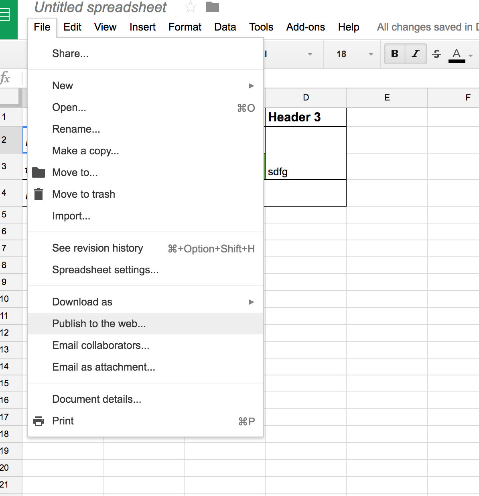
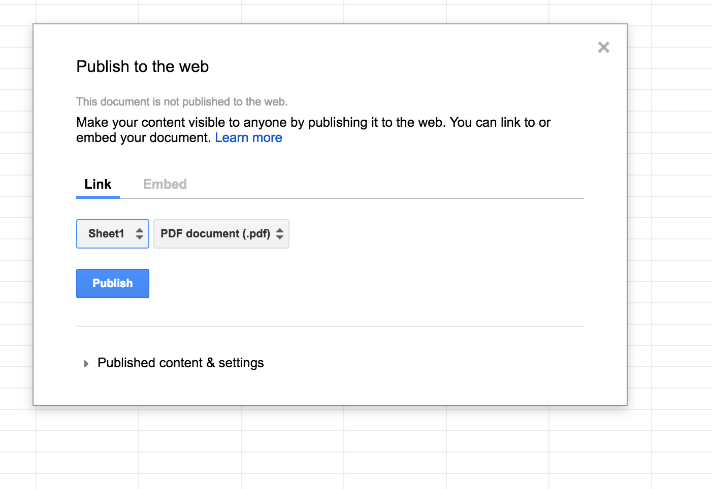
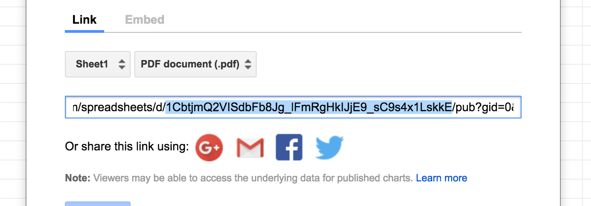
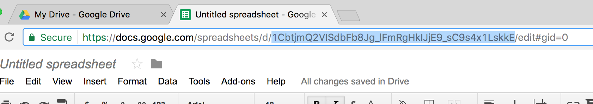

# URGENT ET IMPORTANT : trucs qui marchent pas

## Les renvois
semblent ne pas fonctionner lorsque le renvoi est AVANT la section à laquelle on renvoie. (e.g renvoi \ref{sec:SA} pour {#sec:SA} in chapter 4)

## {.unnumbered} marche que pour gros titres ?
Du coup j'ai fait \setcounter{secnumdepth}{3}. C'est un peu chelou parce que le titre n'est pas identé . j'arrive pas à lui mettre une tablulation. C'est bizarre car normalement leurs titres sont indentés. EN plus le paragraphe qui suit est identé, alors que normalement les paragraphes ne sont pas indentés... ?
bref, j'ai tout essayé (.unnumbered titre de niveau 5 et mettre en gras), mais j'arrive pas à avoir:
saut de ligne
titre en gras indenté
paragraphe non identé
)
Si  je mets \
\
**titre**\

ça indente pas :( et saute 2 lignes (I'd like just one)

Si je mets \
**titre**\ 
ça indente (youpi) mais saute ZÉRO lignes (I'd like just 1 ligne!)

Mais si je mets juste

# TRUCS À APPRENDRE

## TABLEAUX

**Je dois faire un GROS tableau (une page) avec des renvois à des sections dedans. C’est possible hein ?
il doit etre grand comment ton grand tableau ? UNE PAGE OU DEUX. 

## subfigures!

## CSL
Toute une histoire ça aussi, il est super incohérent :(

-------------

# Trucs réglés (pour mémoire de charlotte)

## Comment je réponds à des questions toute seule ?
Read the doc : [http://pandoc.org/MANUAL.html](http://pandoc.org/MANUAL.html)

## Comment je fais pour avoir une page en landscape

C'est faciles tu fais comme ça:

\begin{landscape}

Tout ce que j'ecris ici est mtn en landscape

\end{landscape}

## Marges
Possible de en diminuer un peu les marges des cotés en d’en bas ? (les diminuer toutes de moitié à peu près)

C'est fait. Voir dans `templates/margins.tex`

## Comment mettre une légende à un tableau ? 

Après tableau, mettre Table: legend. Comme ça:

| Header1 | Header2 |
| ------- | ------- |
| Data    | Data    |

Table: This is a great table

## Comment faire un saut de ligne

'\' suivi directement d'un retour a la ligne, comme ça:

La je vais me faire un petit saut de ligne \

## Petits carrés comme simbole pour les listes

Voir dans le fichier `templates/square-bullets.tex`

## Les tableaux comment tu fais pr que les titles sections (gras) soient pas la ligne d'en haut mais celle de gauche ? 
Pour faire de tableaux en markdown, voila la doc : http://pandoc.org/MANUAL.html#tables

Pour faire les trucs de gauche en gras, il faut que tu fasse une table sans header
et ensuite que tu mettes les trucs en gras toi même (oui je sais c est nul).

## Inclure des tableaux de fifou fais avec Google Sheet
**!!!!!!! Attention !!!!!!!** le tableau ne se rafraichit que toutes les 5 minutes approximativement 

1. Creer un document google sheet et faire le tableau le plus fifou que tu connaisse
2. Aller dans 'File' -> 'Publish to the web ...' 
3. Selectionner 'Sheet1' et 'PDF document' da 
4. Cliquer sur 'Publish'
5. Selectionner l'id du document a integrer : 
   L'id se trouve aussi dans l'url dela page :  
6. Le tableau se trouve a l'url : https://dotgraph.herokuapp.com/s/png?<id> et peut être integré comme une image dans le document.
7. Par exemple si l'id c'est `1CbtjmQ2VISdbFb8Jg_lFmRgHkIJjE9_sC9s4x1LskkE` ça donne ça:
  