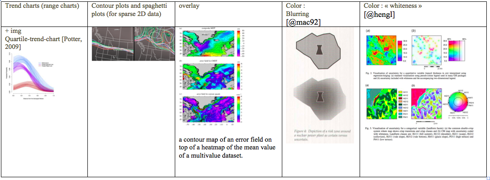

# Design strategies for implementation of complex display
 [make subtitle?]
 *This chapter consists in a litterature review on static and dynamic approaches to displaying multidimensional and uncertain data. It aims to explore the design strategies to express and display multi-dimensional, spatial, multi-objective and uncertain data.*
 
 > "Excellence in statistical graphics consists of complex ideas communicated with clarity, precision and efficiency."
> 
> Edward Tufte

##Elements of data visualization (About data viz?)
###Introduction
Information visualization, or visual communication, consists in transforming complex and abstract data into a accessible and concrete form, that a human brain can perceive with as little as possible cognitive processing. It consists simply in encoding data into visual objects, such as lines or points. 

In order to communicate fact-based information clearly and efficiently, one needs to use tools allowing to gain quick insight from the data. This is the purpose of information visualization. In other words, a clear visualization helps understand complex data. Moreover, in the case of high-dimensional outputs, sophisticated analytical approaches are required, and display tools supports these. 

Effective data visualization takes into account human perception and desicion making process, aesthitical considerations, statistical mathematical precision and more. It is an interdisciplinary work including (...) statistics, graphic design, visual art, perceptual psychology and cognitive science.

###Basics/Principles of data visualization 

####Modes of visualization
* Static presentation : Required for any printed format, static presentations are essentials, as the projects are always summarized in final reports. Posters, but also paperback versions of runs summaries and pdf...


* Dynamic user-interactive visualisations gives the greatest flexibility to the user who is given options to test and visualize results by changing parameters etc. (... TODO). User interactivity enhances the user's implication (REF TODO). Dynamic displays offers many options to tailored and multi-dimensional visualizations. The following sections will detail some of the main features of interest.

* Interactive storytelling is the in-between between the two previous visualization modes. Especially useful during presentations, but also on interactive webpages, the dynamic storrytelling allows the flexibility and multi-dimensional displays options of dynamic visulaizations, while still controlling the selected options, that is walking the user through the visualisation to lead to the envisioned goal. The user, however, c

####Vocabulary
Plot :
•	a default dataset and set of mappings (i.e visual encodings : from variable to aesthetics) 
•	layer(s) = geometric object + statistical transfo + position + dataset
•	one scale for each aesthetic mapping used. Scaling actually occurs in three parts: transforming (if non linear scale) training (choose scale), and mapping.
•	a coordinate system, 
•	the facet specification. Faceting (includes : conditioning, trellising, and latticing) = produces small multiples showing different subsets of the data.

Dynamic features:
-	Scaling
-	Identification (also called pointing) (allows to access to detailed information of a subpart of the graph, by clicking on it)
-	Generalized selection. Selects everything that is similar to the user’s selection, point to an example and define an abstraction based on one or more properties [Clark, Brennan]
-	**Brushing** consists in selecting a subset of data, that can then become highlighted. Also, brushing can be used to remove unwanted data, when a specific threshold is required [@Kollat_Video]
- Linking adds value to brushing, it is the dynamic update of the other graphs displayed, to higlight the corresponding  «brushed» selection. (TODO have an example). 

### Available computational tools
TODO
###Graphical best practices and guidelines
#### What makes a good visualization ?
Keeping in mind the goal which is to gain insight on the data, an efficient visualisation limits the cognitive process of understanding the graph, in order to bring the observer's attention on the actual facts. Some may seem trivial, nevertheless the guidelines summarized in the following paragraphs are essential to achieving the visualisation's purpose. 

>« Graphical displays should:
>
- show the data
-	induce the viewer to think about the substance rather than about methodology, graphic design, the technology of graphic production or something else
-	avoid distorting what the data has to say
-	present many numbers in a small space
-	make large data sets coherent
-	encourage the eye to compare different pieces of data
-	reveal the data at several levels of detail, from a broad overview to the fine structure
-	serve a reasonably clear purpose: description, exploration, tabulation or decoration
-	be closely integrated with the statistical and verbal descriptions of a data set. » 
>
> Edward Tufte, in *The Visual Display of Quantitative Information* [@tufte]

Best practices seem to be summarized by 3 points
-	tailor to audience. 
-	self-explanatory graphics (storytelling can be used...). 
-	graphics « that communicate the key message » [CBO-Telling Visual Stories About Data-June 2014, https://www.cbo.gov/publication/45224] Good visualizations are task dependant, the organisation of the display is closely related to the phenomena considered, and crucial to understand in that perspective.

In terms of aesthetics and graphical choices, readibility should always be a priority. Some key rules needs to be considered : about color scheme (colorblind safe, intuitive hue(...) [Colorbrewer]), but also legend, and ordering (by some properties of data, never alphabetically: a space to express something about the data would be neglected)... Layouting, selecting apporpriate scales and aspect ratios (there is always trade-offs between showing the zero, or zooming on fluctuations)
#### Colors
make a whole paragraph for that ?
color scale = "it is prudent to identify likely solutions with which the color limits should be clamped so that the color scale used to probe the de- cision space is normalized" >> normalizing the color limits,

TODO ask Ben about his issues w/ colors 

- Use only a few colors (~6 ideal)
- Colors should be distinctive and named
- Strive for color harmony (natural colors?)
- Use cultural conventions; appreciate symbolism, Beware of bad interactions (red/blue etc.)
- Get it right in black and white
- Respect the color blind
-  Color schemes: sequential color scheme when the underlying data shows ranked differences; diverging scheme when dealing with negative and positive differences around a mean or a neutral value; and a categorical scheme for discrete values (such as land cover types). - >> https://tilemill-project.github.io/tilemill/docs/guides/tips-for-color/
Colorbrewer, Color Scheme Designer, 0_255

####Zooming
magnification, fishe-eye view (Leung and Apperley 94), difocal distortion ...

##Specific data visualization challenges et strategies
###Displaying multi-dimensional data
####Epic Example

This figurative map, drawn up by M. Minard in 1869, depicts the successive losses in men of the French amry in the Russian campaign of 1812-1813. The text translates to: *The numbers of men present are represented by the width of the colored zones at a rae of one millimeter for every ten thousand men; they are further written accros the zones. The red designates the men who enter into Russia, the black those who leave it. The information which has served to draw up the map has been extracted from the works of M. M. Thiers of Ségur, of Fezensac, of Chambray and the unpublished diary of Jacob, the pharmacst of the army since october 28th. In order to better judge with the eye the diminution of the army, I have assumed that the troops of Prince Jérôme and the Marshal Davoush who had been detached at Minsk and Mokilow and have rejoined around Orcha and Vitebsk had always marched with the army.*

It figures multi-variate data, including 6 dimensions that are the army size, its direction, its location in (x,y) coordinates, the dates and the temperature in the lower part of the display. *"The best statisctical graphic ever drawn"* according to Edward Tufte is an example of displaying complexity with clarity.

![Minard's Napoleon's March figurative map. The text translates to: *The numbers of men present are represented by the width of the colored zones at a rae of one millimeter for every ten thousand men; they are further written accros the zones. The red designates the men who enter into Russia, the black those who leave it. The information which has served to draw up the map has been extracted from the works of M. M. Thiers of Ségur, of Fezensac, of Chambray and the unpublished diary of Jacob, the pharmacst of the army since october 28th. In order to better judge with the eye the diminution of the army, I have assumed that the troops of Prince Jérôme and the Marshal Davoush who had been detached at Minsk and Mokilow and have rejoined around Orcha and Vitebsk had always marched with the army.* ](https://upload.wikimedia.org/wikipedia/commons/2/29/Minard.png)

Interestingly, Wickham ([@wickham08])  attempted to reproduce this visualisation, with today's computational tools, namely the R library used here is ggplot. This may show limit of the computational tools, but also one may argue that Minard's map is not applicable to dataset of a bigger order of magnitude. Overall, it highlights that each visualisation is very specific to the case considered, its data and its aim. 
![Reproduction of Minard's Napoleon's March with ggplot [@wickham08]](../images/minard-ggplot.png)

####Small Multiples
TODO

####Other TODO
TODO
###Displaying mutiple inputs
Choice Modeler: A Web-based Spatial Multiple Criteria Evaluation Tool. CM : tool used for evaluation of decision variants. To reduce the cognitive complexity of the decision space characterized by multiple decision options, evaluation criteria, and criterion weights. This is achieved by incorporating in CM the sensitivity analysis functions for the identification of criteria that do not influence the decision option ranking. Users can remove such criteria from further consideration and thus lessen the cognitive burden of evaluation, which may be essential in multi-stakeholder participatory decision processes.  [ TODO Piotr, 2008 : https://web.a.ebscohost.com/ehost/detail/detail?sid=d823dd5b-5edc-4b96-ba8d-f20ccf16b46d%40sessionmgr4006&vid=0&hid=4209&bdata=JnNpdGU9ZWhvc3QtbGl2ZSZzY29wZT1zaXRl#AN=33334407&db=bth]

###Displaying multi-objective optimization problems
*Vocabulary note: "multi-objective" refers here to problems with three or more objectives, also called many-objective problems [@Fleming05] or high order-Pareto optimization problems [@Reed04]*

Visual decision support tools are very relevant in the field of multi-objective optimization problems. In the multi-objective typical cases, there is no unique optimal solution, but a collection of Pareto optimal ones [@Hadka2015], i.e solutions where improving the result towards one objective result a decrease in performance with regards to another objective  [@paretoUNIL]. Efficient visualizations empower the user with the ability to navigate through thousands of potential solutions, compare them and understand trade-offs, leading to performant decision-making. 

In 2007, Kollat et al developp an interactive visual decision support tool to apply to multi-objective Pareto optimization problems/solution sets. VIDEO (Visually Interactive Decision-making and Design using Evolutionary Multi-objective Optimization) takes advantage of interoperability of Python and speed of C++ (through the use of the Visaulization ToolKit VTK). Divded in an objective space window and a decision space window, it ...

Up to four objectives can be represented in a 3D scatterplot to which a color scale is added. Additional objectives could be represented by varying orientation, shape or size of the points. However, it would be likely to overwhelm the plot. 
Interactivity allows the user to perform selections of one or multiple solution point(s). 

![Overview of VIDEO decision-making software from [@Kollat_Video]](http://ars.els-cdn.com/content/image/1-s2.0-S1364815207000308-gr1.jpg)

__

Parallel coordinates plots are very efficient to display different solutions multi-objective. 3D scatter plots are also an option, by using variation in colors, a fourth dimension can be added. Below, an example of these two solutions for a 4-objectives problem, that can be achieved with the OpenMORDM open-source R library [@Hadka2015].

![Four objectives visualisations with (a) 3D scatterplot and colors and (b) parallel coordinate plot [@Hadka2015]](http://ars.els-cdn.com/content/image/1-s2.0-S1364815215300190-gr3.jpg)

Woodruff et al, MOVA, Many objective visual analytics: rethinking the design of complex engineered systems
mutli-objective Visual analytic tools (MOVA), 
+++ : adding objectives and reducing aggregation (to a ten-objective problem formulation)


Hadka et al, MORDM An open source framework for many-objective robust decision making
The OpenMORDM software framework enables decision makers to identify optimal policy-relevant scenarios/designs under well- characterized uncertainty, explore the trade-offs, dependencies, and vulnerabilities revealed under deep uncertainty, flexibly explore alternative definitions of robustness, and identify key system factors that should be monitored as triggers for future actions.
+ visualization toolkit (R)


###Displaying spatial data (grid-based maps)
hotspot map 
A heatmap uses colour mapping (sometimes called pseudo- colouring) to visualize a scalar function over a 2D region [Brodlie, 

###Comparing runs
 
####Comparing spatial categorical data (discrete attributes)
VERY GREAT REFERENCE : [@Kuhnert2005] 
#####Maps displays
Map comparison example TODO ?

Visual comparisons of maps is efficient and not too intense cognitively for human perception. However, it fails to rank quantitatively the results, nor is adapted to an important number of maps. Screening through hundreds of maps produced is not a viable option. Therefore, other solutions must be considered. 

#####Quantitative indices and spatial metric
######Between 2 maps
Different types of map consistency measures can be distinguished:


1. The coarsest approach would be to compare the total numbers of pixels assigned to each category, neglecting any spatial patterns. This gives a very general quantitative overview of the total per categories. (All the other, finer approaches detailed below imply a cell-by-cell comparison.)

1. A basic cell-by-cell comparison method measures simply the overall agreement, by calculating the portion of cells that agree between two maps:
(Cell-by-cell level of agreement) = (Number of direct matched cells between 2 maps) / (Total number of cells in map)

1. Kappa index of agreement (KIA or Cohen's κ) is a statistic measuring concordance between categorical items. This technique has proven efficient for cell-by-cell comparisons of spatial data [@Manson2005], as long as patterns and locations of changes are not involved [@Kuhnert2005]. Some variants have been developped to adress the quantity and the location fit (points 2 and 3 below) as well [TODO? [@Hagen2003] and [@Pontius2000] ) It is more robust than a percent agreement because it takes into account the agreement occuring by chance. 
κ = (p0 - pe)/(1 - pe) with p0 being the proportion of units agreeing, and pe the proportion of units expected to agree by chance (i.e the hypothetical probability of chance agreement). Complete agreeement results in κ = 1. [@Cohen1960]. 

1. The quantity fit informs on the number of cells that changed from one category to another, offering an overall comparison on the quantity of each category: [todo @ Pontius2002 cf Kuhnert2005]
(Quantity fit) = 1 - 1/( (Total number of cells in map) * sum(all categories) abs(a1i - a2i) 
where aki is the number of cells assigned to category i, in map k. (k appartient 1,2) TODO FORMULA ! (see Kuhnert formula 2) 

1. The location fit informs on the number of cells that kept the category but changed location from one map to another:
(Location fit) = (Quantity fit) - (Cell-by-cell level of agreement)

1. The distance between the locations of matching cells in the maps can also be calculated [@Kuhnert2005] but is of less interest for the purpose of this work. (or is it ? BEN?). (...) An overall measure of distance between two discrete maps expresses the amount of agreement or the goodness of fit [@Seppelt2003217] and [@costanza]

1. The moving window algorithm further accounts for landscape patterns by considering neighboring cells in addition to the cell-to-cell comparison. It has been developp to anwer the following problem: computing solely the number of cell-to-cell matches is not performant in all circumstances, as if there is a matching cell right near by, it will not be taken into account (e.g if we compare two chessboards shifted by one well, the number of cell-to-cell matches is null although there is evident similarity not to be ignored) [@Kuhnert2005]. 

1. So-called landscape patterns metrics, such as the average patch perimeter-area ratio (PA-1), can also be used to describe the patterns for each category, and compared to quantify differences [@Ritters1995]. However, this metrics have not yet proven to be efficient, nor are widely used. 

"more comprehensive methods and measures for tracking land use changes and comparing maps under multiple resolutions (from coarse to fine)": TODO EXPLORE

######Between many maps
When comparing a large number of maps, it may be necessary to simplify, by using a coarser approach such as the total numbers of pixels assigned to each category (point 1 from previous section), or agreement measures (point 6 from previous section). These metrics can be used to calculate correlation between maps [@Seppelt2003217]

#####Maps displays (continuous or categorical??)
For the examination of (dis)agreement between runs, over space : 
Ensemble data sets are the results of multiple runs of a simulation, generated using multiple numerical models,  and input conditions and parameters varying within a given space [@PotterWilson]

Ensemble-Vis is a tool, designed to gain insight on distribution of spatio-temporal simulation results, as well as the associated uncertainty. It argues in favor of combining multiple linked displays [Potter, 2009]

Spaghetti plots (img : spaghetti-plots-ensemble) [Potter, 2009]. The spaghetti plot is the isocontour of each run. If the runs agree (Fig. left), it will result in a coherent bundle. Slight disagrements induce divergence from the main bundle (Fig. right)

To compare and constrast alternative options, and explore the effects of trade-offs, 3D scatter plot and parallel coordinates plot are recommended by [@Hadka2015] 

####Comparing spatial continuous data

###Displaying uncertainty
####A note on uncertainty analysis and sensitivity analysis
It is often of interest to analyst to consider how input uncertainty and model structure affect the precision and robustness of findings. Because ecosystem services depends on unique landscape characteristics, each case is unique and different procedures can be specifically chosen to generate summaries of robustness and sensitivity. [

![Uncertainty analysis and sensitivity analysis [@lig14]](../images/UA_SA-lig14.png)

####Spatial summaries of robustness
Not only does uncertainty adds a dimension to the visualization, it is especially complex because it depends directly on the data itself, and also because uncertainty propagates (i.e if the data is transformed to be visualized, its underlying uncertainty propagates, not necessarly in a trivial way [@correa]). It can be presented in different ways : as a function of the data, (as a PDF, as a multi-value data), as bounded data...

TODO: In the context of this study, the state-of-the art research will limit to 1D and 2D scalar data, leaving aside vector data and 3D (that are further explored by Brodlie [@Brodlie]). 

The most common static visualization techniques include :

* juxtaposition (adding a separate similar figure to represent uncertainty, alongside the representation of the data), 
* range representation? (representing the mean and then a range from the ...)
* Spaghetti plots show possible flows but also allow examnation of variation of different variables of an ensemble over space. 
* overlaying a visualization of uncertainty on top of the main one. [@Bingham] overlay a contour map of an error field on top of a heatmap of the mean value of a multivalue dataset. Not so straightforward. 
* Varying the intensity/some properties ?/ of the color palet used to visualize the main data can also express uncertainty. The first option is to adapt focus proportionally to the level of uncertainty, i.e « blurring » the representation of imprecise data, this can be done through one of these parameters : contour crispness (« fuzzyness »), fill clarity, fod or resolution [@mac92] as suggested on fig. Formally, blurring is defined as removing spatial high frequency details [Russ, 1995] 
* Saturation is the second option, uncertainty is expressed by paleness (or whiteness) [@hengl]. These options are less precise but more intuitive.
* Circular glyphs and a ribbons have been designed, in the context of weather forecast ensemble data, to visualize uncertainty [@sanyal].

In the specific context of portfolios 
>>Robustness approach #1: Modal portfolio and frequency
- modal portfolio : activity most chosen 
- Frequency map : how often chosen (>90%?) [@RIOS]

In dynamic visualization, uncertainty representation can be more easily achieved. A swap button can allow the user to visualize successively the main data and its associated uncertainty on the same background map, allowing easier interpretation, with the possibility of going back and forth. This method is referred to as toggling [@Aerts03]

Other ways of expressing imprecision dynamically make use of time as an extra dimension,  via vibrations proportional to the level of uncertainty [@Brown], or smooth animation of sequence of different realizations of a model [@Ehlschlaeger].  There have even been attempts to display uncertainty by adding another dimension via sounds [Lodha, 1996 and Fisher, 1994]. Another solution to convey accuracy is probabilistic animation : the uncertain points appear and disapear according to their accuracy, i.e the probability domain is sampled over time [@Lundstrom].

TODO : 3D/other dim.... (explore BRODLIE)
TODO : explore also *Bluriness :  Also Cartography, Third Edition: Visualization of Spatial Data Par Menno-Jan Kraak,Ferjan Ormeling

A word on deep uncertainty ? TODO

####Non-spatial summaries of robustness
>>Robustness approach #2: Breakeven prioritization scores
>>"how much things would need to change before a different decision is taken" [@RIOS]

 >>Two statistics are particularly useful: the mean that represents the central tendency of the stochastic process, and the variance that summarizes the variability of the results. Variance is then used as input to SA (UA is, therefore, a prerequisite to SA)[@lig14]
 

###Sensitivity Analysis displays

An essential part of sensitivity analysis is understanding the input parameter - output relationship. A common and direct way of expressing it is a scatterplot (with input parameter considered on x-axis and the scalar output on y-axis), the relationship is explicitly revealed, especially in the case of strctured dependencies. However, if the number of inputs to consider is high, scatterplots can become cumbersome. Pie charts displaying variance partitions are a good alternative, and do not require a scalar output. [@ABMleelig (see for examples)]

###Robustness displays (relevant? (ASK BEN) should be merged w/ uncertainty?)
Robustness measures fall in two categories : regret and satisficing measures. [@Hadka2015] >> robustness viz fig 5-6-7 [@Hadka2015] 
Lempert and Collins (2007), Herman et al. (2015) distinguish two major classes of robustness measures in the literature: regret and satisficing. Generally speaking, regret-based robustness seeks to minimize deviations in system performance caused by deep uncertainties compared to a preferred or ideal design (i.e., minimizing expected loss), whereas satisficing-based robustness seeks to maximize the SOWs where system requirements as defined by stakeholders are met

###Parametric  ...
Display parametric( ?)
Interactive/querying displays
Ensemble-vis [Potter, 2009]
Combining

###Things that I'm not so sure where they go:
####Agent-based Modeling 
Agent-based modeling (ABM), or indivisual-based modeling consist in representing phenomenas as dynamical systems of interacting agents, where an agent is a discrete and autonomous entity. Their individual behaviors are encoded, resulting in outputs describing the the agents' interactions that are used to describe complex systems. These systems can be a  variety of processes, phenomena, and situations in any field. [@ABM_intro] (Why ?

* *Complex systems Approaching Design Limits
* large models with complex interactions and outputs
*  by conducting computer-based experiments)*

In the context of this work, ABM is of interest because of the high volume of multidimensional output data (induces by Monte Carlo sampling), the visualization and statistical analysis of these outputs can be applied
 
*  the study of variance in the model outputs (i.e., stability) 
*

Processing ABM output data over time and space. 

__
Visualisation strategies [@ABMleelig]
 the role of effective visualization as a medium for both analysis and exposition of model dynamics


