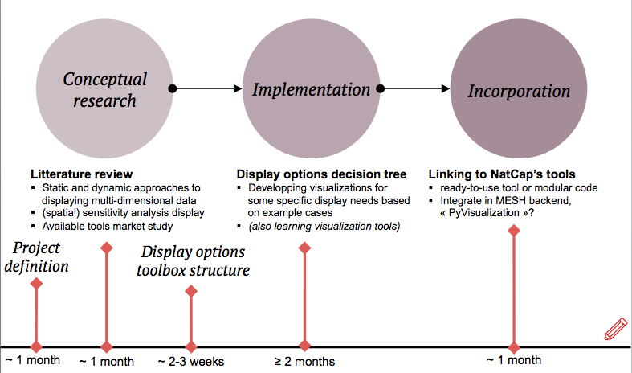

#Method
*This chapter is an unfinished draft for now...because not 200% sure on next steps methods / also need to put form in here *

##Project definition (scoping)
Within the initial framework of the project, on environmental modeling and data analysis, several potential directions were considered. Possible directions of work targeted handling spatial interdependence in the models or assessing the value of detailed data in improving optimization outputs and modeled impacts... However, an extended exploration of the needs was conducted to understand where would could this work bring the most useful contribution. Analyzing the need is indeed crucial to a good project definition. This preliminary step was achieved during the first month and the annual gathering of NatCap has been a great occasion to identify the areas of needs, it resulted in defining the project around the topic of display tools for ecosystem services. The question of how to synthesize and communicate spatial and multi-dimensional outputs of multiple runs for multiple ES models would be addressed. The goal being to define easy approaches to clear ES visualizations and summaries.

##Background and context (approaching the problem)
###Literature review
The first steps to approaching the question of displaying natural capital information were to explore the context, learn notions of data visualization in general and understand the state-of-the art. Background knowledge was built gathering from the literature. It turned out this literature review could answer the need for a useful guidance document on ES visualization, by putting together the various approaches and main strategies for displaying ES information. 

### Tools exploration
Meanwhile, in computational data visualization, the resulting display highly depends on the choice of tool. And it turned out that the available data visualization tools were numerous, varied, overlapping. An exploration of these softwares and libraries attempted to guide with more clarity towards the choice of an adapted tool. To conduct such a comparison, some of these tools were learned and used.

##Identifying display needs
First, based on typical example cases and interviews of *Natcappers* / *professionals in the field of ecosystem services* ? , some display needs were identified. Then this list was refined and completed thanks to the inputs of the broader FWAT team. Next, these needs were gathered and organized in a survey document sent out to a broader community of professionals in the field, including scientists, ecologists, hydrologist, economists, analysts and researchers working with the Natural Capital Project. The survey questions can be found in Annex (renvoi). A total of (???) answers were collected, where participants assessed, for each identified need, the usefulness of such a display, but also commented on their current implementation and the usefulness of improving the current displays. Resulting from their inputs, the display needs were prioritized (...TODO!)

##Example Cases
The present work have found applications, and based its trials on several on-going projects at the Natural Capital Project. 

###Prioritization of native forest restoration in Pu‘u Wa‘awa‘a, Hawai‘i
*A spatial multi-objective approach to watershed conservation*

In the context of a study aiming to develop a method to analyze the tradeoffs relative to effective watershed restoration planning, applied to the case of a particular watershed in Hawai‘i, namely Pu‘u Wa‘awa‘a, located in the North Kona region of Kekaha. The paper further informs on prioritization of conservation spending, under different climate scenarios, to include possible climate change. It focuses on groundwater recharge and landscape flammability and details management costs. 
 
In the context of this work, this project's display tasks were (...) (*portfolios etc TODO*)

###Peru
TODO. 

In the context of this work, this project's display tasks were (...) (*multi-objective displays TODO*)
###The Upper Tana Nairobi Water Fund
*Improving Water for Millions in Kenya*

The Tana River supplies 95% of the water for a total of 9 million people living in Nairobi and surroundings, feeds one of the country’s most important agricultural areas and provides half of the country’s hydropower output
*Re-write this:* Since the 1970s, forests on steep hillsides and areas of wetlands have been converted to agriculture, removing natural areas for storing runoff water and soil from the land. Now, as rain falls over farms, soils are washed down into the river, which reduces the productivity of farmland and sends sediment into the rivers. This increased sedimentation can choke water treatment and distribution facilities causing complete service disruptions for days or weeks at a time. Today, 60 percent of Nairobi’s residents do not have access to a reliable water supply.
This growing challenge requires something innovative to protect the Tana River, increase downstream water quality and quantity and provide positive benefits for tens of thousands of farmers in the watershed. Enter the Upper Tana-Nairobi Water Fund. Water funds are founded on the principle that it is cheaper to prevent water problems at the source than it is to address them further downstream. Public and private donors and major water consumers downstream contribute to the Fund to support upstream water and soil conservation measures, resulting in improved water quality and supply.
The Nairobi Water Fund builds on the Conservancy’s experience addressing similar issues in Latin America, where more than 30 water funds are either underway or in development. This fund is now the first of its kind in Africa, and will serve as a model as leaders across the continent look for innovative ways to solve ever-increasing water challenges.

In the context of this work, this project's display tasks were (...) (*Tana, todo.*)

##Build the display toolbox structure
*TODO*
The display needs were organized per theme, in the most logical way that could be found, despite the many overlaps...
Once these questions were organized, the aim consisted in answering each effectively.
To each display tasks was associated  corresponding concrete questions, and examples to which the user could identify its projects. Then, for each task, several solutions would be proposed according to options the user specifies, namely the target audience (analysts, stakeholders, public), the document type (static, dynamic). For each solution, implementations

**Basic question > display task > document type > visualization > implementation**

##Prioritization of needs
From results of survey
##Develop suggested solutions
Strong of the knowledge from the literature review, and the current state of existing visualizations, display solutions were suggested for each tasks. For the tasks where no satisfying solutions could be found, new ones were developed. (... TODO)

###Specific developed tools : implementation methodology
### Hawaii case
#### Defining the needs
In terms of static visualizations. The main goal of the paper  is to look at the impact of restoration (land cover scenarios) on the ES objectives (water, flammability) both independently and then simultaneously with climate scenarios going on in the background.

 
##Assess quality of suggested solutions 
TODO, Assessment through:

* Expert's opinions (Assessment/survey online or in person)
* Criterias of clarity and completeness:
![When Evaluating a Figure for Clarity and Completeness, Consider the Following Questions[@Allen1]](../images/assess_table.png)

##Incorporation of the tools (?)
If time : e.g MESH/InVEST ?

##Master thesis workflow 

