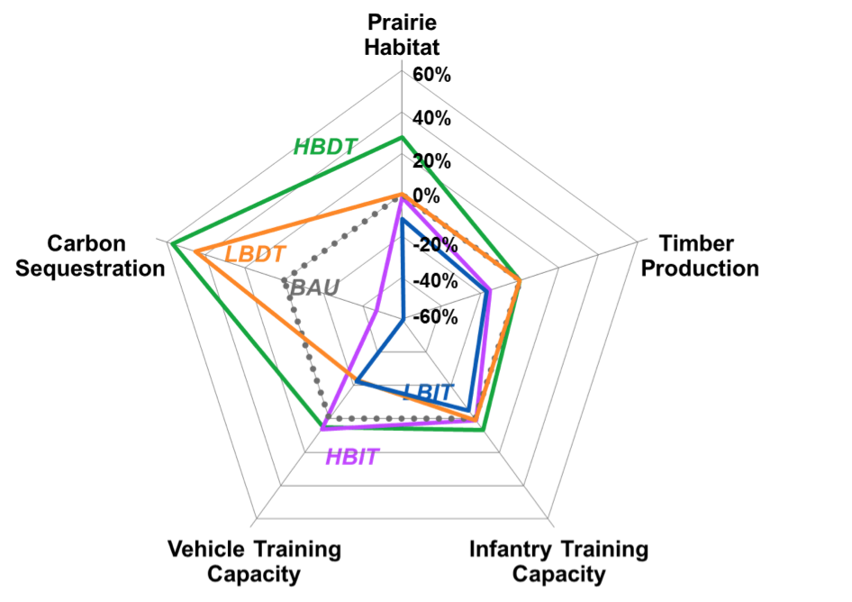

# Design strategies for complex information display

>
>   
> 
>*"Excellence in statistical graphics consists of complex ideas communicated with clarity, precision and efficiency."*
> 
> *Edward Tufte*
> 
> 

This chapter consists in a literature review on static and dynamic approaches to displaying complex data. First, a brief overview of some general notions in data visualization is given to familiarize with the context. Then, and most importantly this chapter aims to explore the design strategies to express and display multi-dimensional, spatial, multi-objective, uncertain data and combinations of these. This focus corresponds to the specific challenges faced while communicating natural capital information. Finally, an exploration of the multiple visualization tools supports choice of the most adapted software or library for each application.    

##Elements of data visualization

###Information visualization and graphical integrity
Information visualization, or visual communication, consists in transforming complex and abstract data into an accessible and concrete form, that a human brain can perceive with as little as possible cognitive processing. It consists simply in encoding data into visual objects, such as lines or points [@tufte]. The goal of a visualization is to effectively convey information [@Kelleher].

In order to achieve this aim honestly, graphical integrity considerations must be kept in mind throughout the process of building visualizations. It has been shown that graphs can clearly be misleading because of design choices [@Allen1]. Graphical integrity consists in accurate representations of data, avoiding distortions or misleading designs. To this end, data must be shown in its context, well-known units and clear labeling should be used to avoid ambiguity, true proportions must be kept in representing numbers [@tufte]. In the context of ES, graphical integrity could be interpreted as showing uncertainties and all scenarios; hiding some may be considered dishonest [@McMahon2016]. 

The following sections aim to introduce some basic principles of data visualization, laying the foundations for further exploration.

###Notions and techniques in data visualization 

####Vocabulary and grammar of graphics
Graphs, charts, diagrams and plots, despite ambiguous nuances, are all defined as representations of data, these words will be used synonymously in this work. A graph consists in at least one dataset translated into a set of mappings (i.e visual encodings), forming layers that are statistically transformed according to the scale, the coordinate system and the facet specification [@wickham08]. 

Spatial data is handled with specific tools, so called **geographical information systems (GIS)** which link geographic (e.g maps) and descriptive informations. Data is organized is different layers, associated based on their geography. Spatial data can be stored in two types: raster, which is a collection of pixels referenced with coordinates, and vector, which corresponds to a set of point, lines and polygons. Different projections and coordinate systems are of great importance when dealing with spatial data: the round shape of the earth different from the flat projections of the maps means that distortion cannot be avoided. These projections conserve either the shape, or the area for example but cannot conserve all measures [@LectureGIS]. 

####Modes of visualization
Required for printed format, **static presentations** are essential. Plus, in the context of inter-organizational projects, there is almost always a need to summarize results in static reports. 
**Dynamic user-interactive visualizations** gives the greatest flexibility to the user who is given options to test and visualize results while having some control on the display. In many cases, user interactivity enhances the user's implication and satisfaction [@Teo2003281]. Dynamic displays offers many options to tailored and multi-dimensional visualizations. Section ({number}) will detail some of the main features of interest.
**Dynamic storytelling** is the in-between between the two previous visualization modes, is is dynamic but not fully interactive. The viewer is guided through the visualization, either by a presenter, or step-by-step through the storyline, he therefore has less flexibility to "play around" with the variables, but it can result in easier delivery of main message.  Especially useful during presentations, but also on webpages, the dynamic storytelling allows the flexibility and multi-dimensional displays options of dynamic visualizations, while keeping control on the selected options, i.e walking the user through the visualization to lead to the envisioned goal. 

####Distortion techniques
When displaying large datasets, combining considerations about different scales can become very tricky. As noted in (({section number lit review intro}), aiming for graphical integrity, the context of the dataset is required to be presented. However, when attempting to show local variations, displaying two scales at once is a notable challenge. Some distortion techniques have been developed in order to view precisely local details in their global context. They allows a greater space to the display of a focused zone, while still embedding its surrounding context. Generally, linear or hyperbolic geometry supports the smooth connection of the focus area and the background, that have different scales [@Leung].

- The **bifocal display** (or lens) corresponds simply to a linear transformation (in one or two directions) [@bifocal and @Leung].
- The **polyfocal lens** is similar to bifocal lens, but using a more complex hyperbolic (or polynomial) transformation function [@Leung].
- The **fisheye view**, originally called *Focus + Context* technique [@Lamping], [@Furnas_fisheye] uses a continuous magnification function (that also transforms the boundaries). Tough this term has been used with different definitions, it is broadly used and very intuitive.
- Other distortion techniques include the **perspective wall** [@Mackinlay], that simulates the perspective effect, the **hyperbolic tree**, that extends the fisheye view using hyperbolic plane mapped onto a circular display region [@Lamping] and more.  

####Interaction techniques
A few interactive features of interest include [@wilhelm1995software]:

-	**Scaling** which is simply zooming in and out but is powerful in the sense that it allows the user to both global view of the whole dataset and precise details on smaller fluctuations, therefore removing the need for a distorded view. Some scaling options also combine distortion techniques (see previous section ({number})) to both zoom in and keep the background context in the surroundings.
-	**Identification** (also called pointing) allows access to detailed information of a subset of the graph by clicking on it.
-	**Generalized selection** extracts every point that is similar to the user’s selection for an overview of subsets. The similarity rules are defined according to the case.
-	**Brushing** consists in selecting a subset of data, that is then highlighted. Also, brushing can be used to remove unwanted data, when a specific threshold is required [@Kollat_Video]. Brushing can be done with a slider, or with direct selection on the plot [@xmdvtool].
-      In a context where the displays consists in several views (different plots), **linking** adds value to brushing, it is the dynamic update of the other graphs displayed, to undergo the corresponding  «brushed» selection [@Buja].

###Graphical best practices and guidelines
#### What makes a good visualization ?
Keeping in mind the goal which is to effectively convey information, i.e to gain insight on the data, an efficient visualization reduces the cognitive effort of understanding the graph, in order to bring the observer's attention on the actual facts. Some may seem trivial, nevertheless the guidelines summarized in the following paragraphs are essential to achieving the highlight's purpose. As described by Tufte (1983) in his classic text, graphical displays should: "'*show the data, induce the viewer to think about the substance rather than about methodology, graphic design, the technology of graphic production or something else, avoid distorting what the data has to say, present many numbers in a small space, make large data sets coherent, encourage the eye to compare different pieces of data, reveal the data at several levels of detail, from a broad overview to the fine structure, serve a reasonably clear purpose: description, exploration, tabulation or decoration, be closely integrated with the statistical and verbal descriptions of a data set. »*

Best practices seem to be summarized by three main points. An efficient display should be self-explanatory, tailored to the audience and most importantly convey the key message. Moreover a good visualization is highly dependent on the task, the type of display and other design choices are very specific to the dataset considered.

**Readibility and intuitivity**

Simplicity is key to an effective display. Tufte advocates to minimize the design complexity, to maximize the content reasoning time. Redundancy complicates vainly and should be avoided. For example, the data ink ratio (i.e the ratio of ink used to display data over the total ink of the figure) should be minimized as far as possible [@tufte]. Additionally, [@Kelleher] argues to maintain axis ranges across subplots for easier comparison, connect sequential data (e.g disconnection for missing data in time series plots) and express density in overlapping points (e.g with color gradient in scatterplots). Moreover, appropriate encoding of objects and attributes lead to intuitive plots [@cleveland1984graphical].

**Scale and ratios**

The success of a visualization is contingent upon the careful selection of appropriate scales and aspect ratios. There is always trade-offs between showing the zero, or zooming on fluctuations. Dynamic features and distortion techniques allow to overcome some of this difficult choices, but are not always possible. Making the right choice between displaying patterns or details is crucial [@kosslyn1992minding]. Meaningful axis ranges, data transformations (e.g log scale) and aggregation level (e.g temporal aggregation by averaging over a larger time step for long time-series) are essential too [@Kelleher]

**Legend**

For the graph to be self-explanatory, a clear labeling must be included. If opting for a legend, it should be ordered by some properties of data, never alphabetically because a space to express something about the data would be wasted [@tufte].

**Colorscheme** 

The careful choice of the color scheme is not be neglected [@Kelleher]. Sequential color scheme ought to be chosen when the underlying data shows ranked differences; diverging scheme when dealing with negative and positive differences around a mean or a neutral value; and a categorical scheme for discrete values [@tilemill]. Moreover, many sources suggests to use only a few colors (about 6), while choosing them distinct, and striving for color harmony. Cultural conventions and intuitive tints facilitate fast perception. Colorblind and printing safe schemes are prudent. Also, the color scale should be normalized, considering which datapoints should appear in different categories. [@Colorbrewer] provides good templates.

**Interactivity**

The success of an interactive display results from the appropriate interface complexity for a certain user motivation [@Roth]. In the field of interactive maps, [@Roth] examines when cartographic interaction positively supports work.Interactivity is not always beneficial to the graphs, but relevant for users who wish to customize the communicated information to their particular interests, also relevant to overcome some display problematics. Another point that interactivity helps achieving is enhancing the user's involvment with the map, by offering a sense of control over the experience.

##Specific data visualization challenges and strategies
###Displaying multi-dimensional data
In the context of ES, multi-dimensionality arises from multi-objective problems, such as cases where mutiple ES are considered and their trade-offs are to be explored, but also from (*where do we encounter multi-dim in ES besides multi-obj???*) Visual decision support tools are very relevant in field of multi-objective optimization problems[^0326back]. In the  typical cases, there is no unique optimal solution, but a collection of Pareto optimal ones [@Hadka2015], i.e solutions where improving the result towards one objective result a decrease in performance with regards to another objective  [@paretoUNIL]. Efficient visualizations empower the user with the ability to navigate through thousands of potential solutions, compare them and understand trade-offs, leading to performant decision-making. 

Multidimensional data visualization has been given considerable attention, as computational capacities have been increasing and the amount of produced data exploding. Multi-dimensional data exploration has taken several directions, based on a geometric projection techniques, to which distortion and interaction techniques (discussed in section ({number})) can be added to further improve these visualizations [@Keim]. The curse of multi-dimensionality, as explained by [@Allen1] is that graphical displays become less informative as the dimensions and complexity of data sets increase. However, he argues in favor of detailed graphs showing more data and revealing more informations.

 [^0326back]: Vocabulary note: "multi-objective" refers here to problems with three or more objectives, also called many-objective problems [@Fleming05] or high order-Pareto optimization problems [@Reed04]

####Time-series data: line charts, streamgraphs and more
For data including several independent variables, and a dependent one, line charts is a version of a scatter plot where points are ordered (on the x-axis), and joined with segments. Line charts (also refered to as run charts for time-series data, or index charts when interactive) highlights relative changes, these are a good options when comparing the independant variables. Streamgraphs, also called stacked graphs, sums visually the time-series values around a central axis by stacking area charts on top of each other [@Tour]. In the case of very large timeseries datasets, horizon graphs is a very space-effective option, despite a certain amount of learning time. Horizon graphs consists in filled line charts, where negative values are mirrored (and colored typically in red) and then the chart divided into bands that are overlayed using transparency effects; the space used is divided by four thanks to these two transformations [@horizon]. When the goal is to compare monthly values over the years and the different year, a fairly recent display solution has been suggested: temporal maps [@temporalmap].

![Illustrations of concepts of streamgraph [@streamchart], horizon graphs[@horizon] and temporal map[@temporalmap] *Should I add line charts or unecessary?* Todo?](../images/horizon_stream_temp_combined.png) 

####Small Multiples
An effective alternative to coercing all the data in a single plot (risking overplotting) is displaying small multiples. The concept is to replicate the same simple graph structure (in terms of axis, shape and scale), for many datasets, ordered logically. The cognitive process of understanding the graph is undertaken only once, and the understanding then is replicated while scanning all other multiples. This strategy is very efficient in many cases for comparison. Referred by Edward Tufte as "multivariate and data bountiful", they enforces comparisons of alternatives, differences and changes [@tufte]. This displaying startegy has also been called trellis chart, lattice chart, grid chart, or panel chart. It can be applied to many types of graphs.

![Small multiples applied to (a) line plots [@small_mult_lines] and (b) spatial data [@small_mult_maps]](../images/smallmultiples.png)

####Scatterplots
The classic scatterplot displays data with two to three dimensions, using cartesian coordinates and two or three axes; in a **3D scatterplot**, solutions are represented as points in the space.  Additional dimensions can be represented by changing attributes (color, shape, size, orientation, etc), however concerns about clarity and risk of overwhelming the plot may occur. Interactivity allows the user to perform selections of one or multiple solution point(s). 3D scatterplots are often used for multi-objective display (e.g  the VIDEO software [@Kollat_Video]).

A **Scatter plot matrix** combines the small multiple strategy with the classic scatterplot; abbreviated SPLOM, it displays relationships between every pair of variables.

#### Parallel coordinates plot *ben is this section better now?*
Parallel coordinates plots are very effective to display different solutions in a multi-objective context. The number of objectives is then nearly unlimited, they are listed horizontally; solutions are represented as lines, distinguished by varying colors. Patterns are clearly visible [@Achtert2013_6]. The vertical direction of preferred solution must be clearly indicated to assist interpretation. 

Combining parallel coordinates with interactive features offers interesting options to explore the data, for example brushing allows to extract trends over subsets, [@andrienkopp] recommends linking to other graphics.

Tradeoffs are illustrated by crossing lines. However, one limitation is that each axis having at most two neighboring axis, only N-1 relationships of $\binom{N}{2}$ combinations for an N-dimensional dataset can be visualized at once. This can be overcome by re-ordering the axis, possibly with an interactive tool, or by upgrading to a 3D parallel coordinate plot where the axis are still in parallel, but some appear closer [@Achtert2013_6], although this solution result in a much harder interpretation, which may explain why it is not widely used. 

 To compare and constrast alternative options, and explore the effects of trade-offs, 3D scatter plot and parallel coordinates plot are recommended by [@Hadka2015], as shown in Figure {number}. 

![Four objectives visualization with (a) 3D scatterplot and colors and (b) parallel coordinate plot, achieved with the OpenMORDM open-source R library [@Hadka2015]](http://ars.els-cdn.com/content/image/1-s2.0-S1364815215300190-gr3.jpg)

####Radar charts *(merge with parallel coord plots?)*
The radar chart, (that has also been refered to as spider chart[^5353back], web chart, star chart, polar chart, or Kiviat diagram.[2][3]) is the parallel coordinates plot version in polar coordinates. It can be an interesting way to visualize trade-offs.

However, opinions in the data visualization community diverge, and some argue for petal charts against radar charts [@spiderman_bad_Ref] *mmmmh*

#### Other displays 
Other statistical distributed data displays more specific to some data types include **Stem-and-Leaf Plots**, which is a variant of horizontal histogram painting a frequency distribution with numbers classified forming the histogram-like bars; and **Q-Q Plots** that compare probability distributions by graphing their quantiles where values lining up will reflect linear correlation [@Tour]. 

More display techniques have been explored, but are not widely used. To mention just a few, in the 1990's, were developed the **prosections views** [@prosections] that build view of high-dimensional objects through projection (in one or two dimensions), followed by section (i.e intersection of subspaces). Also, the **Hyperslice** [@Wijk] attempts to represents multi-dimensional function as a matrix of orthogonal two-dimensional plans. 

For very high-dimensional data, one may consider **pixel-oriented visualization** [@Keim] which consists in using each pixel to display one data value. 

#### Other strategies
Another approach to reduce cognitive complexity of multi-dimensional data, is to reduce the dimensions in some coherent way. For example, the **choice modeler approach** aims to evaluate multiple decision variants, in a very large decision space. The concept is to identify criteria that do not influence the output (here, the decision option ranking), and remove these dimensions, to simplify without loosing correctness [@Piotr]. Similarly, a **principal components analysis** (PCA) can be conducted to reduce the number of variables by combining the correlated ones [@hotelling1933analysis].

Several options to display multi-variate data were discussed. However they all realistically apply to a limited number of variables. As dimensions of the data increase, **multiple linked views** become necessary to convey the complex information, giving different perspectives to the viewer. 

###Displaying spatial data 

####Chloropleth maps, proportional symbol maps, heatmaps
Spatial data is often aggregated by regions, then a variable of interest can be expressed by coloring (or using patterns on) these defined areas. Particular attention needs to be given to the choice of patterns (see section Colors). Normalizing raw data values may be necessary [@Tour] to ensure graphical integrity.

Another solution to represent spatial data aggregated by regions is the graduated symbol map (or proportional symbol map) that overlays symbols to the base map. In this case, the underlying area does not affect the perception of the variable considered [@Tour]. These two approaches can also be combined. 

Variants of these are heatmaps, and hotspot maps which are used to display the density of a phenomena, and allow to identify clusters. The heatmap can be seen as the continuous version of the chloropleth map, which categorized the data. It visualizes a scalar function over a geographical area [@Brodlie]. Similarly, in the dot distribution map,  the density of dots represents the intensity of the variable. 

####Isopleths, contour maps
Also know by contour maps, or isarithmic maps, they display variable with contour lines (isopleth) joining the points where the variable has a constant value. In the field of ecoogy, isoflors are isopleths connecting areas of comparable biological diversity [@isoflor]

####Dasymetric map
Visually more straight-forward than an isopleth map, and statistically more precise than a chloropleth map, a dasymetric map can be build models the distribution of the variable, even within the geographical units. Relying on additional informations on the data, it is more complex to build, and not supported by most GIS softwares, therefore not very common. [Ref todo?]

####Cartograms
Cartogram also illustrate data aggregated over regions. The variable to be expressed is substituted to the geographical distance. The regions are in the same locations with respect to each other, but their geometry is distorted proportionally to the variable of interest [Ref todo? or @Tour]

#### Flow maps : spatial data and multi-dimensionality
A flow map illustrates movement in space and/or in time. Its great strength reside in its capacity to encode many variables. 

This epic example of flow map, drawn up by M. Minard in 1869, depicts the successive losses in men of the French amry in the Russian campaign of 1812-1813. It figures multi-variate data, including 6 dimensions that are the army size, its direction, its location in (x,y) coordinates, the dates and the temperature in the lower part of the display. *"The best statisctical graphic ever drawn"* according to Edward Tufte is an example of displaying complexity with clarity.

![Minard's Napoleon's March figurative map. The text translates to: *The numbers of men present are represented by the width of the colored zones at a rae of one millimeter for every ten thousand men; they are further written accros the zones. The red designates the men who enter into Russia, the black those who leave it. The information which has served to draw up the map has been extracted from the works of M. M. Thiers of Ségur, of Fezensac, of Chambray and the unpublished diary of Jacob, the pharmacst of the army since october 28th. In order to better judge with the eye the diminution of the army, I have assumed that the troops of Prince Jérôme and the Marshal Davoush who had been detached at Minsk and Mokilow and have rejoined around Orcha and Vitebsk had always marched with the army.* ](https://upload.wikimedia.org/wikipedia/commons/2/29/Minard.png)

Attempts were made to reproduce this visualization with modern tools. This may show limits of the computational tools, but also one may argue that Minard's map is not applicable to dataset of a bigger order of magnitude. Overall, it highlights that each visualization is very specific to the case considered, its data and its aim. 

![Reproduction of Minard's Napoleon's March ith the R package ggplot (described in section {number}) [@wickham08]](../images/minard_ggplot_2.png)

![Another modern reproduction of Minard's Napoleon's March overlaying a map [@Tour]](../images/napoleon_1.png)

###Comparing multiple versions of spatial data (runs)
 Summarizing results of mutiples model outputs that consists in multi-dimensional spatial data is often necessary, wheter the multiplicity of outputs correspond to multiple objectives, various scenarios or a parameters explorations (i.e sensitivity analysis, this case is further described in section {number}). Comparison and summaries of maps can be achieved either by visualizing in space (maps display) or through quantitative indices and spatial metrics synthetizing the results. 
 
####Maps displays 
##### Between 2 maps
For the examination of (dis)agreement between two maps, simple and efficient strategies suggests to show the two maps next to each other; or to substract one map to another to display the change map. Typically change maps uses diverging colorscheme, two colors representing respectively increase and decrease, and the intensity gradient reflects the amount of change. 

##### Between many maps
The problem complicates when comparing many runs. 

Visualizing flow data, **spaghetti plots** can express consistency between runs. Widely used in meteorology, the consistency of the runs is expressed by how tightly clustered they appear. Spaghetti plots may be translated to continuous spatial data by using the isocontour of each run, which is useful when concerned about a specific threshold. *better, Ben?*
For continuous data, **3D plots overlaying maps** (figure {number}) have been used to highlight structural differences across maps. However, this solution seems limited to relatively small regions, and clearly distinguishable distributions of the variables expressed through color and height of the histogram. 

![Spaghetti plots displaying ensemble data sets [Potter, 2009]. The spaghetti plot is the isocontour of each run. If the runs agree (Fig. left), it will result in a coherent bundle. Slight disagrements induce divergence from the main bundle (Fig. right). *for categorical or continuous?*](../images/spaguetti.png)

![3D histograms, organized according the geographical layout; extract from figure 8 of [@Huang13] -- Merge (subfigures!)](../images/3Dplotsoverlaying.png)

For categorical data, the **frequency map** approach would display the most assigned category to each area across many runs, with possibly additionally a measure of how often this category was assigned. More details can be found in section {number} Robustness metrics and displays [@RIOS].

Animation is of great interest in this context. Dynamic visualizations are very suited for displaying multiple spatial outputs, there are increasingly used to display results in the field of ABMs[^1back], encountering similar type of outputs [@ABMleelig]. 

[^1back]: Agent-based modeling (ABM), or indivisual-based modeling consist in representing phenomenas as dynamical systems of interacting agents, where an agent is a discrete and autonomous entity. Their individual behaviors are encoded, resulting in outputs describing the the agents' interactions that are used to describe complex systems. These systems can be a  variety of processes, phenomena, and situations in any field. [@ABM_intro] In the context of this work, ABM is of interest because of the high volume of multidimensional output data (induces by Monte Carlo sampling), the visualization and statistical analysis of these outputs can be applied.

Visual comparisons of maps is efficient and not too intense cognitively for human perception. However, it fails to rank quantitatively the results, nor is adapted to an important number of maps. Screening through hundreds of maps produced is not a viable option. Therefore, other solutions must be considered. 

####Quantitative indices and spatial metrics for categorical data
#####Between two maps
There are different types of categorical (i.e discrete attributes) map consistency measures [@Kuhnert2005]:

1. The coarsest approach would be to compare the total numbers of cells[^3back] assigned to each category, neglecting any spatial patterns. This gives a very general quantitative overview of the **total per categories**. (All the other, finer approaches detailed below imply a cell-by-cell comparison.)

[^3back]: *Vocabulary note: in this section, "cell" corresponds to the regional unit at which data is aggregated, it can be a region, a pixel, an HRU, a state...*

1. A basic cell-by-cell comparison method measures simply the **overall agreement**, by calculating the portion of cells that agree between two maps:
(Cell-by-cell level of agreement) = (Number of direct matched cells between 2 maps) / (Total number of cells in map)
1. **Kappa index of agreement** (KIA or Cohen's $\kappa$) is a statistic measuring concordance between categorical items. This technique has proven efficient for cell-by-cell comparisons of spatial data [@Manson2005], as long as patterns and locations of changes are not involved [@Kuhnert2005]. Some variants have been visualizations to adress the quantity and the location fit (points 4 and 5 below) as well [@Hagen2003] and [@Pontius2000] It is more robust than a percent agreement because it takes into account the agreement occuring by chance. $\kappa = \frac{\textrm{p}_{0}-\textrm{p}_\textrm{e}}{1-\textrm{p}_\textrm{e}}$  with  $\textrm{p}_{0}$  being the proportion of units agreeing, and  $\textrm{p}_\textrm{e}$  the proportion of units expected to agree by chance (i.e the hypothetical probability of chance agreement). Complete agreement results in $\kappa = 1$ [@Cohen1960]. 
1. The **quantity fit** informs on the number of cells that changed from one category to another, offering an overall comparison on the quantity of each category: $$Quantity \ fit = 1 - \frac{1}{N}\sum \left |  \textrm{a}_\textrm{1i} - \textrm{a}_\textrm{2i} \right |$$ where $\textrm{a}_\textrm{ki}$ is the number of cells assigned to category $i$, in map $k$ with $k \subseteq (1,2)$, $N$ the total number of cells in map and $C$ means all categories [@Kuhnert2005].
1. The **location fit** informs on the number of cells that kept the category but changed location from one map to another:  $Quantity \ fit = (Location \ fit) \ - \ (Cell-by-cell\  level\  of\  agreement)$
1. The **distance** between the locations of matching cells in the maps can also be calculated [@Kuhnert2005]. An overall measure of distance between two discrete maps expresses the amount of agreement or the goodness of fit [@Seppelt2003217] and [@costanza].
1. The **moving window algorithm** further accounts for landscape patterns by considering neighboring cells in addition to the cell-to-cell comparison. It has been develop to answer the following problem: computing solely the number of cell-to-cell matches is not reliable in all circumstances, as if there is a matching cell right near by, it will not be taken into account (e.g if we compare two chessboards shifted by one well, the number of cell-to-cell matches is null although there is evident similarity not to be ignored) [@Kuhnert2005]. 

#####Between many maps

When comparing a large number of maps, aggregation often is necessary to communicate results [@Brown2005]. Some of the metrics detailed above that calculate correlation between two maps may be extended to many maps comparison [@Seppelt2003217]. Calculating the total numbers of pixels assigned to each category (point 1 from previous section) is the coarsest approach. Finer methods imply to make calculations for each cell, in all the considered maps (as in, superposing all maps, and making calculation for the column of corresponding cells). For raster data, this technique of *column of cells* is referred to as pixel stack (? From Ben, fin ref TODO). Measures expressing the agreement between runs include:

1. Proportion of runs in which the cell was assigned **any category**, by opposition to empty cell; this measure would make sense for example in the context of intervention maps, where one would consider scenarios selecting where, on the landscape, the intervention should be undertaken - which is a very typical question in optimizing natural capital conservation. 
2. **Category most often assigned** to the cell, among all the runs. For example, in the context of portfolios, the modal portfolio approach is based on calculation of the most often chosen activity for each parcel. These have been called modal portfolios, and frequency map can be constructed from there, expressing how often was the activity chosen [@RIOS]. These can display the category assigned in most of the runs, or limit to these assigned in a certain threshold percentage of the runs. 
5. In the same vein, the **variant-invariant method** aims to distinguish the invariant regions, that is the areas where the category assigned is consistently the same [@Brown2005]
4. (TODO) the idea of some “breakeven” or “next best” score (*Does Breakeven prioritization scores apply to comparison of many maps? Ben: "it's comparing one particular map to a whole bunch of other maps (to find next-best values), but once  you've found the next best, it's just a calculation from two elements of the pixel stack. (That's probably confusing)*" 
1. The **fuzzy set approach** [@Hagen2003] assesses the similarity of several categorical maps, resulting in a fuzzy set comparison map where each cell displays a degree of similarity and an overall value for similarity, so-called $\kappa$-Fuzzy as it extends the Kappa index including fuzziness of category and of location.
2. The **hierarchical fuzzy pattern matching** uses a different strategy to address the same concern as the moving window algorithm (see previous section, point 7). It avoids drawbacks of a cell-by-cell comparison by aggregating the regional unit considered in patches, and conducting comparisons at different scales [@power2001].
8. Other **spatial metrics** can be used to measure land-use change and discover spatial patterns. They include Area-weighted mean shape index, centrality indexes, contagion index... [@ABMleelig]. (*need more details ? todo ABMleelig> 4.16*). Some are more specific landscape metrics, such as the average core area, which is the proportion of production land per land cover category [Parker2004], and the average patch perimeter-area ratio (PA-1) [@Ritters1995]. 
9. Landscape statistics measuring sprawl and frangmentation include landscape shape index (LSI), aggregation index (AI) contiguity index (CI) and centrality index (CTI). Together, they allow for comparison of landscape, spatial patterns of change and overall spread [@Sun14]. Spatial autocorrelation statistics, such as Moran I, inform on the degree of correlation, revealing the extent of clustering [@Wu2002].
5. A **coefficient of unlikeability** measures variability in categorical data by considering how often, not how much, observations differ [@kader7]. It can be used as a type of variance for categorical interventions *[Ref here is Ginger!]*. **Shannon diversity index** can also be used as a way to summarize categorical variance (?) [*Peter does this. But not found in literature - so it goes in results section??*]. This diversity index measures the relative abundance of each category across the dataset, i.e how evenly they are distributed; but this measure only account for the overall amount of each category, and not for spatial distribution. (Todo?)

Automated comparison of maps can be achieved with softwares like the Map Comparison Kit[^127back] [@visser2006map].

[^127back]: MCK compares raster maps using fuzzy set map comparison, hierarchical fuzzy pattern matching, and moving window based comparison of landscape structure. See $http://mck.riks.nl$. 

##### Visualizations of summary statistics 
Through comprehensive plotting, quantitative metrics can be visualized. Spatial metrics can also be visualized through histograms comparing main summary statistics in different scenarios (e.g the percentage of land areas covered by each 3 category is displayed for 3 drivers, and 4 scenarios using small multiples histograms in [@villamor14], figure 4)[^11back].

![An example of comprehensive plotting where [@Sun14] displays results of 4 metrics (one per figure), as several line plots (for several variables, here one per market level), and varying parameters (here 3 parameters with 3 possible values each resulting in $3^3$ data points per market level, per figure. This is one of four figures corresponding to the metric "Edge density".](../images/sun.png)

[^11back]: A side concern that may come up in these cases, is about data management: the total size of the runs can become is too large for available main memory. A strategy is to precompute summary statistics, such as the mean and extrema [@PotterWilson].

####Quantitative indices and spatial metric for continuous data
#####Between 2 maps
#####Between many maps

###Displaying uncertainty
####A note on uncertainty and sensitivity analysis
>*"“Finding ways to accurately and effectively represent uncertainty is one of the most important challenges in data visualization today. And it’s important to know that visualizing uncertainty in general is extremely difficult to do.”*  [@sohardtovizuncertainty]

It is often of interest to analysts to consider how input uncertainty and model structure affect the precision and robustness of findings. The inclusion of uncertainty estimates improves decision making [@reichert2005does] and [@beven2006undermining]. Because ecosystem services depends on unique landscape characteristics, each case is unique and different procedures can be specifically chosen to generate summaries of robustness and sensitivity [@lig14]. However, uncertainty is just ignored in the representation, because of its difficult to visualize [@sohardtovizuncertainty]. Conveying both statistical and data uncertainties is nevertheless essential to an exhaustive communication of results. 

![Uncertainty analysis and sensitivity analysis *useless figure?* [@lig14]](../images/UA_SA-lig14.png)

Closely related concepts must be distinguished: uncertainty analysis (UA) aims to explore the variability of the results; whereas sensitivity analysis (SA) explores the factors responsible for such variability. Robustness is considered when conducting uncertainty analysis; defined as "the ability of a system to resist change without adapting its initial stable configuration" [@wieland212], it can be understood as insensitivity to changes [@Maier] or also a function of performance under many states of the world. In the context of decision making, a decision is qualified robust if not vulnerable to changes, i.e if it leads to the desired outcomes under different states of the world. However, the concept of robustness is somehow vague, and cover several interpretations overlapping with UA and SA. For example, assessing the robustness many runs resulting from uncertain inputs or model assumptions can be considered as a sensitivity analysis [@Pianosi2016]. *Is this paragraph unclear??* 

In the context of this study, the state-of-the art research will limit to scalar data, leaving aside data types that are rarely encountered in the context of natural capital information such as 3D datasets, that are further explored by [@Brodlie].

####Non-spatial data uncertainty displays
Not only does uncertainty adds a dimension to the visualization, it is especially complex because it depends directly on the data itself, and also because uncertainty propagates, i.e if the data is transformed to be visualized, its underlying uncertainty propagates, not necessarly in a trivial way [@correa]. Uncertainty can be presented in different ways : as a function of the data, (as a PDF, as a multi-value data), as bounded data...

For one dimensional scalar data, uncertainty can be represented with **error bars** [@Ehlschlaeger]. **Box plots** are also common to express variability by showing the quartiles. An extension of these are the **violin plots**, additionally displaying the probability density (kernel density estimation) of the data at each value [@violin].

**Contouring** by displaying around the mean an indication of the spread, or the standard deviation, allow to visualize the range among which the variable can locate [@Brodlie]. This is common for time-series datasets.

####Spatial data uncertainty metrics

In general for uncertainty analysis, two statistics are very relevant to display: a measure of central tendency, such as the mean, and an indicator of dispersion, for example the variance [@lig14], but also extrema (minimum and maximum), and standard deviation; these measures of range are the most relevant when dealing with deep uncertainty. *(Ref? = Ben!)*

There are also specific measures for robustness, based on the amount of times, accross many runs in different states of the world, leading to desired solutions, i.e the cases where all criterias are met . Robustness measures of two types: **regret and satisficing measures**. The former seek to minimize expected loss, that is differences from an ideal solution due to deep uncertainties; the latter seek to maximize the good solutions [@Hadka2015].

Robustness of an output is contingent upon the consistency between multiple runs leading to this output, under varying conditions. Therefore, spatial metrics measuring agreement between multiple runs, as detailed in sections (section {number}) can be used for assessing robustness, and will not be repeated here, to avoid redundancy.

Furthermore, there is an approach specific to robustness in the context of decision making. Methods based on the **breakeven point** inquire about the magnitude of change that would result in changing the decision. The breakeven ratio is defined as the prioritization score of the best choice over the prioritization score of the second best choice. This metric applied to spatial data result in prioritization score breakeven maps, which are efficient displays of how much the prioritization score of the chosen category would need to be reduced before switching to the second best category [@RIOS] 

####Spatial data uncertainty displays
The most common static visualization techniques for spatial data uncertainty include:

1. **Juxtaposition**, that is adding a separate similar figure to represent uncertainty, alongside the representation of the data.
2. **Overlaying** a visualization of uncertainty on top of the main one. [@Bingham] overlays a contour map of an error field on top of a heatmap of the mean value of a multivalue dataset, but it is not so straightforward. 
3. Varying the value of a free graphical variable, such as a property of the color palet used to visualize the main data can also express uncertainty. The first option is **"blurring"**: the focus is adapted proportionally to the level of uncertainty, this can be done through one of these parameters : contour crispness (« fuzzyness »), fill clarity, fod or resolution [@mac92]. Formally, blurring is defined as removing spatial high frequency details [@russ95]. **Saturation** is the second option, uncertainty is expressed by paleness, also referred to as whiteness [@hengl]. More options include texture and edge crispness variations, overall all these solutions are more intuitive but less precise [@griethe].
4. Integrating **additional geometrical objects**, such as labels, volume rendered thickness, or error bars may express uncertainty [@griethe]. Circular glyphs and ribbons have been designed, in the context of weather forecast ensemble data, to visualize uncertainty [@sanyal].
5. **Spaghetti plots**, as described in section {number}, may also allow examination of variation of different variables of an ensemble over space, which is another way of giving a sense of the uncertainty associated. 
6.  **Frequency maps** reflect the number of times a certain category was assigned to a certain pixel, across multiples runs. These accompany a categorical map, that can be the **modal portfolio** i.e the map displaying, for each cell, the category chosen most frequently across multiple runs [@RIOS]

In dynamic visualization, uncertainty representation can be more easily achieved. A swap button can allow the user to visualize successively the main data and its associated uncertainty on the same background map, allowing easier interpretation, with the possibility of going back and forth. This method is referred to as **toggling** [@Aerts03]. Other interactive options include the **clickable map**, where uncertainty information displays upon click [@Vander]. There has also been attempts to express imprecision dynamically adressing human senses via vibrations proportional to the level of uncertainty [@Brown], or smooth animation of sequence of different realizations of a model [@Ehlschlaeger].  There have even been attempts to display uncertainty by adding another dimension via sounds [@Lodha][@Fisher]. Another solution to convey accuracy is probabilistic animation : the uncertain points appear and disapear according to their accuracy, i.e the probability domain is sampled over time [@Lundstrom].

Another strategy is to combine uncertainty metrics with maps, by displaying statistics calculated across cell stacks. For example, a map could show measures of dispersion like standard deviation or extremum, or measure of robustness such as the amount of time the cell has value in a certain range (for continuous data) or is assigned to a specific category (for categorical data). 
 
The techniques described above were mainly developed for continuous data, but can be adapted to categorical data. However specific techniques for categorical spatial data exist. In the context of landcovers, prioritization score maps express the effiency of a landcover/activity with regards to an objective [@RIOS] 

####Parametric uncertainty: sensitivity analysis displays *this is pretty superficial but is that enough - otherwise this is a whole other topic to dig in (See Pianosi2016)*
Sensitivity analysis aims to understand the influence of the inputs, and their uncertainty, on the outputs and their uncertainties of a model [@Pianosi2016]. To visualize the input/output relationship, a common and direct way is a **scatterplot** (for each input parameter, with input parameter considered on x-axis and the output on y-axis), the relationship is explicitly revealed, especially in the case of strctured dependencies. This corresponds to the so-called O(F)AT (one factor at a time) method [@hamby], e.g [@murphy04]. However, with a high number of inputs, scatterplots can become cumbersome. Then, partial derivative of the output by one factor can be displayed to assess the impact of small perturbations; however it explores only locally the input space around a baseline. Other metrics such as the percentage of output change per percentage of input change, or sensitivity indexes are also used. More details can be found in [@hamby]

Variance decomposition is another approach to sensitivity analysis; then **pie charts** displaying variance partitions are a good alternative [@ABMleelig]. By opposition to trying to display the impact of each inputs, variance-based method focus on finding the most influencing factors. The output variance is decomposed into parts corresponding to the contribution of each input, therefore displaying its impact on total variance [@Homma]. Pie charts are widely used mostly because they are easy to build and understand (*and named after a desert. Okay I know I'll remove this, just checking if you were reading :D*). They are effective for small datasets (less than 6 segments of notably different sizes), and if segments are ordered according to size [@piepiepie]. Because only effective on small datasets, and unadequate for comparisons, partisans of high density displays, like Tufte, argue against these charts.

![Expressing sensitivity analysis through variance decomposition, from [@lig14]](../images/sa.png)

**Tornado diagrams** are also used to visualize the total impact of factors, and highlight their relative importance [@tornadospider]. They are horizontal bar charts corresponding to each input, plotted on the axis of output values. 

**Spiderplots** [^5353back] display these informations and more, including limit values and impact on output of each input, and also the amount of change in input leading to breakeven point. However, the amount of factors displayed is limited (to about 7 [@tornadospider]). These are 2D plots, with percentage of change from baseline on x-axis, and output values on y-axis, and several lines corresponding to each input. 

[^5353back]: Spiderplots or spidercharts is a blurry term to that has been used to refer both to 2-axis spiderplots (as in Fig {number: SPIDERPLOT Sensitivity analysis}, but also to multi-axis spiderplots (as in Fig {number: RADARCHART}). 

Using landscape comparison metrics described in section ({number} many cat maps),  sensitivity analysis can be conducted through the Wilcoxon signed rank test assessing significance of mean differences. [@Sun14].

### Other things to consider (or not) 
*(draft - this is todo later maybe don't bother reading)*
####Mutiple views ?
http://delivery.acm.org/10.1145/350000/345271/p110-wang_baldonado.pdf?ip=171.66.209.8&id=345271&acc=ACTIVE%20SERVICE&key=AA86BE8B6928DDC7%2E0AF80552DEC4BA76%2E4D4702B0C3E38B35%2E4D4702B0C3E38B35&CFID=698885994&CFTOKEN=85237999&__acm__=1480547267_54bb0860e703e0f12121386553fe243b
####Visualizing trade-offs
Radar Plot !

####Spatial correlation

A very cool way of displaying spatial correlation between an ES and something (here LER) [@jgong]

![A very cool way of displaying spatial correlation between an ES and something (here LER) [@jgong]](../images/spatial_correlation_jgong.png)

####Displaying hierarchical and networks data 
 *To remove or todo?: Less relevant to the context of natural capital informations...*
 **Hierarchichal data**
 [@Tour]
 Node-Link Diagrams
 Adjacency Diagrams
 Enclosure  Diagrams
 
**Networks data**
 [@Tour]
 Force-Directed Layout
 Arc Diagrams
 Matrix Views
 
### Conclusion
With no pretention of being exhaustive, this chapter gathers strategies to display complex data, in the context of ecosystem services model outputs. It took inspirations from the current data visualizations in different fields, such as agent-based modeling and ensemble data sets.

Overall, combining multiple linked displays seems to be necessary as complexity and number of dimensions increase, as argues [@potter] in the context of gaining insight on distribution of spatio-temporal simulation results, as well as the associated uncertainty. Arranging many views is aslo relevant to facilitate comparisons [@Buja]. 

The examples, guidelines and suggestions gathered above aim to support creation of effective visualizations. Nevertheless, the main thing to keep in mind is that graphs are here to support conveying the data's message; i.e visualizations should always be tailored to the specific need and dataset. The final visualization needs to be adapted to fit the document type and format, the audience adressed and will also depend on the functionalities of the charting tool used.
 
 
## Overview of visualization tools

A few important things to consider when chosing a tool are the features supported (user interactivity, 3D, web), and also speed, scalability, robustness, and user adoption. Then, it is often a trade-off between customizability and ease of use. The softwares are usually easier to manipulate, and the results are aesthetic, but if the user is willing to code, custom scripts offer the most flexibility in design, and various charting libraries allow to tailor the figure to specific needs. This section does not pretend to be exhaustive but attempts to give an overview of the available data visualization tools, as of 2016. Emphasis will be given on spatial data as it constitutes an essential part of natural capital informations.

### Data analysis and visualization softwares
As we enter the information age, data visualization softwares, usually combining some analytics features, thrive. The main softwares for static graphs would be **Tableau**, **Spotfire** , **Qlickview** and **MS BI Stack**. Dynamic visualization are supported by softwares like **Xmdv Tool** and **OpenDX**, which are both open source. (*TODO : more?*)

In terms of maps, some of these softwares support spatial data (namely Tableau, Spotfire and OpenDX). Moreover, GIS softwares are designed to build maps from any data and to perform spatial data analysis. The two most used ones: **ArcGIS** and **QGIS**. The former integrates in its desktop version several applications, namely ArcMap to build maps, ArcCatalog for data management, ArcToolbox for geoprocessing, and also ArcScene, ArcGlobe, and ArcGIS Pro. QGIS (formerly Quantum GIS) is the corresponding open-source software. According to synthesis of users' forums, it seems that ArcGIS seems to have more functionalities, especially when dealing with rasters and better support tools, and QGIS a steeper learning curve. However, they are really comparable. To combine spatial data and dynamic displays, some softwares such as **InstantAtlas** provide interactive mapping services. 

### Charting libraries
Charts and maps can also be coded, allowing greater flexibility. Sorted by programming languages, some of the main plotting and mapping libraries are listed below. On the spatial data side, these options are better than GIS softwares for exploratory data analysis [@python_libs]. 

####Javascript
Javascript is, without a doubt, the go-to language for fancy - and definately for interactive - data visualization, considering the multiple charting libraries written in this language. The one that stands out is **D3.js** (or just D3 for Data-Driven Documents). Formerly Protovis, it produces dynamic, interactive and very customizable web visualizations. In the same vein, Processing, Anychart, FusionCharts, Dygraphs, Highchart, Zingchart, Three (3D)... Several tools build upon D3, the library **Dc.js** adds crossfiltering functionalities, such as brushing and linking,  Raw provides a user interface to build D3 typical examples without having to code [@raw_raw]. Also **Plotly** API libraries that build on D3.js not only for javascript but also with versions for python, Matlab and R.

About spatial data, **Leaflet** is probably the most adopted mapping library. **Mapbox** supports similar functionalities with the Mapbox GL library. Other mapping libraries include ModestMap (from the makers of Mapbox) and Highmaps.  (*diff Mapbox/ModestMap?*)

####R
R plotting packages **ggplot** and **ggplot2** are very efficient for static visualizations. The map package built on top of the latter, **ggmap** combines spatial information from GoogleMaps, OpenStreetMap with the grammar of graphics of ggplot2 [@ggmap]. The interactive version of ggplot2 would be **ggvis**, however its dynamic  functionalities are quite limited. A powerful package for interactive (web) visualizations is **Shiny**. R spatial packages include **sp**, **raster**, **maptools** and **rasterVis**. Also, as mentioned above, Plotly has an R version too, converting ggplot2 charts to interactive ones. Another way to connect to the multiple javascript charting libraries is to use the package rCharts.

The OpenMORDM visualization toolkit [@Hadka2015] is a dynamic visualization platform built from R Shiny. It allows to explore, gain insight on the data, and make static plots, with a focus on deep uncertainty and robustness visualizations.

####Python
**Matplotlib** is the main Python graphing library. It contains a toolkit for plotting 2D data on maps: **basemap**.  Also, **geopandas** extends the data analysis library Pandas to spatial data, using also Fiona for file access, Shapely and Descartes for geometric operations, PySal for spatial analysis, and of couse Matplotlib for plotting [@python_libs]. Interactive plots are based on **Bokeh** which imitates D3, or, as mentioned previously, Plotly. 

____
___

 