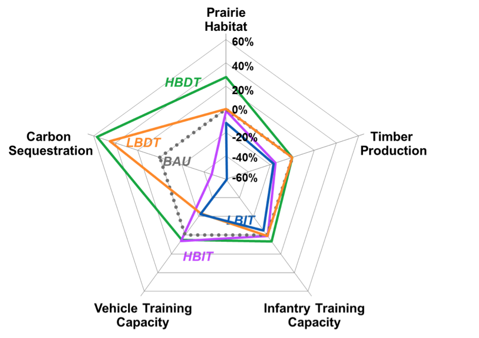
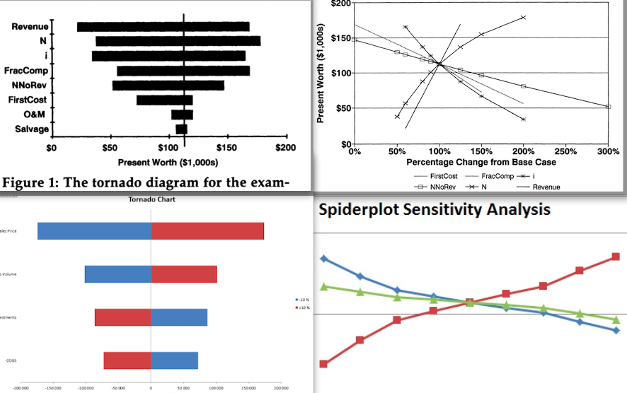

# Design strategies to display natural capital information {#sec:UserGuide}

This chapter gathers learnings from in a literature review on static and dynamic approaches to displaying complex data and existing ... Then, and most importantly this chapter aims to explore the design strategies to express and display multi-dimensional, spatial, multi-objective, uncertain data and combinations of these. This focus corresponds to the specific challenges faced while communicating natural capital information.


## Specific data visualization challenges
### Analysis/proof of need

The display tasks gathered in the survey (detailed in section \ref{sec:survey}) appeared to be right on point as the average scores, in terms of general usefulness, were all higher than 3.5, and 84% were higher than 4.0 and 47% higher than 4.5. As these results proves the relevance of these display tasks, the structure of the present user guide will follow the same order.

### How to read this document

This document is intended to support and guide analysts who need to display nat cap info. 
**TODO**
METHOD : Strong of the learning of the previous chapter on \ref{sec:litreview}, and the knowledge of currently used displays among ecosystem services analysts at The Natural Capital Project and beyond, this chapter proposes a toolbox to support analysts in their tasks of communicating natural capital information. This user guide is structured around 6 main topics encountered in ecosystem services analysis: portfolios, spatial and non-spatial ES model outputs, scales, uncertainty and beneficiaries. In each topic, several specific display tasks are listed and solutions are suggested (... DYNAMIC/STATIC? THESE SOL ARE STARTING POINTS THAT SHOULD BE TAILORED TO EACH CONTEXT.) 
Along with suggested tools (programming language or software), ready-to-use when available.

These solutions were (subjectively?) selected based on several criterion (see section \ref{sec:criterion}). However, when it comes to data visualization and clarity, some subjectivity cannot be avoided ..

Also, data visualization is really a case-by-case and efficient displays really depends on the underlying data and information to convey. This user guidance aims to serve as a basis suggesting several options to be (se réapproprier) by the analyst. to inspire to analyst.

**Tailor**, the suggested displays have different degrees of complexity and the analyst should pick a complexity level according to :

* the audience targeted:
*  the time at disposition: conveying the key results and the conclusion, or should we go in depth ?
*  document type : static or dynamic, 
* Presentation type: (should it be a self explanatory document, or will the analyst present it?)

Plots and graphs are not always necessary. Sometimes, the full data table is the best visualization. For example, in the case of an mid-project intermediary report for a meeting with experts on the project, it is likely that plots will lead to questions digging in details, where showing the full dataset and how solution where selected, and compare to each other is necessary. 

## Multi-dimensional data
In the context of ES, multi-dimensionality arises from multi-objective problems, such as cases where mutiple ES are considered and their trade-offs are to be explored, but also from (*where do we encounter multi-dim in ES besides multi-obj???*) Visual decision support tools are very relevant in field of multi-objective optimization problems[^0326back]. In the  typical cases, there is no unique optimal solution, but a collection of Pareto optimal ones [@Hadka2015], i.e solutions where improving the result towards one objective result a decrease in performance with regards to another objective  [@paretoUNIL]. Efficient visualizations empower the user with the ability to navigate through thousands of potential solutions, compare them and understand trade-offs, leading to performant decision-making. 

*FOCUS ON VISUALIZING TRADE-OFFS AND INCLUDE EVERYWHERE TODO*

Relevance : for scenario comparison, multi-objective optimization. For multi-objective optimization under uncertainty, the number of scenario considered can be very large. 

Multidimensional data visualization has been given considerable attention, as computational capacities have been increasing and the amount of produced data exploding. Multi-dimensional data exploration has taken several directions, based on a geometric projection techniques, to which distortion and interaction techniques (discussed in sections \ref{sec:disto} and \ref{sec:interactivefeatures}) can be added to further improve these visualizations [@Keim]. The curse of multi-dimensionality, as explained by [@Allen1] is that graphical displays become less informative as the dimensions and complexity of data sets increase. However, he argues in favor of detailed graphs showing more data and revealing more informations.

 [^0326back]: Vocabulary note: "multi-objective" refers here to problems with three or more objectives, also called many-objective problems [@Fleming05] or high order-Pareto optimization problems [@Reed04]

###Time-series data: line charts, streamgraphs and more
For data including several independent variables, and a dependent one, line charts is a version of a scatter plot where points are ordered (on the x-axis), and joined with segments. Line charts (also refered to as run charts for time-series data, or index charts when interactive) highlights relative changes, these are a good options when comparing the independant variables. Streamgraphs, also called stacked graphs, sums visually the time-series values around a central axis by stacking area charts on top of each other [@Tour]. These work only for positive values, and provide general view of the data, but are not effective for visualizing details, also they are more efficient in interactive form than static [@datavizz]. In the case of very large timeseries datasets, horizon graphs is a very space-effective option, despite a certain amount of learning time. Horizon graphs consists in filled line charts, where negative values are mirrored (and colored typically in red) and then the chart divided into bands that are overlayed using transparency effects; the space used is divided by four thanks to these two transformations [@horizon]. When the goal is to compare monthly values over the years and the different year, a fairly recent display solution has been suggested: temporal maps [@temporalmap].

![Illustrations of concepts of streamgraph [@streamchart], horizon graphs[@horizon] and temporal map[@temporalmap] *Should I add line charts or unecessary?* Image to update ! Todo?](../images/horizon_stream_temp_combined.png){#fig:todotodo}

*EXAMPLE: SOME SORT OF LINE GRAPH FOR MULTI-OBJ OPTIMIZATION (STACIE?)*

####Comprehensive plotting 
Through comprehensive plotting, multi-variate metrics can be visualized. For example, figure \ref{fig:compreh} illustrates a case of a 4-dimensions dataset plotted with four 3-dimensions figures to display 4*3^3 data points.
Spatial metrics can also be visualized through histograms comparing main summary statistics in different scenarios (e.g the percentage of land areas covered by each 3 category is displayed for 3 drivers, and 4 scenarios using small multiples histograms in [@villamor14], figure 4)[^11back].

![An example of comprehensive plotting where [@Sun14] displays results of 4 metrics (one per figure), as several line plots (for several variables, here one per market level), and varying parameters (here 3 parameters with 3 possible values each resulting in $3^3$ data points per market level, per figure. This is one of four figures corresponding to the metric "Edge density".](../images/sun.png){#fig:compreh}

[^11back]: A side concern that may come up in these cases, is about data management: the total size of the runs can become is too large for available main memory. A strategy is to precompute summary statistics, such as the mean and extrema [@PotterWilson].

###Small Multiples
An effective alternative to coercing all the data in a single plot (risking overplotting) is displaying small multiples. The concept is to replicate the same simple graph structure (in terms of axis, shape and scale), for many datasets, ordered logically. The cognitive process of understanding the graph is undertaken only once, and the understanding then is replicated while scanning all other multiples. This strategy is very efficient in many cases for comparison. Referred by Edward Tufte as "multivariate and data bountiful", they enforces comparisons of alternatives, differences and changes [@tufte]. This displaying startegy has also been called trellis chart, lattice chart, grid chart, or panel chart. It can be applied to many types of graphs.

![Small multiples applied to (a) line plots [@small_mult_lines] and (b) spatial data [@small_mult_maps]](../images/smallmultiples.png){#fig:todotodo2}

###Scatterplots
The classic scatterplot displays data with two to three dimensions, using cartesian coordinates and two or three axes. In a **3D scatterplot**, solutions are represented as points in the space.  Additional dimensions can be represented by changing attributes (color, shape, size, orientation, etc), however concerns about clarity and risk of overwhelming the plot may occur. Interactivity allows the user to perform selections of one or multiple solution point(s). 

A **Scatter plot matrix** combines the small multiple strategy with the classic scatterplot; abbreviated SPLOM, it displays relationships between every pair of variables.

In the context of multi-objective optimization, to understand trade-offs and synergies between several objectives under many scenarios, scatterplots are a great option. The commonly used **trade-off curve** is a scatterplot displaying objective scores, with each an axis per objective, and a datapoint per scenario. A third objective can be displayed by adding a colorscale or size-scale. Also, 3D scatterplots are often used for up to four objectives (e.g in figure \ref{fig:hadka} or the VIDEO software [@Kollat_Video]). Over 4 objectives, small multiples of trade-off curves are very relevant.

*bpb NEED EXAMPLE OF SMALL MULTIPLE SCATTERPLOTS TRADE OFFS CURVES (I asked Dave you mentioned in the survey he uses this)*

###Parallel coordinates plot *bpb is this section better now?*
Parallel coordinates plots are very effective to display different solutions in a multi-objective context to understand trade-offs and synergies between objectives under several scenarios. The number of scenarios is then nearly unlimited, and so is the number of objectives, to the limit that the horizontal axis fit the page. Scenarios are represented as lines, distinguished by varying colors, which intersect horizontal axis representing the objectives. Patterns are clearly visible [@Achtert2013_6]. The vertical direction of preferred solution must be clearly indicated to assist interpretation. 

Combining parallel coordinates with interactive features offers interesting options to explore the data, for example brushing allows to extract trends over subsets, [@andrienkopp] recommends linking to other graphics.

Tradeoffs are illustrated by crossing lines. However, one limitation is that each axis having at most two neighboring axis, only N-1 relationships of $\binom{N}{2}$ combinations for an N-dimensional dataset can be visualized at once. This can be overcome by re-ordering the axis, possibly with an interactive tool, or by upgrading to a 3D parallel coordinate plot where the axis are still in parallel, but some appear closer [@Achtert2013_6], although this solution result in a much harder interpretation, which may explain why it is not widely used. 

 To compare and constrast alternative options, and explore the effects of trade-offs, 3D scatter plot and parallel coordinates plot are recommended by [@Hadka2015], as shown in Figure @fig:hadka. 

![Four objectives visualization with (a) 3D scatterplot and colors and (b) parallel coordinate plot, achieved with the OpenMORDM open-source R library [@Hadka2015]](http://ars.els-cdn.com/content/image/1-s2.0-S1364815215300190-gr3.jpg) {#fig:hadka}

###Radar charts 
 The radar chart, (that has also been refered to as spider chart[^5353back], web chart, star chart, polar chart, or Kiviat diagram.[2][3]) is the parallel coordinates plot version in polar coordinates. It can be an interesting way to visualize trade-offs. However, they tend to become cluttered and complicated if with many variables, making comparisons very difficult [@datavizz] [^100back]

[^100back]: see also petal charts [@spiderman_bad_Ref].

{#fig:radar}

###Other displays 
Other statistical distributed data displays more specific to some data types include **Stem-and-Leaf Plots**, which is a variant of horizontal histogram painting a frequency distribution with numbers classified forming the histogram-like bars; and **Q-Q Plots** that compare probability distributions by graphing their quantiles where values lining up will reflect linear correlation [@Tour]. 

More display techniques have been explored, but are not widely used. To mention just a few, in the 1990's, were developed the **prosections views** [@prosections] that build view of high-dimensional objects through projection (in one or two dimensions), followed by section (i.e intersection of subspaces). Also, the **Hyperslice** [@Wijk] attempts to represents multi-dimensional function as a matrix of orthogonal two-dimensional plans. 

For very high-dimensional data, one may consider **pixel-oriented visualization** [@Keim] which consists in using each pixel to display one data value. 

### Reduce dimensions
Another approach to reduce cognitive complexity of multi-dimensional data, is to reduce the dimensions in some coherent way. For example, the **principal components analysis** (PCA) can be conducted to reduce the number of variables by combining the correlated ones [@hotelling1933analysis]. Similarly, the **choice modeler approach** aims to evaluate multiple decision variants, in a very large decision space. The concept is to identify criteria that do not influence the output (here, the decision option ranking), and remove these dimensions, to simplify without loosing correctness [@Piotr]. 

NEED EXAMPLE RYAN COMBINE VARIABLE UNTIL ITS 2 DIMENSIONS (RYAN)

Several options to display multi-variate data were discussed. However they all realistically apply to a limited number of variables. As dimensions of the data increase, **multiple linked views** become necessary to convey the complex information, giving different perspectives to the viewer. 

## Spatial data 
*Possible tools : ArcGIS, QGIS, PyGeoprocessing, Python, matplotlib, R, CV / HRA Dashboards*

###General classification of maps 
####Chloropleth maps and proportional symbol maps
Chloropleth maps are very effective and widely used to display a continuous or categorical spatial variable aggregated by regions. The variable of interest is expressed by coloring (or using patterns on) these geographical areas. Particular attention needs to be given to the choice of patterns (see section \ref{sec:colors}). Furthermore, it is necessary to normalize[^212back] raw data values may be necessary to ensure graphical integrity [@Tour]. However, the main drawback is that larger areas appear emphasised [@datavizz].
 
Another solution for continuous spatial data aggregated by regions is the graduated symbol map (or proportional symbol map, also called bubble map [@datavizz]) that overlays symbols to the base map. In this case, the underlying area does not affect the perception of the variable considered [@Tour]. These two approaches can also be combined, allowing to express more than one variable.

[^212back]: Normalizing consists in dividing the variable of interest per unit area; e.g to express population, the population per square kilometer should be displayed.
 
#### Heatmaps, isopleths and dot density maps
Displaying density of occurence, and identifying clusters can be achieved with heatmaps and hotspot maps. The heatmap can be understood as the continuous version of the chloropleth map, whithout aggregation of the data. It visualizes a scalar function over a geographical area [@Brodlie]. Similarly, in the dot distribution map (or dot density map), the density of dots represents the intensity of the variable. 

\begin{figure}
\centering
\begin{subfigure}{.1\textwidth}
  \centering
  \includegraphics[width=.4\linewidth]{images/maps1/map1.png}
  \caption{Chloropleth map}
  \label{fig:sub1}
\end{subfigure}%
\begin{subfigure}{.3\textwidth}
  \centering
  \includegraphics[width=.7\linewidth]{images/maps1/graduated.png}
  \caption{Graduated symbol map}
  \label{fig:sub1}
\end{subfigure}%
\begin{subfigure}{.5\textwidth}
  \centering
  \includegraphics[width=.7\linewidth]{images/maps1/dot.png}
  \caption{Dot density map}
  \label{fig:sub4}
\end{subfigure}%
\begin{subfigure}{.5\textwidth}
  \centering
  \includegraphics[width=.5\linewidth]{images/maps1/heat.png}
  \caption{Heatmap}
  \label{fig:sub3}
\end{subfigure}
\caption{Maps types from }
\label{fig:test}
\end{figure}

#### Contour maps 
Also know by contour maps, or isarithmic maps, isopleth maps they display variable with contour lines (isopleths) joining the points where the variable has a constant value. For example in the field of ecology, isoflors are isopleths connecting areas of comparable biological diversity [@isoflor]. Color fills may be used to enhance the map pattern. 
Contouring can also be used to highlight areas on a map, as in figure \ref{fig:myanmar_biodiv-ppl}), which combines informations about two independant variables, overlaying two types of maps.
![Combining informations about biodiversity (contour maps in red showing the key biodiversity areas) and about ES benefits (chloropleth map with green gradient), overlayed on a relief map [@Myanmar16]](../images/Myanmar_benefit-people.png){#fig:myanmar_biodiv-ppl}

####Cartograms
Cartogram also illustrate data aggregated over regions. The variable to be expressed is substituted to the geographical distance or area. The regions are in the same locations with respect to each other, but their geometry is distorted proportionally to the variable of interest [@Tour]

![Cartogram displaying population (variable) per country (regions of aggregation) [@carto_img]](../images/carto.png){#fig:carto}

#### Flow maps 
A flow map illustrates movement in space and/or in time. The intensity of a flow is represented by the thickness of the line depicting it [@datavizz]. Flow maps are typically used to visualize migrations of animals, but could also be applied to pollution load transfer, or groundwater recharge from a region ot another. 
{>> better in context of ES? <<}

![Minard's Napoleon's March figurative map. This epic example of flow map, drawn up by M. Minard in 1869, depicts the successive losses in men of the French army in the Russian campaign of 1812-1813. It figures multi-variate data, including 6 dimensions that are the army size, its direction, its location in (x,y) coordinates, the dates and the temperature in the lower part of the display. *"The best statisctical graphic ever drawn"* according to Edward Tufte is an example of displaying complexity with clarity. Its great strength reside in its capacity to encode many variables. This example reminds also that successful and effective visualization are very specific to the dataset and message, and its buty resides in the fact that it is very tailored to the story to be conveyed, here: the numerous deaths of soldiers. 
The text translates to: *The numbers of men present are represented by the width of the colored zones at a rae of one millimeter for every ten thousand men; they are further written accros the zones. The red designates the men who enter into Russia, the black those who leave it. The information which has served to draw up the map has been extracted from the works of M. M. Thiers of Ségur, of Fezensac, of Chambray and the unpublished diary of Jacob, the pharmacst of the army since october 28th. In order to better judge with the eye the diminution of the army, I have assumed that the troops of Prince Jérôme and the Marshal Davoush who had been detached at Minsk and Mokilow and have rejoined around Orcha and Vitebsk had always marched with the army.* ](../images/Minard.png){#fig:minard}

###Two widely used ES maps
Two types of chloropleth maps are very often used.

####Portfolios TODO
Categorical : land cover.
*Example*
Careful care must be given to symbology, see recommendations in section \ref{sec:colors}. (+see stacie/ginger colorscale email)

####Objective score maps TODO
spatial ES model outputs displays, continuous data, at pixel or polygon level.
Combined
*Example*

###Spatial visualization of tradeoffs
In the context of optimization, ES analysts often have to figure out where, on a landscape, do activities produce co-benefits, and where are they in conflict ? That is: where does an intervention move multiple ES metrics (aka objectives) in the same direction i.e where are the "win-wins"? And on the other hand, where in space is a given intervention or scenario contribute to some metrics at the expense of others? 

In the case of only 2 scenarios or only 2 objectives, one could show change maps, or side by side maps, i.e techniques used to compare 2 maps, detailed in \ref{sec:comp_map_2}. For more objectives, maps such as figure \ref{fig:spatialtradeoffs} can display location of synergies/tradeoffs of intervention/scenario on multiple ES metrics. (*bpb:  Do I need to add more detail explaning how map was constructed or is it pretty straight forward?*)

![Priority and conflicts areas, in the case of 3 objectives: biodiversity (BD), water quality (WQ) and profit. Thanks to this map, the decison-maker can decide where to intervene on the landscape, depending on which objective(s) (s)he prioritzes [@QUICK]](../images/quick.png){#fig:spatialtradeoffs}

A remaining subquestion is about the intensity of tradeoffs and synergies in space: where are tradeoffs more or less stark? An extension of figure \ref{fig:spatialtradeoffs} could be envisioned, varying transparency to represent intensity.

Another strategy consists in combining trade-offs curves with small multiples of objective score maps.
"In the past for PPFs using raster data, I have converted cells to points in ArcGIS and attached service values at each point to the attribute table. With fine scale rasters of spatially continuous service value, it is usually only necessary to extract a sample of these points into a data. This data is then imported into R for visualization and further processing."
TODO
Examples: Polasky + describe Peter 's The Middle Ceddar visualization[^009back]

[^009back]: https://phawthorne.github.io/mc-vis/

###Relationship between two independant variables 
Combining two maps 
Displaying side by side the two input map and the one combining these.
![ ... [@Myanmar16]](../images/combine_my.png)

####Spatial correlation
A very cool way of displaying spatial correlation between an ES and something (here LER) [@jgong]
![A very cool way of displaying spatial correlation between an ES and something (here LER) [@jgong]](../images/spatial_correlation_jgong.png)

See also figures \ref{fig:myanmar_biodiv-ppl} (combines informations about two independant variables).

####Beneficiaries {#sec:beneficiaries}
The survey conducted highlighted growing interest in the topic of displaying the beneficiaries (TODO CiteSurvey). However, this tasks appears to be very context specific. Typically, the displays would aim to quantify and show the beneficaries impact, possibly by subgroups, and often their location in space. It is also often of interest to contrast beneficiary distribution in space with service distribution in space. 

Figure \ref{fig:myanmar_forest} highlights depend

![Combining ES maps with population maps to show people's dependency to ES [@Myanmar16]](../images/Myanmar_people_depend.png){#fig:myanmar_forest} *Ask Stacie*

## Comparison of mutiple spatial runs {#sec:compare}
Runs refers here to different versions of a spatially explicit variable; this section deals about comparing multiple maps expressing the same variable. This multiplicity of outputs may correspond to multiple objectives, various scenarios or varying parameters values (i.e sensitivity analysis, this case is further described in section \ref{sec:SA}). Summarizing these mutiples spatial model outputs is necessary in applications such as:

* portfolios comparisons, to understand trends in agreement and disagreement on recommended action, in contexts of land use change planning, optimization. 
* comparison of ES model outputs such as objective scores at pixel or polygon level, to understand similarity and differences between maps of several ES objectives under one scenario, or the maps of same objective under several scenarios. Many maps are often generated under many combinations of scenarios or parametric uncertainty. Relevant examples also include comparing objective score maps associated with many points on an optimization frontier.

Comparison and summaries of maps can be achieved either by visualizing spatially through maps (\ref{sec:comp_map}) or through quantitative indices and metrics synthetizing the results aspatially (\ref{sec:comp_stat_cat} for categorical data summary indices, \ref{sec:comp_stat_cont} for continuous data).

**Tools**: Automated comparison of maps can be achieved with softwares like the Map Comparison Kit[^127back] [@visser2006map]. An algorithm called Mapcurves, implemented in R and Matlab, provides a goodness-of-fit measure based on spatial overlap.
[^127back]: MCK compares raster maps using fuzzy set map comparison, hierarchical fuzzy pattern matching, and moving window based comparison of landscape structure. See $http://mck.riks.nl$. 
 
###Maps displays 
#### Between 2 maps {#sec:comp_map_2}
**Interactive switching between maps**\
For the examination of (dis)agreement between two maps, analysts often like to flip back and forth between the two. This is easy to do in GIS softwares and is a convenient solution for the data exploration purposes. Nevertheless, this method is not always suited for communication purposes. Plus, this interactive solution doesn't apply to static documents.

\ **Side by side maps**\
Show the two maps next to each other. This is not the most space effective option, but allow an intuitive understanding and faciltiates comparison. The two maps must be within eyespan (careful to page breaks).

\ **Change map**\
Substracting one map to the other (generally corresponding to the baseline scenario) results in a change map. Typically change maps uses diverging colorscheme, two colors representing respectively increase and decrease, and the intensity gradient reflects the amount of change. 
Suited for (examples)\

![Change map displaying the amount of additional sediment export (in percentage) comparing a future scenario with the current baseline one [@Myanmar16]](../images/changemap.png)

\ **Agreement map**\
= An agreement map (?): ça veut reien dire c'est tt et rien
* A single map showing which areas are consistently selected ( in case of portfolios). 
*  take top 20% of service for two ES and find areas of overlap. (in case of continuous Es model outputs such as objective scores per pixel. >> Stacie?)

TODO

#### Between many maps {#sec:comp_map_many}
The problem complicates when comparing many runs. 
\
**Footprint map** \

To express the agreement on doing an (any) activity across portfolios, footprint maps show which areas are consistently selected. Pixels are assigned a binary value (1 if the pixel was selected in the portfolio for any intervention, 0 otherwise), and these binary values are added up across pixel stack. 

To express agreement about an activity across portfolios, footprint maps can also be done for a specific category (1 is assigned is the pixel was selected in this category). \

**20%mapStacie?**\
* For ES results, the method of taking top 20% of service and seeing overlap between scenarios extends to many map comparison too.

**Modal portfolio and frequency map**\
For categorical data, the frequency map approach would display the most assigned category to each area across runs, with additionally a measure of how often this category was assigned [@RIOS]. In the context of portfolios, this is called the modal portfolio, displaying the most often chosen activity for each spatial unit[^55back]. The comparison part is held by the frequency map, which express how often was the activity chosen. Precisely, the frequency map is usually constructed as such: for each spatial unit, number of portfolios where the modal value is chosen divided by total number of portfolios. 
These two maps complements each other: the former is about summarizing when the latter hold indications on comparison. They can be overlayed or displayed side by side.

*Examples: RIOS TODO *

[^55back]: More precisely, the modal portfolio maps can either display the category assigned in most of the runs, or limit to these assigned in a certain threshold percentage of the runs. 

**Shannon diversity index**
An alternative to frequency maps, to summarize the categorical variance accross many runs is the shannon diversity indexes of each pixel: $SDI = - \sum_{i=1}^{R} p_{i} \ln(p_{i})$, with $\textrm{p}_{i}$ the proportion of cells assigned to category i, and $R$ the total number of categories. Here is how to interprete the SDI: when evenly distributed, $H = \ln(R)$, and as it approaches $0$, proportions in each category vary more. Hence, SDI reflects the relative abundance of each category across the pixel stack. So, the bigger the SDI, the most confident one can be about the pixel's most chosen category. Other diversity indexes can also be substituted. 

TODO MAYBE ; A **coefficient of unlikeability** measures variability in categorical data by considering how often, not how much, observations differ [@kader7]. It can be used as a type of variance for categorical interventions *[Ref here is Ginger!]*. 

**variant-invariant method**\
In the same vein, the **variant-invariant method** aims to distinguish the invariant regions, that is the areas where the category assigned is consistently the same [@Brown2005]

**“breakeven” or “next best” score**\
TODO RIOS  (*Does Breakeven prioritization scores apply to comparison of many maps? Ben: "it's comparing one particular map to a whole bunch of other maps (to find next-best values), but once  you've found the next best, it's just a calculation from two elements of the pixel stack. (That's probably confusing)*" 

**Fuzzy set approach**\
TODO !
The fuzzy set approach [@Hagen2003] assesses the similarity of several categorical maps, resulting in a fuzzy set comparison map where each cell displays a degree of similarity and an overall value for similarity, so-called $\kappa$-Fuzzy as it extends the Kappa index including fuzziness of category and of location.

**spaghetti plots**\
Visualizing flow data, **spaghetti plots** (figure \ref{fig:spag}) express consistency between runs. Widely used in meteorology, the consistency of the runs is expressed by how tightly clustered they appear. Spaghetti plots may be translated to continuous spatial data by using the isocontour of each run, which is useful when concerned about a specific threshold. *bpb: better?*

**3D plots overlaying maps**\
For continuous data, **3D plots overlaying maps** (figure \ref{fig:overlay}) have been used to highlight structural differences across maps. However, this solution seems limited to relatively small regions, and clearly distinguishable distributions of the variables expressed through color and height of the histogram. 

TODO merge subfigures: 
![Spaghetti plots displaying ensemble data sets [Potter, 2009]. The spaghetti plot is the isocontour of each run. If the runs agree (Fig. left), it will result in a coherent bundle. Slight disagrements induce divergence from the main bundle (Fig. right). *for categorical or continuous?*](../images/spaguetti.png){#fig:spag}

![3D histograms, organized according the geographical layout; extract from figure 8 of [@Huang13] -- Merge (subfigures!)](../images/3Dplotsoverlaying.png){#fig:overlay}

**Interactive map comparisons**\
Animation is of great interest in this context. Dynamic visualizations are very suited for displaying multiple spatial outputs, there are increasingly used to display results in the field of ABMs[^1back], encountering similar type of outputs [@ABMleelig]. 

(saut de ligne TODO)

Visual comparisons of maps is efficient and not too intense cognitively for human perception. However, it fails to rank quantitatively the results, nor is adapted to an important number of maps. Screening through hundreds of maps produced is not a viable option. Therefore, other solutions must be considered. 

[^1back]: Agent-based modeling (ABM), or indivisual-based modeling consist in representing phenomenas as dynamical systems of interacting agents, where an agent is a discrete and autonomous entity. Their individual behaviors are encoded, resulting in outputs describing the the agents' interactions that are used to describe complex systems. These systems can be a  variety of processes, phenomena, and situations in any field. [@ABM_intro] In the context of this work, ABM is of interest because of the high volume of multidimensional output data (induces by Monte Carlo sampling), the visualization and statistical analysis of these outputs can be applied.

###Aspatial metrics to summarize results and agreements of categorical maps {#sec:metricsmultrunscat} 
Non-spatial statistics, such as quantitative indices exist ...
#####Between two maps {#sec:comp_stat_cat_2}
There are different types of categorical (i.e discrete attributes) map consistency measures [@Kuhnert2005]:
\ **Total per categories**\
The coarsest approach would be to compare the total numbers of cells[^3back] assigned to each category, neglecting any spatial patterns. This gives a very general quantitative overview of the total per categories, that can be delivered as tabular data. (All the other, finer approaches detailed below imply a cell-by-cell comparison.)
[^3back]: *Vocabulary note: in this section, "cell" corresponds to the regional unit at which data is aggregated, it can be a region, a pixel, an HRU, a state...*

\ **Percent agreement**\
A basic cell-by-cell comparison method measures simply the overall agreement (or percent agreement) by calculating the portion of cells that agree between two maps:
(Cell-by-cell level of agreement) = (Number of direct matched cells between 2 maps) / (Total number of cells in map)

\ **Kappa index of agreement** \
KIA or Cohen's $\kappa$ is a widely used statistic measuring concordance between categorical items. This technique has proven efficient for cell-by-cell comparisons of spatial data [@Manson2005], as long as patterns and locations of changes are not involved [@Kuhnert2005]. It is more robust than a percent agreement because it takes into account the agreement occuring by chance. $\kappa = \frac{\textrm{p}_{0}-\textrm{p}_\textrm{e}}{1-\textrm{p}_\textrm{e}}$  with  $\textrm{p}_{0}$  being the proportion of units agreeing, and  $\textrm{p}_\textrm{e}$  the proportion of units expected to agree by chance (i.e the hypothetical probability of chance agreement). Complete agreement results in $\kappa = 1$ [@Cohen1960]. 

However, Pontius, who published about $\kappa$ [@Pontius2000] ended up reconsidering his positions and advocating against the use of this index because of several flaws, mainly the irrelevance of the randomness baseline in many applications, and the fact that it's the ratio is difficult to interprete and overly complicated, as only the numerator actually matters [@Pontius2011]. Instead, he suggests to use quantity disagreement and allocation disagreement measures (see next point). 

\ **Quantity & location fit** \
A more precise version of the $\kappa$ approach explained above consists in analyzing 2 metrics, measuring respectively the quantity disagreement and allocation disagreement. These are more helpful to understand both components of disagreement than with a single statistic of agreement. [@Pontius2011]. For example:

* The **quantity fit** informs on the number of cells that changed from one category to another, offering an overall comparison on the quantity of each category: $$Quantity \ fit = 1 - \frac{1}{N}\sum \left |  \textrm{a}_\textrm{1i} - \textrm{a}_\textrm{2i} \right |$$ where $\textrm{a}_\textrm{ki}$ is the number of cells assigned to category $i$, in map $k$ with $k \subseteq (1,2)$, $N$ the total number of cells in map and $C$ means all categories [@Kuhnert2005].
* The **location fit** informs on the number of cells that kept the category but changed location from one map to another:  $Quantity \ fit = (Location \ fit) \ - \ (Cell-by-cell\  level\  of\  agreement)$. Another possible way of measuring the location disagrement is the **distance between the locations of matching cells** in the maps can also be calculated [@Kuhnert2005]. An overall measure of distance between two discrete maps expresses the amount of agreement or the goodness of fit [@Seppelt2003217] and [@costanza].

\ **Jaccard index**\
Other indexes comparing agreement accross categorical datasets exist. However, very few to no applications in comparing maps has been found. 
The Jaccard index, also known as Tanimoto index, is computed as the ratio of the intersection of the two sets over their union: $$Jaccard\ index = \frac{Map1 \cap Map2}{Map1 \cup Map2}$$ [@jaccard]. Simple to understand, it ranges from 0 to 1, increasing with increasing similarity between the sets.
The **Sørensen-Dice coefficient** is a slightly different version of the Jaccard index. Also called the Dice similarity coefficient , or F1 score, it is calculated as such: $$Sorensen-Dice\ index={\frac {2|Map1\cap Map2|}{|Map1|+|Map2|}}$$. More similarity measures for categorical data have been explored by Lourenco [@ourenco2004binary].

\ **Taking into account shifted similar patterns...**\
The **moving window algorithm** further accounts for landscape patterns by considering neighboring cells in addition to the cell-to-cell comparison. It has been develop to answer the following problem: computing solely the number of cell-to-cell matches is not reliable in all circumstances, as if there is a matching cell right near by, it will not be taken into account (e.g if we compare two chessboards shifted by one well, the number of cell-to-cell matches is null although there is evident similarity not to be ignored) [@Kuhnert2005]. The **hierarchical fuzzy pattern matching** uses a different strategy to address the same concern, instead of moving a "window", it varies the zoom. It avoids drawbacks of a cell-by-cell comparison by aggregating the regional unit considered in patches, and conducting comparisons at different scales [@power2001].

#####Between many maps {#sec:comp_stat_cat_many}

When comparing a large number of maps, aggregation often is necessary to communicate results [@Brown2005]. Some of the metrics detailed above that calculate correlation between two maps may be extended to many maps comparison [@Seppelt2003217], like the approach #1.

\ **Total per categories**\
Calculating the total numbers of pixels assigned to each category (as in point 1 from previous section) resulting in a table, with categories in comuns and runs in rows, which works if there are not too many runs. If there are, one may display a simple table linking categories with summary statistics indicating some measure of the mean and the variance (e.g average and extrema or standard deviation), as exemplified in the table below. However, this measure only account for the overall amount of each category, and not for spatial distribution. 

| Land cover    |  Grass | Forest | Barren | 
| --------------------------------- | ----------------------------------- | --------------------------------- | -------------- |
| Average pixels [min;max]     | 121 [110;143] | 204 [158;226] | 25 [14;50] | 
| Average percentage ± standard deviation     | 35% ± 2% | 58% ± 3%  | 7% ± 3% | 

Table: Made-up example to illustrate the *total per categories* approach [^80back] 

*bpb: No reference. I litterally made this up,  it sucks?*
 
 [^80back]: Details of calculations can be found at: https://docs.google.com/spreadsheets/d/1wsm0-X5-pJ_I7J7nduWE_dmiOVWgSUyyo-51t58C8Vo/edit#gid=436596527

/ **Pixel stack methods**/
Finer methods imply to make calculations for each cell, in all the considered maps (as in, superposing all maps, and making calculation for the column of corresponding cells). For raster data, this technique of *column of cells* is referred to as **pixel stack** (bpb: reference for this term ? Not found in Pontius articles nor R/raster package reference...? TODO). To summarize agreement between runs in a single number, the measures suggested in \ref{sec:comp_map_many} can be aggregated. For example, the average SDI would give an indication of the consistency of the runs. However, these overall average do not give any indications on spatial patterns.

/ **Comparison of landscape metrics**/ (bpb: unclear? useless?)
Some spatial metrics allow to spatial patterns. They allow tabular comparisons of some runs (the indexes are calculated for each run) They include Area-weighted mean shape index, centrality indexes, contagion index... [@ABMleelig]. (* bpb: need more details ? (if so todo ABMleelig> 4.16*). Some are more specific landscape metrics, such as the average core area, which is the proportion of production land per land cover category [Parker2004], and the average patch perimeter-area ratio (PA-1) [@Ritters1995]. Landscape statistics measuring sprawl and frangmentation include landscape shape index (LSI), aggregation index (AI) contiguity index (CI) and centrality index (CTI). Together, they allow for comparison of landscape, spatial patterns of change and overall spread [@Sun14]. 

###Aspatial metrics to summarize results and agreements of continuous maps {#sec:metricsmultrunscont} 

A handy strategy if to **discretize the continuous data**, by sorting the dataset into categories corresponding to ranges of values. This allow to use all the metrics discussed above (section \ref{sec:metricsmultrunscat}) for comparison. However, the arbitrary classification will impact the results. For a reliable metric, it is therefore necessary to do several different classication (i.e discretize the dataset with different limits/size of categories). (bpb: reference for this is my brain, what do you think discretizing continuous datasets?)

#####Between 2 maps {#sec:comp_stat_cont_2}

**Aggregation of cell's values: sum or mean**
Each map can be summarized with a value aggregating cell's values. For example, for an objective score map, the overall objective score of the map is the sum of the pixel's scores. The average could also be used to aggregate. Once each map has an aggregated "summary value", these can be substracted to reflect the numerical difference in ES between 2 scenarios. 

**Statistical tests to summarize variance** ? (like average of difference between corresponding pixels, normalized ?)
Disagreement between two maps can be summarized by their variance, i.e the average of corresponding cell's squared difference: $$\sum_{cells} (v_1 - v_2)^2$$ where $$v_1, v_2$$ would be the same cell's value in $$Map_1, Map_2$$.
(bpb: no ref, this is out of my brain because couldn't find literature. But this should exist no ? Makes sense? Should remove?)

**Least squares** (??)
A conventional approach would be the least square on the plotted points [^776back] (Pontius, 2008)

**Spatial correlation coefficients**
Statistical indices like the Bivariate Moran's I or LISA aim to measure spatial autocorrelation between 2 variables in a same location [@akbar], which can correspond to two runs of the same variable. (bpb: enough? should dig more? out of scope?)

**Correlation coefficient** *relevant??*

* Pearson linear correlation: $$\rho _{X,Y}={\frac {\operatorname {cov} (X,Y)}{\sigma _{X}\sigma _{Y}}}$$. It ranges from -1 (negative linar correlation) to +1 (positive linear correlation), and 0 corresponds to maps not correlated, or its variant, the reflective correlation.

#####Between many maps {#sec:comp_stat_cont_many}
Besides discretizing the data and then using methods from \ref{sec:comp_stat_cat_many}, the solution would be an aggregation of aggregated map values. As mentioned above, each map can be summarized with a value aggregating cell's values. For example, for an objective score map, the overall objective score of the map is the sum of the pixel's scores. A second aggregation can follow: for example, the mean of these overall objective scores will give an indication of average total objective score of scenarios. (This could be interesting when comparing different subsets of runs). (bpb: is this super unclear? refers to agreement value plotted in webapp!)

### Influence of scale in map comparison {#sec:scale} 
(*bpb: is this section enough? if not what should I add really?*)
Questions of interests in the context of natural capital : 
Consistency of spatial patterns in pixel data, at coarser resolution 

The question of scale was briefly noted when mentioning the hierarchical fuzzy pattern matching algorithm. Pontius explores the influence of resolution in map comparison [@Pontius2008], by conducting comparisons at multiple scales. He notes that the format of the data (the resolution considered) impacts tremedously the results which sometimes are more due to this format, than the underlying mandscape patterns. 

## Uncertainty {#sec:uncertainty}
### Introduction to uncertainty & sensitivity analysis visualization
> "“Finding ways to accurately and effectively represent uncertainty is one of the most important challenges in data visualization today. And it’s important to know that visualizing uncertainty in general is extremely difficult to do.”  [@sohardtovizuncertainty]

It is often of interest to analysts to consider how input uncertainty and model structure affect the precision and robustness of findings. The inclusion of uncertainty estimates improves decision making [@reichert2005does] and [@beven2006undermining]. Because ecosystem services depends on unique landscape characteristics, each case is unique and different procedures can be specifically chosen to generate summaries of robustness and sensitivity [@lig14]. However, uncertainty is often just ignored in the representation, because it is challenging to visualize [@sohardtovizuncertainty]. Conveying both statistical and data uncertainties is nevertheless essential to an exhaustive communication of results. 

![Uncertainty analysis and sensitivity analysis *useless figure?* [@lig14]](../images/UA_SA-lig14.png)

Closely related concepts must be distinguished: uncertainty analysis (UA) aims to explore the variability of the results; whereas sensitivity analysis (SA) explores the factors responsible for such variability. Robustness is considered when conducting uncertainty analysis; defined as "the ability of a system to resist change without adapting its initial stable configuration" [@wieland212], it can be understood as insensitivity to changes [@Maier] or also a function of performance under many states of the world. In the context of decision making, a decision is qualified robust if not vulnerable to changes, i.e if it leads to the desired outcomes under different states of the world. However, the concept of robustness is somehow vague, and cover several interpretations overlapping with UA and SA. For example, assessing the robustness many runs resulting from uncertain inputs or model assumptions can be considered as a sensitivity analysis [@Pianosi2016]. *bpb: Is this paragraph unclear??* 

In the context of this study, the state-of-the art research will limit to scalar data, leaving aside data types that are rarely encountered in the context of natural capital information such as 3D datasets, that are further explored by [@Brodlie].

###Non-spatial data uncertainty displays 
Not only does uncertainty adds a dimension to the visualization, it is especially complex because it depends directly on the data itself, and also because uncertainty propagates, i.e if the data is transformed to be visualized, its underlying uncertainty propagates, not necessarly in a trivial way [@correa]. Uncertainty can be presented in different ways : as a function of the data, (as a PDF, as a multi-value data), as bounded data...

For one dimensional scalar data, uncertainty can be represented with **error bars** [@Ehlschlaeger]. **Box plots** are also common to express variability by showing the quartiles. An extension of these are the **violin plots**, additionally displaying the probability density (kernel density estimation) of the data at each value [@violin].

**Contouring** by displaying around the mean an indication of the spread, or the standard deviation, allow to visualize the range among which the variable can locate [@Brodlie]. This is common for time-series datasets.

###Spatial data uncertainty metrics {#sec:uncert_non_maps}
Many ES analysts came ot the conclusion that uncertainty seems best understood in an aspatial manner, as spatial representations can often be difficult to digest. Vsualizing uncertainty has traditionally been handled via tabular representations or in a narrative format (*bpb : ref here is survey responses form Ryan, Dave, ROb and Eric.. should I state a ref?*). In this context, summary metrics are necessary.

In general for uncertainty analysis, two statistics are very relevant to display: a measure of central tendency, such as the mean, and an indicator of dispersion, for example the variance [@lig14], but also extrema (minimum and maximum), and standard deviation; these measures of range are the most relevant when dealing with deep uncertainty. *bpb : reference?*

There are also specific measures for robustness, based on the amount of times, accross many runs in different states of the world, leading to desired solutions, i.e the cases where all criterias are met . Robustness measures of two types: **regret and satisficing measures**. The former seek to minimize expected loss, that is differences from an ideal solution due to deep uncertainties; the latter seek to maximize the good solutions [@Hadka2015]. Robustness of an output is contingent upon the consistency between multiple runs leading to this output, under varying conditions. Therefore, spatial metrics measuring agreement between multiple runs, as detailed in sections \ref{sec:metricsmultrunscat} and \ref{sec:metricsmultrunscont} can be used for assessing robustness, and will not be repeated here, to avoid redundancy. Furthermore, there is an approach specific to robustness in the context of decision making. Methods based on the **breakeven point** inquire about the magnitude of change that would result in changing the decision. The breakeven ratio is defined as the prioritization score of the best choice over the prioritization score of the second best choice. This metric applied to spatial data result in prioritization score breakeven maps, which are efficient displays of how much the prioritization score of the chosen category would need to be reduced before switching to the second best category [@RIOS] 

###Spatial data uncertainty mapped displays {#sec:uncert_maps}
The most common static visualization techniques for spatial data uncertainty include:

**Juxtaposition of an uncertainty map**
That is adding a separate similar figure to represent uncertainty, alongside the representation of the data.

 **Overlaying an uncertainty variable** 
 Overlaying a visualization of uncertainty on top of the main one. [@Bingham] overlays a contour map of an error field on top of a heatmap of the mean value of a multivalue dataset, but it is not so straightforward. Integrating additional geometrical objects, such as labels, volume rendered thickness, or error bars may express uncertainty [@griethe]. Circular glyphs and ribbons have been designed, in the context of weather forecast ensemble data, to visualize uncertainty [@sanyal].
 
**Modifying the displayed variable to account for uncertainty**
Varying the value of a free graphical variable, such as a property of the color palet used to visualize the main data can also express uncertainty. The first option is **"blurring"**: the focus is adapted proportionally to the level of uncertainty, this can be done through one of these parameters : contour crispness (« fuzzyness »), fill clarity, fod or resolution [@mac92]. Formally, blurring is defined as removing spatial high frequency details [@russ95]. **Saturation** is the second option, uncertainty is expressed by paleness, also referred to as whiteness [@hengl]. More options include texture and edge crispness variations, overall all these solutions are more intuitive but less precise [@griethe].

**Agreement maps**
Techniques for comparison of multiple spatial runs, such as frequency maps or spaguetti plots, can be applied in the context of uncertainty. See section \ref{sec:comp_map_many}.

**Interactive options**
In dynamic visualization, uncertainty representation can be more easily achieved. A swap button can allow the user to visualize successively the main data and its associated uncertainty on the same background map, allowing easier interpretation, with the possibility of going back and forth. This method is referred to as **toggling** [@Aerts03]. Other interactive options include the **clickable map**, where uncertainty information displays upon click [@Vander]. There has also been attempts to express imprecision dynamically adressing human senses via vibrations proportional to the level of uncertainty [@Brown], or smooth animation of sequence of different realizations of a model [@Ehlschlaeger].  There have even been attempts to display uncertainty by adding another dimension via sounds [@Lodha][@Fisher]. Another solution to convey accuracy is probabilistic animation : the uncertain points appear and disapear according to their accuracy, i.e the probability domain is sampled over time [@Lundstrom].

**Maps of uncertainty metrics per pixel stack**
Another strategy is to combine uncertainty metrics with maps, by displaying statistics calculated across cell stacks. For example, a map could show measures of dispersion like standard deviation or extremum, or measure of robustness such as the amount of time the cell has value in a certain range (for continuous data) or is assigned to a specific category (for categorical data). This approach has been considered, with the example of the Shannon diversity index, in section {#sec:comp_map_many}.

\ 
The techniques described above were mainly developed for continuous data, but can be adapted to categorical data. However specific techniques for categorical spatial data exist. In the context of landcovers, prioritization score maps express the effiency of a landcover/activity with regards to an objective [@RIOS] 

###Parametric uncertainty: sensitivity analysis displays {#sec:SA} 
*bpb:this is pretty superficial but is that enough - otherwise this is a whole other topic to dig in (See Pianosi2016)*
Sensitivity analysis aims to understand the influence of the inputs, and their uncertainty, on the outputs and their uncertainties of a model [@Pianosi2016]. To visualize the input/output relationship, a common and direct way is a **scatterplot** (for each input parameter, with input parameter considered on x-axis and the output on y-axis), the relationship is explicitly revealed, especially in the case of strctured dependencies. This corresponds to the so-called O(F)AT (one factor at a time) method [@hamby], e.g [@murphy04]. However, with a high number of inputs, scatterplots can become cumbersome. Then, partial derivative of the output by one factor can be displayed to assess the impact of small perturbations; however it explores only locally the input space around a baseline. Other metrics such as the percentage of output change per percentage of input change, or sensitivity indexes are also used. More details can be found in [@hamby]

Variance decomposition is another approach to sensitivity analysis; then **pie charts** displaying variance partitions are a good alternative [@ABMleelig]. By opposition to trying to display the impact of each inputs, variance-based method focus on finding the most influencing factors. The output variance is decomposed into parts corresponding to the contribution of each input, therefore displaying its impact on total variance [@Homma]. Pie charts are widely used mostly because they are easy to build and understand (*and named after a desert. Okay I know I'll remove this, just checking if you were reading :D (bpb)*). They are effective for small datasets (less than 6 segments of notably different sizes), and if segments are ordered according to size [@piepiepie]. Because only effective on small datasets, and inadequate for comparisons (between several pie charts), partisans of high density space-effective displays, like Tufte, argue against these charts.

![Expressing sensitivity analysis through variance decomposition, from [@lig14]](../images/sa.png){#fig:lig}

**Tornado diagrams** are also used to visualize the total impact of factors, and highlight their relative importance [@tornadospider]. They are horizontal bar charts corresponding to each input, plotted on the axis of output values. 

**Spiderplots** [^5353back] display these informations and more, including limit values and impact on output of each input, and also the amount of change in input leading to breakeven point. However, the amount of factors displayed is limited (to about 7 [@tornadospider]). These are 2D plots, with percentage of change from baseline on x-axis, and output values on y-axis, and several lines corresponding to each input. 

{#fig:spiderplot}

[^5353back]: Spiderplots or spidercharts is a blurry term to that has been used to refer both to 2-axis spiderplots (as in figure \ref{fig:spiderplot}), but also to multi-axis spiderplots (as in figure \ref{fig:radar}). 

Using landscape comparison metrics described in section \ref{sec:comp_stat_cat_many},  sensitivity analysis can be conducted through the Wilcoxon signed rank test assessing significance of mean differences. [@Sun14].

*Adrian:methods for showing which input parameters influence outputs non-spatially"?*

sensitivity analysis packages in multiple languages (SAlib for python, sensitivity for R)

## Summary
### Mutiple linked views
PETER

### Key take-aways
With no pretention of being exhaustive, this chapter gathers strategies to display complex data, in the context of ecosystem services model outputs. It took inspirations from the current data visualizations in different fields, such as agent-based modeling and ensemble data sets.

Overall, combining multiple linked displays seems to be necessary as complexity and number of dimensions increase, as argues [@potter] in the context of gaining insight on distribution of spatio-temporal simulation results, as well as the associated uncertainty. Arranging many views is aslo relevant to facilitate comparisons [@Buja]. Some of the most successful visualizations currently used combine interactive features and mutiple linked views to deliver broad information in an organized an straight-forward way, as exemplified by The Middle Ceddar Visualization[^009back].

The examples, guidelines and suggestions gathered above aim to support creation of effective visualizations. Nevertheless, the main thing to keep in mind is that graphs are here to support conveying the data's message; i.e visualizations should always be tailored to the specific need and dataset. The final visualization needs to be adapted to fit the document type and format, the audience adressed and will also depend on the functionalities of the charting tool used.

CONTEXT SPECIFIC

### Useful tools 
Chapter relevant if not all in table

Parallel coordinates plots

* https://reed.cee.cornell.edu/parallel-axis/
* http://syntagmatic.github.io/parallel-coordinates/
* in Python : https://waterprogramming.wordpress.com/2016/09/12/easy-vectorized-parallel-plots-for-multiple-data-sets/
* in R (linked with a 3D scatterplot): OpenMORDRM

Mutiple views ?
http://delivery.acm.org/10.1145/350000/345271/p110-wang_baldonado.pdf?ip=171.66.209.8&id=345271&acc=ACTIVE%20SERVICE&key=AA86BE8B6928DDC7%2E0AF80552DEC4BA76%2E4D4702B0C3E38B35%2E4D4702B0C3E38B35&CFID=698885994&CFTOKEN=85237999&__acm__=1480547267_54bb0860e703e0f12121386553fe243b

### Summary table for specific display needs *for analyst in a hurry*

