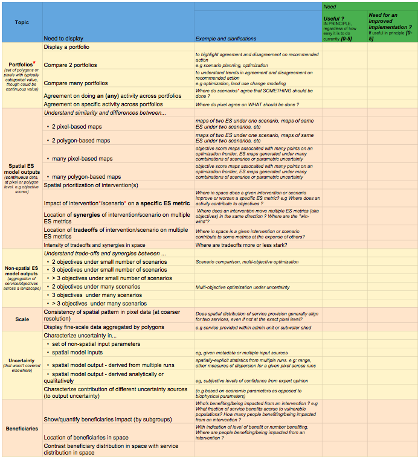

# Acknowledgements {.unnumbered}

Grant - Zeno Karl Schindler Foundation 
\
{There will be something here}

# Appendices {.unnumbered}

 
\begin{table}[H]
\centering
\begin{tabular}{|l|l|l|}
\hline
\textit{\textbf{Weeks}} & \textit{\textbf{Main focus}} & \textit{\textbf{Skills gained and tools learnt}} \\ \hline
1-3 & Project definition and scoping & Natural capital, InVEST \\ \hline
4 & Analysis of need & Surveying \\ \hline
5-10 & Literature review & Data visualization \\ \hline
11-12 & Figures generation (use case: Hawaii) & GIS (QGIS) \\ \hline
13-17 & Guidance document redaction & Markdown, LaTEX, Github \\ \hline
18-19 & Webapp design & - \\ \hline
20-24 & Webapp implementation & \begin{tabular}[c]{@{}l@{}}Html, CSS, Javascript (D3.js)\\ Python pandas library\end{tabular} \\ \hline
25 & Report redaction &  \\ \hline
\end{tabular}
\caption{Master thesis workflow: rough estimate of time allocation}
\label{my-label}
\end{table}

\iffalse

<table style="border-collapse:collapse;border-spacing:0"><tr><th style="font-family:Arial, sans-serif;font-size:14px;font-weight:bold;padding:10px 5px;border-style:solid;border-width:1px;overflow:hidden;word-break:normal;font-style:italic">Weeks</th><th style="font-family:Arial, sans-serif;font-size:14px;font-weight:bold;padding:10px 5px;border-style:solid;border-width:1px;overflow:hidden;word-break:normal;font-style:italic">Main focus</th><th style="font-family:Arial, sans-serif;font-size:14px;font-weight:bold;padding:10px 5px;border-style:solid;border-width:1px;overflow:hidden;word-break:normal;font-style:italic">Skills gained and tools learnt</th></tr><tr><td style="font-family:Arial, sans-serif;font-size:14px;padding:10px 5px;border-style:solid;border-width:1px;overflow:hidden;word-break:normal">1-3</td><td style="font-family:Arial, sans-serif;font-size:14px;padding:10px 5px;border-style:solid;border-width:1px;overflow:hidden;word-break:normal">Project definition and scoping</td><td style="font-family:Arial, sans-serif;font-size:14px;padding:10px 5px;border-style:solid;border-width:1px;overflow:hidden;word-break:normal">Natural capital, InVEST</td></tr><tr><td style="font-family:Arial, sans-serif;font-size:14px;padding:10px 5px;border-style:solid;border-width:1px;overflow:hidden;word-break:normal">4</td><td style="font-family:Arial, sans-serif;font-size:14px;padding:10px 5px;border-style:solid;border-width:1px;overflow:hidden;word-break:normal">Analysis of need</td><td style="font-family:Arial, sans-serif;font-size:14px;padding:10px 5px;border-style:solid;border-width:1px;overflow:hidden;word-break:normal">Surveying</td></tr><tr><td style="font-family:Arial, sans-serif;font-size:14px;padding:10px 5px;border-style:solid;border-width:1px;overflow:hidden;word-break:normal">5-10</td><td style="font-family:Arial, sans-serif;font-size:14px;padding:10px 5px;border-style:solid;border-width:1px;overflow:hidden;word-break:normal">Literature review</td><td style="font-family:Arial, sans-serif;font-size:14px;padding:10px 5px;border-style:solid;border-width:1px;overflow:hidden;word-break:normal">Data visualization</td></tr><tr><td style="font-family:Arial, sans-serif;font-size:14px;padding:10px 5px;border-style:solid;border-width:1px;overflow:hidden;word-break:normal">11-12</td><td style="font-family:Arial, sans-serif;font-size:14px;padding:10px 5px;border-style:solid;border-width:1px;overflow:hidden;word-break:normal">Figures generation (use case: Hawaii)</td><td style="font-family:Arial, sans-serif;font-size:14px;padding:10px 5px;border-style:solid;border-width:1px;overflow:hidden;word-break:normal">GIS (QGIS)</td></tr><tr><td style="font-family:Arial, sans-serif;font-size:14px;padding:10px 5px;border-style:solid;border-width:1px;overflow:hidden;word-break:normal">13-17</td><td style="font-family:Arial, sans-serif;font-size:14px;padding:10px 5px;border-style:solid;border-width:1px;overflow:hidden;word-break:normal">Guidance document redaction</td><td style="font-family:Arial, sans-serif;font-size:14px;padding:10px 5px;border-style:solid;border-width:1px;overflow:hidden;word-break:normal">Markdown, LaTEX, Github</td></tr><tr><td style="font-family:Arial, sans-serif;font-size:14px;padding:10px 5px;border-style:solid;border-width:1px;overflow:hidden;word-break:normal">18-19</td><td style="font-family:Arial, sans-serif;font-size:14px;padding:10px 5px;border-style:solid;border-width:1px;overflow:hidden;word-break:normal">Webapp design</td><td style="font-family:Arial, sans-serif;font-size:14px;padding:10px 5px;border-style:solid;border-width:1px;overflow:hidden;word-break:normal">-</td></tr><tr><td style="font-family:Arial, sans-serif;font-size:14px;padding:10px 5px;border-style:solid;border-width:1px;overflow:hidden;word-break:normal">20-24</td><td style="font-family:Arial, sans-serif;font-size:14px;padding:10px 5px;border-style:solid;border-width:1px;overflow:hidden;word-break:normal">Webapp implementation</td><td style="font-family:Arial, sans-serif;font-size:14px;padding:10px 5px;border-style:solid;border-width:1px;overflow:hidden;word-break:normal">Html, CSS, Javascript (D3.js) Python pandas library </td></tr><tr><td style="font-family:Arial, sans-serif;font-size:14px;padding:10px 5px;border-style:solid;border-width:1px;overflow:hidden;word-break:normal;vertical-align:top">25</td><td style="font-family:Arial, sans-serif;font-size:14px;padding:10px 5px;border-style:solid;border-width:1px;overflow:hidden;word-break:normal;vertical-align:top">Report redaction</td><td style="font-family:Arial, sans-serif;font-size:14px;padding:10px 5px;border-style:solid;border-width:1px;overflow:hidden;word-break:normal;vertical-align:top"></td></tr></table>

\fi

{#fig:survey width=100%}

![When Evaluating a Figure for Clarity and Completeness, Consider the Following Questions[@Allen1]](../images/assess_table.png){#fig:crit2 width=80%} 

![Land cover in Pu‘u Wa‘awa‘a under different restoration and climate scenarios. The purple contours on the current land cover map outline the enclosure areas corresponding to the partial restoration scenario. The maps on top correspond to the evolution of land cover, under the current climate for the partial and full restoration scenarios. The maps underneath correspond to the evolution of the land cover, under the RCP 8.5 future climate projection for the partial and full restoration scenarios. (figure by author in @PWW)](../images/Fig1.png){#fig:hawaii1 width=80%}

{#fig:hawaii2 width=80%}

{#fig:hawaii3 width=80%}

{#fig:hawaii4 width=80%}

#### Workflow to generate the dataset {.unnumbered} {#sec:workfloww}
*Courtesy Benjamin Bryant*

As implemented in the context of the development of the visualization tool (see chapter \ref{sec:TheTool}), the spatial optimization consists of a non-trivial series of steps and intermediate products. The basic workflow to generate a single trade-off frontier is as follows:

1. Generate static marginal value maps for each intervention by running each ecosystem service model with each intervention implemented wherever it is feasible to do so, and differencing with respect to ES provisioning levels on the default “base” landcover.
2. Generate a set of weight combinations, and specify cost for each intervention and total budget.
3. For each weight combinations:

* Create weighted objective scores for each pixel, for each intervention.
* Create weighted cost-effectiveness scores for each pixel, for each intervention, by dividing by the cost.
* Sort at each pixel to identify the intervention with the highest weighted cost-effectiveness score for each pixel.
* Use a greedy search to select the highest cost-effectiveness pixels until the budget constraint can no longer be satisfied. The set of chosen pixels defines a portfolio.
* Extract the base value and change in each objective score for each pixel by indexing the portfolio against the static marginal value maps. This defines the objective score map and marginal value objective score maps.
* Sum pixel-level scores to identify aggregate landscape-wide objective score values for a particular run.
4. Repeat for each weight combination to complete a frontier.

To generate many portfolios, the above steps are wrapped, by:

1. Specifying an experimental design for ES model inputs.
2. Specifying an experimental design for optimization parameters (budget, other constraints).
3. Generating unique index encodings for groupings that maybe relevant for visualization or analysis (eg, indexing tradeoff curves, or objective weight combinations).
4. Running the frontier-generating procedure defined above for each “row” of the full experimental design.