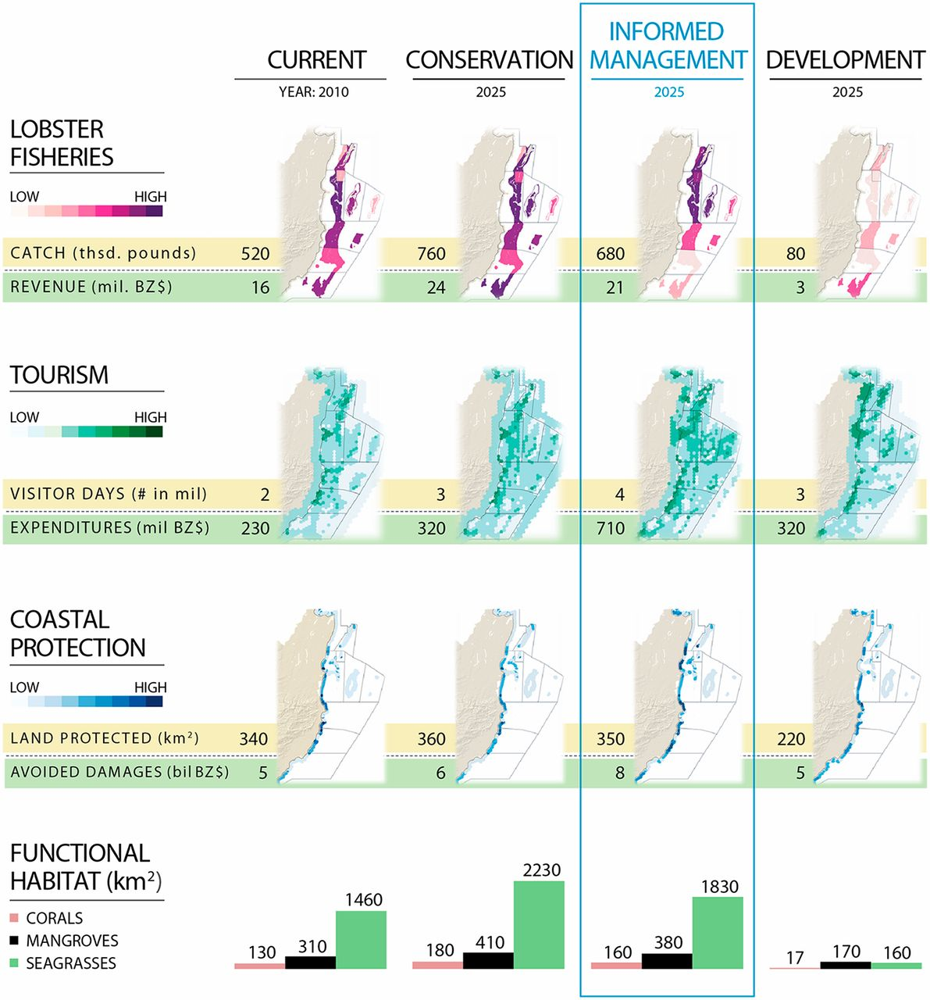
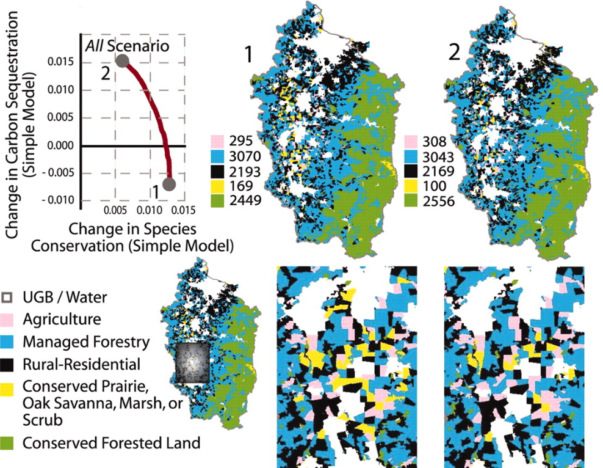
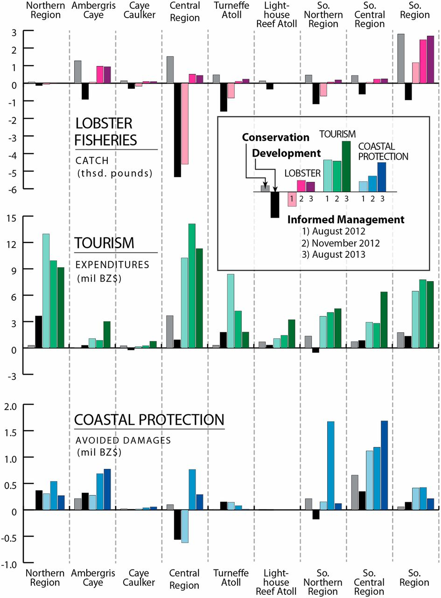

####“Breakeven” or “next best” score{.unnumbered}
Useful in the context of assessing robustness of prioritized activities, the breakeven approach compares a map (supposively, the modal portfolio) to many others. It answers the question of "how much things would need to change before a different decision is taken" [@RIOS]. For each cell, the breakeven map displays a fraction corresponding to the amount of change that the prioritization score would need to be reduced for another activity to be chosen. 
*bpb: is my interpretation right ? I still think this approach is slightly confusing!*

#method
##Display toolbox structure
To each display tasks was associated  corresponding concrete questions, and examples to which the user could identify its projects. Then, for each task, several solutions would be proposed according to options the user specifies, namely the target audience (analysts, stakeholders, public), the document type (static, dynamic). For each solution, implementations
**Basic question > display task > document type > visualization > implementation**

____
#relationship btw var:
![(a) Displaying spatial correlation coefficients, between two variables (here an ES and LER) [@jgong]](../images/spatial_correlation_jgong.png){#fig:jong width=50%} **combine with ^^^**

####Overlaying information {#sec:beneficiaries}
The survey conducted highlighted growing interest in the topic of displaying the beneficiaries (*TODO bpb how to Cite Survey results?* link to section \ref{sec:survey}). However, this tasks appears to be very context specific. Typically, the displays would aim to quantify and show the beneficaries impact, possibly by subgroups, and often their location in space. It is also often of interest to contrast beneficiary distribution in space with service distribution in space. For example, figure \ref{fig:myanmar_biodiv-ppl} highlights the relationship between people dependency on forests and the location of KBAs.

// ![(b) Overlaying variables: combining informations about biodiversity (contour maps in red showing the key biodiversity areas) and about ES benefits (chloropleth map with green gradient), overlayed on a relief map [@Myanmar16]](../images/Myanmar_benefit-people.png){#fig:myanmar_biodiv-ppl} **combine with ^^^**

Addl figure
{#fig:addl}
![(b) Change map displaying the amount of additional sediment export (in percentage) comparing a future scenario with the current baseline one [@Myanmar16]](../images/changemap.png){#fig:my123 width=35%} 
{#fig:polasky width=50%} 
{fig:barplots width=60%)

Furthermore, valuating natural capital is not a new concept; 20 years ago, @costanza1997value estimated the value of the entire biosphere to be around 33 trillion dollars per year (considered a minimum estimate, with significant uncertainty associated). This is the magnitude of two times the US GNP. 