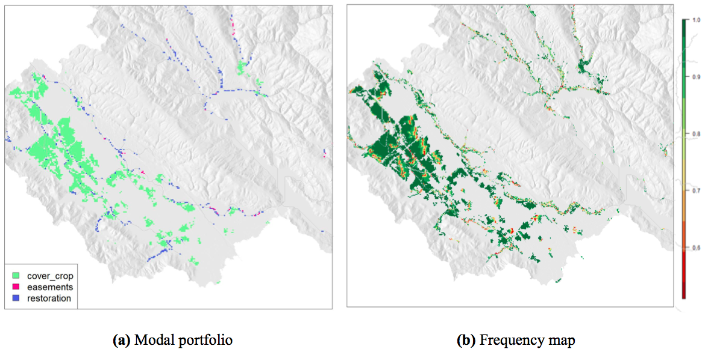

# Design strategies to display natural capital information {#sec:UserGuide}

This chapter gathers the knowledge acquired from an extended literature review on static and dynamic approaches to displaying complex data and existing strategies in use. This literature review explored the design strategies to express and visualize multi-dimensional, spatial, multi-objective, uncertain data and combinations of these. This focus corresponds to the specific challenges faced while communicating natural capital information. The variety of mapping and synthesizing approaches in the field of ES leads to difficult choices of methods for the analysts [@Englund]. So this practical toolbox aims to put together the various options, hopefully providing a clearer vision on the variety of visualization strategies.

An important preliminary note: plots and graphs are not always necessary. Sometimes, the full data table is the best visualization, particularly for small datasets where presenting the data alone could be sufficient. In some cases, visualization will lead to the desire to inspect the data, in which case presenting directly the data itself may be more efficient. For example, in the case of a mid-project intermediary report for a meeting with experts on the project, it is likely that plots will lead to questions digging in details, where showing the full dataset and how solutions were selected and compared to each other is necessary. 

## Multi-dimensional data
In the context of ES, multi-dimensionality arises often from multi-objective problems such as cases where multiple services are considered and their trade-offs are to be explored, but also from multiple scenarios, due for example to exploration of alternate development pathways. Visual decision support tools are very relevant in the field of multi-objective optimization problems[^0326back], as well as for scenario comparison. For multi-objective optimization under uncertainty, the number of scenario considered can be very large. In the typical cases, there is no unique optimal solution, but a collection of Pareto optimal ones [@Hadka2015], i.e. solutions where improving the result towards one objective result a decrease in performance with regards to another objective  [@paretoUNIL]. Efficient visualizations empower the user with the ability to navigate through thousands of potential solutions, compare them and understand trade-offs, leading to performant decision-making. 

Multi-dimensional data visualization has been given considerable attention, as computational capacities have been increasing and the amount of produced data exploding. Multi-dimensional data exploration has taken several directions, based on geometric projection techniques, to which distortion and interaction techniques (discussed in sections \ref{sec:disto} and \ref{sec:interactivefeatures}) can be added to further improve these visualizations [@Keim]. The curse of multi-dimensionality, as explained by @Allen1 is that graphical displays become less informative as the dimensions and complexity of datasets increase. However, she argues in favor of detailed graphs because their ability to show more data and reveal more information outweighs the drawbacks of this curse.

 [^0326back]: Vocabulary note: "multi-objective" refers here to problems with three or more objectives, also called many-objective problems [@Fleming05] or high order-Pareto optimization problems [@Reed04]

###Scatterplots {#sec:scatterplots}
The classic scatterplot displays data with two to three dimensions, using cartesian coordinates and two or three axes. In a **3D scatterplot** (figure \ref{fig:hadka}a) solutions are represented as points in the space.  Additional dimensions can be represented by changing attributes (color, shape, size, orientation, etc), however this may negatively impact clarity or risk ovewhelming key messages of the plot. Interactivity allows the user to perform selections of one or multiple point(s). 

When relationships between several variables are to be explored, **scatter plot matrix** (SPLOM) are suitable. They combines the small multiple strategy (further described in section \ref{sec:smallmultiples}) with the classic scatterplot to display relationships between every pair of variables[^8888back].

[^8888back]: To avoid confusion, we clarify here that figure \ref{fig:scatterplots}b is not a SPLOM, as the axis correspond to the same variables in every multiple. A SPLOM would display plots where each the axis correspond to different variables in each multiple, to show pairwise correlation information. An example can be found in [figure 2 here](https://www3.epa.gov/caddis/da_exploratory_1.html).

In the context of multi-objective optimization, to understand trade-offs and synergies between several objectives under many scenarios, scatterplots are a great option. The commonly used **trade-off curve** is a scatterplot displaying objective scores, with an axis per objective, and a datapoint per scenario (see for example figures \ref{fig:Peter} and \ref{fig:addl}c). A third objective can be displayed by adding a colorscale or size-scale. Also, 3D scatterplots are often used for up to four objectives (e.g. in figure \ref{fig:hadka} or the VIDEO software of @Kollat_Video). Over 4 objectives, small multiples of trade-off curves are very relevant.

![Several options to display multiple variables with scatterplots: (a) Two axis scatterplot [@Sadrian], (b) Small multiples of scatterplots with color coded trade off curves (Courtesy Benjamin Bryant). For trade-off curves example, see also figure \ref{fig:Peter}.](../images/scatter.png){#fig:scatterplots width=100%}

###Time-series data: line charts, streamgraphs and more {#sec:timeseries}
For data including several independent variables, and a dependent one, a **line chart** is a version of a scatterplot (see \ref{sec:scatterplots}) where points are ordered (on the x-axis), and joined with segments. Line charts (also referred to as run charts for time-series data, or index charts when interactive) highlight relative changes, these are a good options when comparing the independent variables.
**Streamgraphs** (figure \ref{fig:line_img}b), also called stacked graphs, sums visually the time-series values around a central axis by stacking area charts on top of each other [@Tour]. These work only for positive values, and provide general view of the data, but are not effective for visualizing details, also they are more efficient in interactive form than static [@datavizz].
In the case of very large timeseries datasets, **horizon graphs** (figure \ref{fig:line_img}a)is a very space-effective option, despite a certain learning time for the reader to understand the graph style. Horizon graphs consists in filled line charts, where negative values are mirrored (and colored typically in red) to appear on the upper side, and then the chart divided into bands that are overlayed using transparency effects to limit the space required for peaks. Thus the space used is divided by four thanks to these two transformations [@horizon].
When the goal is to compare monthly values within and across multiple years, a fairly recent display solution has been suggested: **temporal maps** as shown in figure \ref{fig:line_img}d [@temporalmap]. An extension of this concept, for very high-dimensional datasets, is **pixel-oriented visualization** which consists in using each pixel to display one data value in highly structured arrangements [@Keim]. Both are grids, displaying a value per cell, by a color.
Other strategies extend these plots, for example multi-variate metrics can be visualized through comprehensive plotting (figure \ref{fig:line_img}c). Spatial metrics can also be visualized through histograms comparing main summary statistics in different scenarios (e.g. the percentage of land areas covered by each 3 category is displayed for 3 drivers, and 4 scenarios using small multiples histograms in figure 4 of the work of @villamor14)[^11back].

![Illustrations of concepts of (a) horizon graphs [@horizon], (b) streamgraph [@streamchart], (c) line graph [@Sun14] and (d) temporal map [@temporalmap]. (c) comprehensive plotting example for a case of a 4-dimensions dataset plotted with four 3-dimensions figures to display $4*3^3$ data points. This is one of the 4 figures, where @Sun14 displays results of one of the 4 metrics as several line plots (for several variables, here one per market level), and varying parameters (here 3 parameters with 3 possible values each resulting in $3^3$ data points per market level, per figure.](../images/horizon_etc.png){#fig:line_img width=100%}

[^11back]: A side concern that may come up in these cases, is about data management: the total size of the runs can become is too large for available main memory. A strategy is to precompute summary statistics, such as the mean and extrema [@PotterWilson].

###Parallel coordinates plot {#sec:parcoords}
Parallel coordinates plots (figure \ref{fig:hadka}b) are very effective to display different solutions in a multi-objective context and visualize trade-offs and synergies between objectives under several scenarios. They make relationship and correlation patterns clearly visible [@Achtert2013_6].

The number of scenarios is then nearly unlimited, and so is the number of objectives, to the limit that the axis fit the page. Scenarios are represented as lines, distinguished by varying colors, which intersect horizontal axis representing the objectives. The vertical direction of preferred solution must be clearly indicated to assist interpretation. 

Tradeoffs are illustrated by crossing lines. However, one limitation is that each axis having at most two neighboring axis, only N-1 relationships of $\binom{N}{2}$ combinations for an N-dimensional dataset can be visualized at once. This can be overcome by re-ordering the axis, possibly with an interactive tool, or by upgrading to a 3D parallel coordinate plot where the axis are still in parallel, but some appear closer [@Achtert2013_6], although this approach is more difficult to interpret, which may explain why it is not widely used. 

Combining parallel coordinates with interactive features offers interesting options to explore the data. For example, brushing allows to extract trends over subsets, furthermore [@andrienkopp] recommend linking to other graphics. To contrast alternative options and explore the effects of trade-offs, @Hadka2015 recommends adjacent 3D scatterplot and parallel coordinates plot,as shown in figure \ref{fig:hadka}. The equivalent of parallel coordinates plot for categorical data is the **alluvial plot**; it is also useful to discretize the data into subsets when the dataset is too large for the lines to be distinguished, @Alluvial provides more details. Several tools and packages exist to make both parallel and alluvial plots[^980back].

![Four objectives visualization with (a) 3D scatterplot and colors and (b) parallel coordinate plot, achieved with the OpenMORDM open-source R library [@Hadka2015]](http://ars.els-cdn.com/content/image/1-s2.0-S1364815215300190-gr3.jpg){#fig:hadka width=80%}

[^980back]: Links to parallel coordinates and alluvial plots implementations and packages: \
- [A tool to build directly an interactive parallel coordinate plot](https://reed.cee.cornell.edu/parallel-axis/) \
- [Its underlying implementation, with D3.js](http://syntagmatic.github.io/parallel-coordinates/) \
- [Parallel plots in Python](https://waterprogramming.wordpress.com/2016/09/12/easy-vectorized-parallel-plots-for-multiple-data-sets/) \
- [Interactive parallel plots in R, with Shiny and 3D scatterplot](https://openmordm.shinyapps.io/Iris/) \
- [Alluvial plot package in R](https://cran.r-project.org/web/packages/alluvial/vignettes/alluvial.html).

###Radar charts {#sec:radar}
 The radar chart, as shown in figure \ref{fig:coastal_sm}, is the version of parallel coordinates plot in polar coordinates.  It has also been referred to as spider chart[^5353back], web chart, star chart, polar chart, or Kiviat diagram. It can be an interesting way to visualize trade-offs. However, they tend to become cluttered and complicated if with many variables, making comparisons very difficult @datavizz] [^100back]

[^100back]: see also petal charts, and discussion from @spiderman_bad_Ref.

![(a) Radar chart, in the context of a NatCap project in Kamehameha schools, Hawaii. (b) Small multiples strategy applied to radar charts by @Arkema2. The multiples correspond here to the 9 considered regions. The difference between these two types of radar charts must be noted: the latter (b) may be criticized and raise graphical integrity concerns, as it leads the reader to interpret on the area but the metric is scaled over the distance from center (doubling the distance out from the center quadruples the area, which could be misleading)](../images/radaar.png){#fig:coastal_sm}

###Small Multiples {#sec:smallmultiples}
An effective alternative to coercing all the data in a single plot (risking overplotting) is displaying small multiples. The concept is to replicate the same simple graph structure (in terms of axis, shape and scale), for many datasets, ordered logically. The cognitive process of understanding the graph is undertaken only once, and the understanding then is replicated while scanning all other multiples. This strategy is very efficient in many cases for comparison and broadly used. Referred by the data visualization expert @tufte, as "multivariate and data bountiful", they enforces comparisons of alternatives, differences and changes. This displaying strategy has also been called trellis chart, lattice chart, grid chart, or panel chart. It can be applied to many types of graphs, or maps. Other examples of the small multiple strategy and variants of it can be found in figures \ref{fig:arkemaa}a, \ref{fig:coastal_sm}b, \ref{fig:addl}a.

### Reduce dimensions {#sec:rdim}
Another approach to reduce cognitive complexity of multi-dimensional data, is to reduce the dimensions in some coherent way. For example, the **principal components analysis** (PCA) can be conducted to reduce the number of variables by combining the correlated ones [@hotelling1933analysis]. Similarly, the **choice modeler approach** aims to evaluate multiple decision variants, in a very large decision space. The concept is to identify criteria that do not influence the output (here, the decision option ranking), and remove these dimensions, to simplify without losing correctness [@Piotr]. 

In the same vein, multiple dimensions can be summarized by creating an **aggregated metric**, e.g. an indication of a lake recreation value would combine variables such as water quality, lake size, boat options (Ryan Noe, personal communication).

###Multiple linked views {#sec:multiplelinked}

![Examples of combining static plots: (a) the bar plots display the area of habitat in each risk category (low, medium, high) per planning region (1 to 9), by @arkema1. (b) Dense figure using a story-telling approach to present scenarios. It combines bar plots, maps and the small multiples approach. This figure is self-explanatory, and by including a few sentences, it replaces several paragraphs [@Arkema2]](../images/arkemaa.png){#fig:arkemaa width=100%} 

Several options to display multi-variate data were discussed above. However they all realistically apply to a limited number of variables. As dimensions of the data increase, it is often interesting to show several linked graphs of the same dataset to convey the complex information. This solution gives different perspectives to the viewer. In the case of a static display, the graphs are connected by matching color coding or other corresponding parameters, as in figures \ref{fig:hadka}, \ref{fig:arkemaa}a, \ref{fig:arkemaa}b and \ref{fig:addl}c. 

Furthermore, dynamic displays allow improvement by adding brushing and linking features (see \ref{sec:interactivefeatures}), examples of interactive dashboards with multiple linked views include *(click on the title to be directed to the online version)*:

* [The Middle Cedar visualization](https://phawthorne.g.ithub.io/mc-vis/) (figure \ref{fig:Peter})
* [The Conservation ROI Dashboard](http://nascience.us/roi/public/) (figure \ref{fig:ConservationROIDashboard})
* [Habitat Risk Assessment Dashboard](http://vulpes.sefs.uw.edu/ttapp/hra-dash.php). This interactive web application displays user's InVEST output workspace, and was developped in R and Javascript.
* [Tana Water Fund Spatial Optimization Results Dashboard (prototype)](https://charlottegiseleweil.github.io/webviz_natcap/) (figure \ref{fig:webapp_full})
* [Coastal Vulnerability Dashboard](http://vulpes.sefs.uw.edu/ttapp/cv-dash.php)

## Spatial data 

###General classification of maps 

](../images/0_types_of_maps.png){#fig:typesofmaps width=70%}

####Choropleth maps and proportional symbol maps
Choropleth maps (see figure \ref{fig:typesofmaps}a) are very effective and widely used to display a continuous or categorical spatial variable aggregated by regions. The variable of interest is expressed by coloring (or using patterns on) these geographical areas. Particular attention needs to be given to the choice of patterns (see section \ref{sec:colors}). Furthermore, it may be necessary to normalize[^212back] raw data values to ensure graphical integrity [@Tour]. The main drawback of choropleth maps is that larger areas appear emphasised [@datavizz].
 
Another solution for continuous spatial data aggregated by regions is the graduated symbol map (or proportional symbol map, also called bubble map [@datavizz]) that overlays symbols to the base map. In this case, the underlying area does not affect the perception of the variable considered [@Tour]. These two approaches can also be combined, allowing to express more than one variable.

[^212back]: Normalizing here consists in dividing the variable of interest per unit area; e.g. to express population, the population per square kilometer should be displayed.
 
#### Heatmaps and dot density maps
Displaying density of occurrence, and identifying clusters can be achieved with heatmaps and hotspot maps. The heatmap can be understood as the continuous version of the choropleth map, without aggregation of the data. It visualizes a scalar function over a geographical area [@Brodlie]. Similarly, in the dot distribution map (or dot density map), the density of dots represents the intensity of the variable. The dots are randomly placed, which may be misleading if unclear to the viewer. Figure \ref{fig:typesofmaps} illustrates these.

#### Contour maps 
Also know by contour maps or isarithmic maps, isopleth maps display a variable with contour lines (isopleths) joining the points where the variable has a constant value. For example in the field of ecology, isoflors are isopleths connecting areas of comparable biological diversity [@isoflor]. Color fills may be used to enhance the map pattern. 
Contouring can also be used to highlight areas on a map, as in figure \ref{fig:myanmar_biodiv-ppl}b), which combines information about two independent variables, overlaying two types of maps.

####Cartograms
Cartogram also illustrate data aggregated over regions. The variable to be expressed is substituted to the geographical distance or area. The regions are in the same locations with respect to each other, but their geometry is distorted in proportion to the variable of interest [@Tour]

![Cartogram displaying population (variable) per country (regions of aggregation) [@carto_img]](../images/carto.png){#fig:carto width=70%}

#### Flow maps 
A flow map illustrates movement in space and/or in time. The intensity of a flow is represented by the thickness of the line depicting it [@datavizz]. Flow maps are commonly used to visualize migrations of animals, but can also be applied to pollution load transfer, or groundwater movement from one zone to another. 

![Minard's Napoleon's March figurative map. This classic example of flow map, drawn up by M. Minard in 1869, depicts the successive losses in men of the French army in the Russian campaign of 1812-1813[^01back]. It figures multi-variate data, including 6 dimensions that are the army size, its direction, its location in (x,y) coordinates, the dates and the temperature in the lower part of the display. *"The best statistical graphic ever drawn"* according to Edward Tufte is an example of displaying complexity with clarity. Its great strength reside in its capacity to encode many variables. This example reminds also that successful and effective visualization are very specific to the dataset and message, and its beauty resides in the fact that it is very tailored to the story to be conveyed, here: the numerous deaths of soldiers. 

[^01back]: The text translates to: *The numbers of men present are represented by the width of the colored zones at a scale of one millimeter for every ten thousand men; they are further written across the zones. The red designates the men who enter into Russia, the black those who leave it. The information which has served to draw up the map has been extracted from the works of M. M. Thiers of Ségur, of Fezensac, of Chambray and the unpublished diary of Jacob, the pharmacist of the army since october 28th. In order to better judge with the eye the diminution of the army, I have assumed that the troops of Prince Jérôme and the Marshal Davoush who had been detached at Minsk and Mokilow and have rejoined around Orcha and Vitebsk had always marched with the army.* ](../images/Minard.png){#fig:minard}

###Two widely used ES maps {#sec:twowidely}
In the context of ES modeling to inform decisions about landscape management, two types of choropleth maps are very often used: 

####Portfolios {#sec:portfolios} 
Landcover maps, also called LULC for land use/land cover, represent the full landscape with its corresponding land uses. In a spatial targeting context, oftentimes ES modelers will refer to a **portfolio**, meaning a landcover map which correspond to a subset of the full landscape where interventions or other land management actions are to be undertaken (e.g. protection, restoration, conversion to a specific type of agriculture. Portfolios may be thought of as special cases of land use (or coastal management) *scenarios*[^9102back] -- the latter term often being used when a small number of specific land or coastal management options have been developed to reflect stakeholder concerns. When used in this sense, the visualization challenges are essentially the same between the two terms, and we use portfolio for consistency.

[^9102back]: Inconsistent terminology note: sometimes the word *scenarios* is used to refer to a portfolio. Unfortunately, this term has been used with many meanings depending on the context and niche modeling community, including a more general meaning of a specific realization of uncertain exogenous input variables. Thus one might also develop a "portfolio" of targeted interventions under multiple (exogenous) scenarios.

When displaying portfolios, highest care must be given to symbology (see recommendations in section \ref{sec:colors}). Land cover color schemes can be very tricky, depending on the number of classes and the arrangement. A good example is given by figure \ref{fig:lulc}b.

![Portfolio and land cover maps: (a) a portfolio map of the Nathpa Jhakri catchment [@Sadrian] and (b) a many-classes LULC color scheme (Courtesy Stacie Wolny)](../images/portfolio_lulc.png){#fig:lulc}

####Objective score maps {#sec:objs}
Objective score maps are choropleths with the area of aggregation being generally at the level of the spatial decision unit (which may be a pixel or polygon). These are widely used to visualize ES model outputs. Often, the objective score maps of different ES objectives are combined in a single one summarizing the overall scores (e.g. in the combined figures in appendix \ref{fig:hawaii4}). 

Objective score maps can display either absolute scores, or the change in score relative to a baseline, in which case they are also referred to as marginal value maps. Examples of marginal objective score maps can be found in appendices \ref{fig:hawaii2} and \ref{fig:hawaii3}.

A variant of these are the activity score maps, which display the objective score specific to an intervention, by decision unit. They detail the impact of an intervention on a specific ES metric, and therefore help answer questions like: *Where in space does a given intervention or scenario improve or worsen a specific ES metric? Where does an activity contribute to objectives?*, which the usual objective score maps, looking at the overall change in ES, fails to address. The concept of activity score maps is detailed in figure 6 of @RIOSdoc.

###Spatial visualization of tradeoffs {#sec:hotspot}
In the context of spatial targeting of interventions, ES analysts often have to figure out where, on a landscape, do activities produce co-benefits, and where are they in conflict. That is: where does an intervention move multiple ES metrics (objectives) in the same direction to produce *win-wins* locations? And on the other hand, where in space is a given intervention contributing to some metrics at the expense of others? 

#### Hotspot map {.unnumbered}
In the case of only 2 scenarios or only 2 objectives, one could show change maps, or side by side maps, i.e. techniques used to compare 2 maps, detailed in \ref{sec:comp_map_2}. For more objectives or scenarios, hotspot maps (figure \ref{fig:Stacie20}a) can display location of synergies/tradeoffs of intervention/scenario on multiple ES metrics. The idea of the hotspot map is to select the areas of highest score, for each objective, and find areas of overlaps. For example, as shown in figure \ref{fig:Stacie20}a, the top 20% of each service are selected, the selection are then added to construct the hotspot map. The categorical version of a hotspot map details priority/conflicts zones for each objective, as in figure \ref{fig:Stacie20}b. This one may appear less intuitive, mostly because of the qualitative colorscale, but is more detailed: one can see precisely which objectives are in conflict. 

![(a) Hotspot map in Myanmar for 3 objectives (Wolny, 2016) and (b) Categorical version of a hotspot map: Priority and conflicts areas, in the case of 3 objectives: biodiversity (BD), water quality (WQ) and profit. Thanks to this map, the decision-maker can decide where to intervene on the landscape, depending on which objective(s) (s)he prioritizes [@QUICK]](../images/hotspots.png){#fig:Stacie20}

A remaining subquestion is about the intensity of tradeoffs and synergies in space: where are tradeoffs more or less stark? An extension of figure \ref{fig:Stacie20}b could be envisioned, varying transparency to represent intensity, or using a diverging color scheme (figure \ref{fig:colorschemes}c)to convey both intensity and direction of agreement/disagreement Fig 3.1c].

Another strategy consists in combining trade-off curves with small multiples of objective score maps. On trade-offs curves (see section \ref{sec:scatterplots}), each point corresponds to a portfolio: displaying these together greatly enhances user understanding. Examples of strategies to display together the trade-off curve and the corresponding maps are presented in figures \ref{fig:addl}c and \ref{fig:Peter}.

###Relationship between variables {#sec:beneficiaries}
Expressing relationships between independent or correlated variables is often needed when dealing with several objectives or metrics. For example, it is very relevant in the context of displaying the beneficiaries of a project. This topics seems to trigger growing interest [@Weil]. However, this tasks appears to be very context specific. Typically, the displays would aim to quantify and show the impact on beneficiaries, possibly by subgroups, defined based on demographics or their location. It is also often of interest to contrast beneficiary distribution in space with service distribution in space. For example, figure \ref{fig:myanmar_biodiv-ppl}b highlights the relationship between people’s dependency on forests and the location of key biodiversity areas (KBAs).

####Relationship between independent variables
Two variables can be expressed at once by combining two maps. Figure \ref{fig:mycombine}a shows only the resulting map, while figure \ref{fig:mycombine}b displays side by side the two input map and the one combining these, a more self-explanatory but also space-consuming approach.

![Examples of combining two maps by multiplying them, in Myanmar [@Myanmar16]. (a) Combining ES maps with population maps to show people's dependency to ES. This map results from the multiplication of (1) an objective score map for sediment retention, and (2) a map of the number of people who use surface water for drinking, as provided by the national census 
(b) the top small map displays the number of villages located downstream from regions affected by the flood, the bottom small one indicates how much the natural vegetation contributes to reducing flood risk. The third map results from the multiplication of the two others, and therefore displays the flood risk reduction provided by natural vegetation that benefits the most villages downstream. Displaying these 3 maps on the same page within eyespan facilitates understanding (here, there are squeezed for purposes of space efficiency, but are originally displayed side by side)](../images/combine_my.png){#fig:mycombine}

####Spatial correlation
Spatial correlation can be expressed by displaying correlation statistics computed for corresponding pixels (as in figure \ref{fig:myanmar_biodiv-ppl}a displaying correlation coefficients) or by overlaying different maps (as in figure \ref{fig:myanmar_biodiv-ppl}b)

![Expressing spatial correlation (a) through displaying spatial correlation coefficients between two variables. Here,between each ES considered and the landscape ecological risk (LER) [@jgong] (b) Overlaying variables: combining information about biodiversity (contour maps in red showing the key biodiversity areas) and about ES benefits (choropleth map with green gradient), overlayed on a relief map [@Myanmar16]](../images/spatial_correl.png){#fig:myanmar_biodiv-ppl}

#### Interactive maps
Interactive maps allow one to overlay multiple layers corresponding to multiple variables, allowing to explore relationship between different variables/layers. Good examples include:

* [Myanmar Natural Capital: a storytelling approach for a project involving multiple ecosystem services](http://www.myanmarnaturalcapital.org/en). The tools used here are D3.js, leaflet, openStreetMaps, Google Maps and photoshop.
* [The Nature Conservancy also developed a visualization platform, gathering a suite of web applications based on maps](http://coastalresilience.org/tools/apps/#apps_id|assess-risk|1), aiming to convey and/or simplify ecological concepts, assess risk, identify and compare different solutions and scenarios. For example, [the coastal resilience interactive map in the Gulf of Mexico.](http://maps.coastalresilience.org/gulfmex/)
* [The Mapping portal for the Belize project by Gregg Verutes, developped with Mapbox, and OpenStreetMap](http://www.geointerest.frih.org/NatCap/) and [a similar map web viewer from the same author, for coastal hazard model results in the Bahamas.](http://marineapps.naturalcapitalproject.org/bahamas/)

\newpage
\newpage

## Comparison of multiple spatial runs {#sec:compare}
*Runs* refers here to different versions of a spatially explicit variable; this section is about comparing multiple maps expressing the same variable - while comparison of maps expressing different variables was treated in sections \ref{sec:hotspot} and \ref{sec:beneficiaries}. This multiplicity of outputs may correspond to multiple scenarios, objectives or varying parameters values (i.e. sensitivity analysis, this case is further described in section \ref{sec:SA}). Summarizing these multiple spatial model outputs is necessary in applications such as:

* portfolios comparison, to understand trends in agreement and disagreement on recommended action, in contexts of land use change planning or spatial targeting. 
* comparison of ES model outputs such as objective scores at pixel or polygon level, to understand similarity and differences between maps of several ES objectives under one scenario, or the maps of same objective under several scenarios. Many maps are often generated under many combinations of scenarios or parametric uncertainty. Relevant examples also include comparing objective score maps associated with many points on an optimization frontier.

Comparison and summaries of spatial data can be achieved either by visualizing spatially as maps (see \ref{sec:comp_map}) or through quantitative indices and metrics synthesizing the results aspatially (see \ref{sec:metricsmultrunscat}  for categorical data summary indices, \ref{sec:metricsmultrunscont} for continuous data). 

####Map comparison tools {.unnumbered}
Automated comparison of maps can be achieved with software like the* Map Comparison Kit*[^127back] [@visser2006map]. An algorithm called *Mapcurves*, implemented in R and Matlab, provides a goodness-of-fit measure based on spatial overlap. *TerrSet* software also provdes GIS analysis features, including multiple map comparison and a variety of spatial statistics [@TerrSet]. The R packages *raster* and *lulcc* also provide basic statistical functionality like Moran’s I, and multi-resolution analysis (see @Pontius2011 for the last).

[^127back]: MCK compares raster maps using fuzzy set map comparison, hierarchical fuzzy pattern matching, and moving window based comparison of landscape structure. [See MCK website](http://mck.riks.nl). 
 
###Maps displays {#sec:comp_map}
#### Between two maps {#sec:comp_map_2}
####Interactive switching between maps {.unnumbered}
For the examination of (dis)agreement between two maps, analysts often like to flip back and forth between the two (from survey results). This is easy to do in GIS software and is a convenient solution for the data exploration purposes. Nevertheless, this method is not always suited for communication purposes. Plus, this interactive solution doesn't apply to static documents.

#### Side by side maps  {.unnumbered}
A classic static option consists in showing the two maps next to each other. This is not the most space effective option, but allows an intuitive understanding and facilitates comparison. The two maps must be within eyespan (avoid page breaks).

#### Change map  {.unnumbered}
Subtracting one map to the other (the other generally corresponding to the baseline scenario) results in a change map. Typically change maps use diverging color schemes, with two colors representing increase and decrease, and the intensity gradient reflects the amount of change. These are suited for scenario comparison with a baseline scenario, or how two future scenarios differ from each other. An example can be found in additional figure \ref{fig:addl}b.

#### Between many maps {#sec:comp_map_many}
The problem complicates when comparing many runs. In the context of multiple continuous ES model outputs, such as objective score maps for several ES services, a hotspot map can be constructed (detailed in section \ref{sec:hotspot}) but is limited to few objectives. Other strategies are suggested below.

#### Maps matrix (small multiples strategy) {.unnumbered}
When the number of maps to compare is low enough to fit in a page, with a reasonable resolution, the small multiple approach (see section \ref{sec:smallmultiples}) is relevant, as in figure \ref{fig:addl}a.

#### Footprint map {.unnumbered}

To express the the extent of where interventions might be considered, footprint maps show which areas have been selected as part of any portfolio under consideration. Pixels are assigned a binary value (1 if the pixel was selected in any portfolio for any intervention, 0 otherwise).
To express agreement about an activity across portfolios, footprint maps can also be done for a specific category (1 is assigned is the pixel was selected in this category). 

#### Modal portfolio and frequency map {.unnumbered}
For categorical data, the frequency map approach would display the frequency with which the modal category is assigned to each unit across runs; the modal category being defined according to the context, typically the most assigned category to each area across [@RIOS]. In the context of portfolios, this is called the modal portfolio, displaying the most often chosen activity for each spatial unit[^55back]. The comparison part is held by the frequency map, which express how often was the activity chosen. Precisely, the frequency map is usually constructed as such: for each spatial unit, number of portfolios where the modal value is chosen divided by total number of portfolios. 
These two maps complement each other: the modal portfolio is about summarizing when the frequency map associated hold indications on comparison. They can be overlayed or displayed side by side, as in \ref{fig:RIOS}.

{#fig:RIOS}

[^55back]: More precisely, the modal portfolio maps can either display the category assigned in most of the runs, or limit to these assigned in a certain threshold percentage of the runs. 

####Categorical map diversity indices {.unnumbered}
An alternative to frequency maps, to summarize the categorical variance across many runs is to use a diversity index, such as the **Shannon diversity index**:  for each pixel $SDI = - \sum_{i=1}^{R} p_{i} \ln(p_{i})$, with $\textrm{p}_{i}$ the proportion of cells assigned to category i, and $R$ the total number of categories. How to interpret the SDI: when evenly distributed, $SDI = \ln(R)$, and as it approaches $0$, proportions in each category vary more. Hence, SDI reflects the relative abundance of each category across the pixel stack. So, the smaller the SDI, the more confident one can be about the pixel's most chosen category. Other diversity indices can also be substituted, such as the Evenness index, see the work of @Dimitra for details.

The **fuzzy set approach** [@Hagen2003] assesses the similarity of several categorical maps, resulting in a fuzzy set comparison map where each cell displays a degree of similarity and an overall value for similarity, so-called $\kappa$-Fuzzy as it extends the Kappa index including fuzziness of category and of location.

Similarly, a **coefficient of unlikeability** measure variability in categorical data by considering how often, not how much, observations differ [@kader7]. Calculated for each cell. It should be interpreted as such: the coefficient is high if different interventions were chosen (i.e. low agreement), and low if the same intervention tended to be chosen (high agreement). So it reflects (the inverse of) agreement across maps.

####Variant-invariant method {.unnumbered}
In the same vein, the **variant-invariant method** aims to distinguish the invariant regions, that is the areas where the category assigned is consistently the same (see @Brown2005).

####Spaghetti plots{.unnumbered}
Visualizing flow data, **spaghetti plots** (figure \ref{fig:spag3D}a) express consistency between runs. Widely used in meteorology, the consistency of the runs is expressed by how tightly clustered they appear. Spaghetti plots may be translated to continuous spatial data by using the isocontour of each run, which is useful when concerned about a specific threshold. 

####3D plots overlaying maps {.unnumbered}
For continuous data, **3D plots overlaying maps** (figure \ref{fig:spag3D}b) have been used to highlight structural differences across maps. However, this solution seems limited to relatively small regions, and clearly distinguishable distributions of the variables expressed through color and height of the histogram. 

![(a) Spaghetti plots displaying ensemble datasets [@PotterWilson]. The spaghetti plot is the isocontour of each run. If the runs agree (Fig. left), it will result in a coherent bundle. Slight disagrements induce divergence from the main bundle (Fig. right). (b) 3D histograms, organized according the geographical layout; extract from figure 8 of @Huang13](../images/spag3D.png){#fig:spag3D}

####Interactive map comparisons {.unnumbered}
Animation is of great interest in this context. Dynamic visualizations are very suited for displaying multiple spatial outputs, there are increasingly used to display results in the field of ABMs[^1back], encountering similar type of outputs [@ABMleelig].\

[^1back]: Agent-based modeling (ABM), or indivisual-based modeling consist in representing phenomenas as dynamical systems of interacting agents, where an agent is a discrete and autonomous entity. Their individual behaviors are encoded, resulting in outputs describing the the agents' interactions that are used to describe complex systems. These systems can be a  variety of processes, phenomena, and situations in any field. [@ABM_intro] In the context of this work, ABM is of interest because simulation runs often produce a high volume of multidimensional output data (e.g. induced by Monte Carlo sampling), requiring visualization and statistical analysis of the outputs.

###Aspatial metrics to summarize results and agreements of categorical maps {#sec:metricsmultrunscat} 
Visual comparisons of maps is efficient and not too intense cognitively for human perception. However, it fails to rank quantitatively the results, nor is adapted to an important number of maps. Screening through hundreds of maps produced is not a viable option. Therefore, other solutions must be considered. In particular, a variety of non-spatial statistics can be used to summarize results and agreement over maps of the same area. The quantitative indices presented in this section and the next one (\ref{sec:metricsmultrunscont} for continuous data) are suited for the purposes of summarizing results across many maps. This list is not exhaustive but aims to give an overview of this broad topic.

#### Between two maps {#sec:comp_stat_cat_2}
There are different types of categorical (i.e. discrete attributes) map consistency measures [@Kuhnert2005]:

####Total per categories {.unnumbered}
The coarsest approach would be to compare the total numbers of cells[^3back] assigned to each category, neglecting any spatial patterns. This gives a very general quantitative overview of the total per categories, that can be delivered as tabular data. (All the other, finer approaches detailed below imply a cell-by-cell comparison.)

[^3back]: Terminology note: Following @Kuhnert2005, in this section, "cell" corresponds to the regional unit at which data is aggregated, also referred to as SDU, it can be a region, a pixel, a hydrological area or a state for example.

#### Percent agreement {.unnumbered}
A basic cell-by-cell comparison method measures simply the overall agreement (or percent agreement) by calculating the portion of cells that agree between two maps: \
(Cell-by-cell level of agreement) = (Number of direct matched cells between 2 maps) / (Total number of cells in map)

#### Kappa index of agreement {.unnumbered}
KIA or Cohen's $\kappa$ is a widely used statistic measuring concordance between categorical items. This technique has proven efficient for cell-by-cell comparisons of spatial data [@Manson2005], as long as patterns and locations of changes are not involved [@Kuhnert2005]. It is more robust than a percent agreement because it takes into account the agreement occurring by chance. $\kappa = \frac{\textrm{p}_{0}-\textrm{p}_\textrm{e}}{1-\textrm{p}_\textrm{e}}$  with  $\textrm{p}_{0}$  being the proportion of units agreeing, and  $\textrm{p}_\textrm{e}$  the proportion of units expected to agree by chance (i.e. the hypothetical probability of chance agreement). Complete agreement results in $\kappa = 1$ [@Cohen1960]. 

However, after publishing his work about $\kappa$, @Pontius2000 later reconsidered his positions and advocated against the use of this index because of several flaws, mainly the irrelevance of the randomness baseline in many applications, and the fact that the ratio is difficult to interpret and overly complicated, as only the numerator actually matters [@Pontius2011]. Instead, he suggests to use quantity disagreement and allocation disagreement measures (see next point). 

#### Quantity & location fit{.unnumbered}
A more precise version of the $\kappa$ approach explained above consists in analyzing 2 metrics, measuring respectively the quantity disagreement and allocation disagreement. These are more helpful to understand both components of disagreement than with a single statistic of agreement. [@Pontius2011]. For example:

* The **quantity fit** informs on the number of cells that changed from one category to another, offering an overall comparison on the quantity of each category: $$Quantity \ fit = 1 - \frac{1}{N}\sum \left |  \textrm{a}_\textrm{1i} - \textrm{a}_\textrm{2i} \right |$$ where $\textrm{a}_\textrm{ki}$ is the number of cells assigned to category $i$, in map $k$ with $k \subseteq (1,2)$, $N$ the total number of cells in map and $C$ means all categories [@Kuhnert2005].
* The **location fit** informs on the number of cells that kept the category but changed location from one map to another:  $Quantity \ fit = (Location \ fit) \ - \ (Cell-by-cell\  level\  of\  agreement)$ Another possible way of measuring the location disagreement is the **distance between the locations of matching cells** in the maps can also be calculated [@Kuhnert2005]. An overall measure of distance between two discrete maps expresses the amount of agreement or the goodness of fit [@Seppelt2003217] and [@costanza].

#### Jaccard index {.unnumbered}
Other indices comparing agreement across categorical datasets exist. However, very few to no applications in comparing maps has been found. 
The Jaccard index, also known as Tanimoto index, is computed as the ratio of the intersection of the two sets over their union: $$Jaccard\ index = \frac{Map1 \cap Map2}{Map1 \cup Map2}$$ [@jaccard]. Simple to understand, it ranges from 0 to 1, increasing with increasing similarity between the sets.
The **Sørensen-Dice coefficient** is a slightly different version of the Jaccard index. Also called the Dice similarity coefficient , or F1 score, it is calculated as such: $$Sorensen-Dice\ index={\frac {2|Map1\cap Map2|}{|Map1|+|Map2|}}$$ More similarity measures for categorical data have been explored by Lourenco [@ourenco2004binary].

####Between many maps {#sec:comp_stat_cat_many}

When comparing a large number of maps, aggregation often is necessary to communicate results [@Brown2005]. Some of the metrics detailed above that calculate correlation between two maps may be extended to many maps comparison [@Seppelt2003217], like the total per categories approach:

#### Total per categories{.unnumbered}
Calculating the total numbers of pixels assigned to each category (as in previous section) resulting in a table, with categories in comuns and runs in rows, which works if there are not too many runs. If there are, one may display a simple table linking categories with summary statistics indicating some measure of the mean and the variance (e.g. average and extrema or standard deviation), as exemplified in the table below[^80back]. However, this measure only accounts for the overall amount of each category, and not for spatial distribution. 

| Land cover    |  Grass | Forest | Barren | 
| --------------------------------- | ----------------------------------- | --------------------------------- | -------------- |
| Average pixels [min;max]     | 121 [110;143] | 204 [158;226] | 25 [14;50] | 
| Average percentage ± standard deviation     | 35% ± 2% | 58% ± 3%  | 7% ± 3% | 

Table: Hypothetical example to illustrate the *total per categories* approach
 
 [^80back]: Details of calculations can be found [here](https://docs.google.com/spreadsheets/d/1wsm0-X5-pJ_I7J7nduWE_dmiOVWgSUyyo-51t58C8Vo/edit#gid=436596527).

####Cell stack methods{.unnumbered}
Finer methods imply to make calculations for each cell, in all the considered maps (as in, superposing all maps, and making calculation for the column of corresponding cells). For raster data, this technique of *column of cells* is referred to as pixel stack, raster stack, cell stacks, z-profile or vector of values. To summarize agreement between runs in a single number, the measures suggested in \ref{sec:comp_map_many} can be aggregated. For example, the average SDI would give an indication of the consistency of the runs. However, these overall average do not give any indications on spatial patterns.

####Comparison of landscape metrics{.unnumbered}

Some spatial metrics allow a user to identify and account for spatial patterns. They allow tabular comparisons of some runs (the indices are calculated for each run). They include Area-weighted mean shape index, centrality indices, contagion index [@ABMleelig]. Some are more specific landscape metrics, such as the average core area, which is the proportion of production land per land cover category [@Parker2004], and the average patch perimeter-area ratio (PA-1) [@Ritters1995]. Landscape statistics measuring sprawl and fragmentation include landscape shape index (LSI), aggregation index (AI) contiguity index (CI) and centrality index (CTI). Together, they allow for comparison of landscape, spatial patterns of change and overall spread [@Sun14]. More details on landscape metrics can be found in section 4.16 of @ABMleelig, among other references previously stated.

### Influence of scale in map comparison and taking patterns into account {#sec:scale} 

Spatial patterns may be interesting because solely computing the number of cell-to-cell matches is not reliable in all circumstances, as if there is a matching cell right nearby, it will not be taken into account (e.g. if we compare two chessboards shifted by one square, the number of cell-to-cell matches is null although there is evident similarity not to be ignored) [@Kuhnert2005]. The **moving window algorithm** addresses this issue and accounts for landscape patterns by considering neighboring cells in addition to the cell-to-cell comparison [@Kuhnert2005]. In the same vein, the **ECE method** (edge correlated error) also accounts for edge effect [@dean]. 

Another strategy to address the same concern of accounting for arrangement similarity, instead of moving a "window", is to vary the resolution considered. The **hierarchical fuzzy pattern matching** avoids drawbacks of a cell-by-cell comparison by aggregating the regional unit considered in patches, and conducting comparisons at different scales [@power2001]. More suggestions can be found in the work of @remmel who compare maps at different resolution to find  hierarchical nested patterns, and of @dean who suggests to compare **quadtrees** (a hierarchical structure form of representing raster data) at different scales, resulting in the Quadtree-Based Arrangement Similarity (QBAS) index.

The influence of scale and the consistency of spatial patterns in pixel data, at coarser resolution are questions of interest in the context of natural capital. Pontius explores the influence of resolution in map comparison (Pontius, 2008 and 2011), by conducting comparisons at multiple scales. He notes that the format of the data (the resolution considered) impacts tremendously the results which sometimes are more due to this format, than the underlying landscape patterns. One of his ideas is to plot a total measure of difference (e.g. a sum of mean squares of a cell-to-cell comparison) at different resolutions: this plot gives an idea of allocation error relative to mean error and how the allocation error decays with distance. @remmel, @power2001 and @dean also point out the scale effects while attempting to take into account patterns, spatial shapes and arrangements in map comparisons. There is not yet a clearly adopted methodology to account for scale in ES spatial data analysis, and this topic could benefit from further research. For example, in the context of water-related ES, one may be interested into taking the hydrology of the landscape into account.
 
However, these methods are relevant only to categorical data, and little information has been found about the influence of scale for continuous maps, that are about to be discussed in the following section.

###Aspatial metrics to summarize results and agreements of continuous maps {#sec:metricsmultrunscont} 
One handy strategy to handling continuous data is simply to **discretize** it, by sorting the dataset into categories corresponding to ranges of values. This allow to use all the metrics discussed above (section \ref{sec:metricsmultrunscat}) for comparison. However, the arbitrary classification will impact the results. For a reliable metric, it is therefore necessary to do several different classification (i.e. discretize the dataset with different limits/size of categories). This approach, in the fields of statistics and image processing, has been referred to as *binning*, defined as grouping continuous values into bins, as implemented in many software packages (e.g. [R documentation](https://stat.ethz.ch/R-manual/R-devel/library/base/html/bincode.html)).

#### Between 2 maps {#sec:comp_stat_cont_2}

#### Aggregation of cell's values: sum or mean {.unnumbered}
Each map can be summarized with a value aggregating cell's values. For example, for an objective score map, the overall objective score of the map is the sum of the pixel's scores. The average could also be used to aggregate. Once each map has an aggregated "summary value", these can be subtracted to reflect the numerical difference in ES between 2 scenarios. 

#### Spatial correlation indices {.unnumbered}
Statistical indices like the Bivariate Moran's I or LISA (Local indicators of spatial association) aim to measure spatial autocorrelation between 2 variables in a same location [@akbar], which can correspond to two runs of the same variable. The field of spatial statistics digs more into these metrics.

#### Non spatial metrics {.unnumbered}
Other non-spatial correlation coefficients also can be applied to summarize spatial data, though care must be taken to avoid improper interpretations of statistical tests. An example is the **Pearson linear correlation**: $$\rho _{X,Y}={\frac {\operatorname {cov} (X,Y)}{\sigma _{X}\sigma _{Y}}}$$ It ranges from -1 (negative linear correlation) to +1 (positive linear correlation), and 0 corresponds to maps not correlated, or its variant, the reflective correlation.

Other standard statistical tests and summary statistics, not specific to spatial data, can also be used to summarize variance. For example, disagreement between two maps can be summarized by their variance, i.e. the normalized average of corresponding cell's squared difference: $$\sum_{cells} (v_1 - v_2)^2$$ where $v_1, v_2$ would be the same cell's value in $Map_1, Map_2$, possibly weighted by the relative importance of the cell (for example, the population if displaying results related to beneficiaries). This is just an idea, however, references to a least squares method have been found in literature, referring to it as a conventional approach, which would be to compute the least square on the plotted points (Pontius, 2008). 

#### Between many maps {#sec:comp_stat_cont_many}
Besides discretizing the data and then using methods from \ref{sec:comp_stat_cat_many}, a solution would be an aggregation of aggregated map values: summary statistics on map-wide statistics. As mentioned above, each map can be summarized with a value aggregating cell's values. For example, for an objective score map, the overall objective score of the map is the sum of the pixel's scores. A second aggregation can follow: for example, the mean or range of these overall objective scores provide second order statistics on the collection of maps (e.g. it will give an indication of average total objective score of scenarios), and one can also compare distributions of different subsets of maps.

Measures of dispersion are also interesting in this context, especially when comparing across two *populations* of maps (e.g. one set generated  under the assumption of a climate change scenario, another set under a different assumption). 

## Uncertainty {#sec:uncertainty}

> *"Finding ways to accurately and effectively represent uncertainty is one of the most important challenges in data visualization today. And it’s important to know that visualizing uncertainty in general is extremely difficult to do.”*\
> 
> *@sohardtovizuncertainty*

### Introduction to uncertainty & sensitivity analysis visualization

It is often of interest to analysts to consider how input uncertainty and model structure affect the precision and robustness of findings. Uncertainty may arise from modeling choices, parameters (see in particular section \ref{sec:SA}) or future scenarios (e.g. future climate conditions). The inclusion of uncertainty estimates improves decision making (@reichert2005does and @beven2006undermining among others). Because ecosystem services depends on unique landscape characteristics, each case is unique and different procedures can be specifically chosen to generate summaries of robustness and sensitivity [@lig14]. However, uncertainty is often just ignored in the representation because it is challenging to visualize [@sohardtovizuncertainty]. Conveying both statistical and data uncertainties is nevertheless essential to a thorough communication of results. 

![Uncertainty analysis and sensitivity analysis [@lig14]](../images/UA_SA-lig14.png){#fig:SAoo}
 
Closely related concepts must be distinguished: uncertainty analysis (UA) aims to explore the variability of the results; whereas sensitivity analysis (SA) explores the factors responsible for such variability. Robustness is considered when conducting uncertainty analysis; defined as *"the ability of a system to resist change without adapting its initial stable configuration"* [@wieland212], it can be understood as insensitivity to changes [@Maier] or also a function of performance under many states of the world. In the context of decision making, a decision is qualified robust if not vulnerable to changes, i.e. if it leads to the desired outcomes under different states of the world. However, the concept of robustness is somehow vague, and cover several interpretations overlapping with UA and SA. For example, assessing the robustness of many runs resulting from uncertain inputs or model assumptions can be considered as a sensitivity analysis [@Pianosi2016].

The following discussion is limited to scalar and spatial data, leaving aside data types that are rarely encountered in the context of natural capital information such as 3D datasets, that are further explored by @Brodlie.

###Non-spatial data uncertainty displays {#sec:uncert_aspat}
Not only does uncertainty adds a dimension to the visualization, it is especially complex because it depends directly on the data itself, and also because uncertainty propagates, i.e. if the data is transformed to be visualized, its underlying uncertainty propagates, not necessarily in a trivial way [@correa]. Uncertainty can be presented in different ways, for example as a function of the data, (as a PDF, as a multi-value data) or as bounded data.

For one dimensional scalar data, uncertainty can be represented with **error bars** [@Ehlschlaeger]. **Box plots** are also common to express variability by showing the quartiles. An extension of these are the **violin plots**, additionally displaying the probability density (kernel density estimation) of the data at each value [@violin].

**Contouring** by displaying around the mean an indication of the spread, or the standard deviation, allow to visualize the range among which the variable can locate [@Brodlie]. This is common for time-series datasets.

###Spatial data uncertainty metrics {#sec:uncert_non_maps}
Many ES analysts (responding to the survey) came to the conclusion that uncertainty seems best understood in an aspatial manner, as spatial representations can often be difficult to digest. At NatCap, visualizing uncertainty has generally been handled via tabular representations or in a narrative format (according to survey answers). In this context, summary metrics are necessary.

In general for uncertainty analysis, two statistics are very relevant to display: a measure of central tendency, such as the mean, and an indicator of dispersion, for example the variance or standard deviation [@lig14], but also extrema (minimum and maximum, or extreme percentiles); these measures of range are the most relevant when dealing with deep uncertainty (see also @Hadka2015).

There are also specific measures for robustness, based on the fraction of states of the world in which a conclusion remains valid or a strategy performs acceptably. Robustness measures of two types: **regret and satisficing measures**. The former seek to minimize expected loss, that is difference with respect to the solution that would be chosen under perfect information, ; the latter seek to maximize the range of solutions that are “good enough” [@Hadka2015]. Robustness of an output is contingent upon the consistency between multiple runs leading to this output, under varying conditions. Therefore, spatial metrics measuring agreement between multiple runs, as detailed in sections \ref{sec:metricsmultrunscat} and \ref{sec:metricsmultrunscont} can be used for assessing robustness, and will not be repeated here, to avoid redundancy. Furthermore, there is an approach specific to robustness in the context of decision making. Methods based on the **breakeven point** inquire about the magnitude of change that would result in changing the decision. In the context of spatial targeting, the breakeven ratio is defined as the prioritization score of the best choice over the prioritization score of the second best choice. This metric applied to spatial data result in prioritization score breakeven maps, which are efficient displays of how much the prioritization score of the chosen category would need to be reduced before switching to the second best category [@RIOS] 

###Spatial data uncertainty map displays {#sec:uncert_maps}
The most common static visualization techniques for spatial data uncertainty include:

#### Juxtaposition of an uncertainty map {.unnumbered}
That is adding a separate similar figure to represent solely uncertainty (via a choropleth or heatmap with a sequential color scheme expressing a measure of uncertainty for example), alongside the representation of the data.

#### Overlaying an uncertainty variable {.unnumbered}
 Another approach consists in overlaying a visualization of uncertainty on top of the main one. [@Bingham] overlays a contour map of an error field on top of a heatmap of the mean value of a multivalue dataset, but it is not so straightforward. Integrating additional geometrical objects, such as labels, volume rendered thickness, or error bars may express uncertainty [@griethe]. Circular glyphs and ribbons have been designed, in the context of weather forecast ensemble data, to visualize uncertainty [@sanyal].
 
#### Modifying the displayed variable to account for uncertainty {.unnumbered}
Varying the value of a free graphical variable, such as a property of the color palette used to visualize the main data, can also express uncertainty. The first option is **"blurring"**: the focus is adapted proportionally to the level of uncertainty, this can be done through one of these parameters: contour crispness (“fuzzyness”), fill clarity or resolution [@mac92]. Formally, blurring is defined as removing spatial high frequency details [@russ95]. **Saturation** is the second option, in which uncertainty is expressed by paleness, also referred to as whiteness [@hengl]. More options include texture and edge crispness variations, overall all these solutions are more intuitive but less precise [@griethe].

{#fig:uncert width=40%}

#### Agreement maps {.unnumbered}
Techniques for comparison of multiple spatial runs, such as frequency maps or spaghetti plots, can be applied in the context of uncertainty. See section \ref{sec:comp_map_many}.

#### Interactive options {.unnumbered}
In dynamic visualization, uncertainty representation can be more easily achieved. A swap button can allow the user to successively visualize the main data and its associated uncertainty on the same background map, allowing easier interpretation, with the possibility of going back and forth. This method is referred to as **toggling** [@Aerts03]. Other interactive options include the **clickable map**, where uncertainty information displays upon click [@Vander]. There has also been attempts to express imprecision dynamically addressing human senses via vibrations proportional to the level of uncertainty [@Brown], or smooth animation of sequence of different realizations of a model [@Ehlschlaeger].  There have even been attempts to display uncertainty by adding another dimension via sounds [@Lodha][@Fisher]. Another solution to convey accuracy is probabilistic animation: the uncertain points appear and disappear according to their accuracy, i.e. the probability domain is sampled over time [@Lundstrom].

#### Maps of uncertainty metrics per pixel stack  {.unnumbered}
Another strategy is to combine uncertainty metrics with maps, by displaying statistics calculated across cell stacks (a cell-wise function applied to each element of the map stack). For example, a map could show measures of dispersion like standard deviation or extremum, or measure of robustness such as the amount of time the cell has value in a certain range (for continuous data) or is assigned to a specific category (for categorical data). This approach has been considered, with the example of the Shannon diversity index, in section \ref{sec:comp_map_many}.

\
\ 
The techniques described above were mainly developed for continuous data, but can be adapted to categorical data. However specific techniques for categorical spatial data exist. In the context of land covers, prioritization score maps express the efficiency of a landcover/activity with regards to an objective [@RIOS] 

###Parametric uncertainty: sensitivity analysis displays {#sec:SA} 

Sensitivity analysis aims to understand the influence of the inputs, and their uncertainty, on the outputs and their uncertainties of a model [@Pianosi2016]. To visualize the input/output relationship, a common and direct way is a **scatterplot** (for each input parameter, with input parameter considered on x-axis and the output on y-axis), the relationship is explicitly revealed, especially in the case of strctured dependencies. This corresponds to the so-called O(F)AT (one factor at a time) method (detailed by @hamby, and examplified by @murphy04 among others). However, with a high number of inputs, scatterplots can become cumbersome. Then, partial derivative of the output by one factor can be displayed to assess the impact of small perturbations; however it explores only locally the input space around a baseline. Other metrics such as the percentage of output change per percentage of input change, or sensitivity indices are also used. More details can be found in [@hamby]. 

![ Examples of plots to express sensitivity analysis
(a) Line plot shows the impact of change in an input parameter (ETo) on the output variable (water yield) [@Sadrian].
(b) Spiderplot 
(c) Tornado diagram 
(d) Expressing sensitivity analysis through variance decomposition, with box plots and pie charts by @lig14.
(e) Radial convergence diagram, displaying Sobol sensitivity results for 30 parameters grouped in 10 categories, from @Butler.
(f) Pattern plot, evaluating sensitivity for 12 watersheds and 14 parameters, using the Sobol sensitivity index over a 38-year period, by @van2008.
See also @Pianosi2016, Appendix A.](../images/SA_overall.png){#fig:SA}

**Line plots** express sensitivity analysis by showing the impact of change in an input parameter the output variable: the most horizontal the line is, the less sensitivity to the considered parameter. **Spiderplots**[^5353back] are an upgrade of the line plot, to combine several factors. They display the total impact of factors, and highlight their relative importance. Additionally they include limit values and impact on output of each input, and also the amount of change in input leading to breakeven point. However, the amount of factors displayed is limited (to about 7 according to @tornadospider). These are 2D plots, with percentage of change from baseline on x-axis, and output values on y-axis, and several lines corresponding to each input.

Variance decomposition is another approach to sensitivity analysis; then **pie charts** displaying variance partitions are a good alternative [@ABMleelig]. In contrast to trying to display the impact of each inputs, variance-based method focus on finding the most influencing factors. The output variance is decomposed into parts corresponding to the contribution of each input, therefore displaying its impact on total variance [@Homma]. Pie charts are widely used mostly because they are easy to build and understand. They are effective for small datasets (less than 6 segments of notably different sizes), and if segments are ordered according to size [@piepiepie]. Because they are only effective on small datasets, and inadequate for comparisons (between several pie charts), partisans of high density space-effective displays, like Tufte, argue against these charts. 

**Tornado diagrams** are also used to visualize the total impact of factors, and highlight their relative importance [@tornadospider]. They are horizontal bar charts corresponding to each input, plotted on the axis of output values. @Pianosi2016 gathers examples of helpful visualization tools for global SA (see her Appendix A).

**Radial convergence diagrams** arrange input parameters in logical groups around a circle, and express, for each input its influence on output, and interactions with other input parameters. The size of inner circle of each input is proportional to its direct influence. The size of the outer circle (ring) reflects its total influence (including interactions). The interactions are reflected by the lines connecting the input parameters, the lines' width reflects the extent of the interaction [@Pianosi2016].

**Pattern plots** are similar to temporal maps (section \ref{sec:timeseries}) for sensitivity analysis. A color scale reflects the output sensitivity for each pair of inputs. On figure \ref{fig:SA}e, the input parameters are listed vertically, and the study sites horizontally. Here, the study sites are listed according to another parameter (climate conditions), therefore facilitating visual understanding of trends [@Pianosi2016]

[^5353back]: Spiderplots or spidercharts is a blurry term to that has been used to refer both to 2-axis spiderplots (as in figure \ref{fig:SA_overall}b), but also to multi-axis spiderplots which are also referred to as radar chart (as in figure \ref{fig:coastal_sm}a). 

This section focused on visualization, but there are many ways to conduct a sensitivity analysis, using landscape comparison metrics described in section \ref{sec:comp_stat_cat_many}. Furthermore, sensitivity analysis packages exist in multiple programming languages (e.g. *SAlib* for Python, *sensitivity* for R).

## Summary

### Key take-aways
With no pretention of being exhaustive, this chapter gathers strategies to display complex data in the context of ecosystem services model outputs. It takes inspirations from the current data visualizations in different fields, such as agent-based modeling and ensemble datasets.

Overall, combining multiple linked displays seems to be necessary as complexity and number of dimensions increase, as @potter argues in the context of gaining insight on distribution of spatio-temporal simulation results, as well as the associated uncertainty. Arranging many views is also relevant to facilitate comparisons [@Buja]. Anecdotal experience suggests that some of the most impactful visualizations currently used combine interactive features and multiple linked views to deliver broad information in an organized and straight-forward way, as exemplified by The Middle Cedar Visualization in figure \ref{fig:Peter} [@Peter].

The examples, guidelines and suggestions gathered above aim to support creation of effective visualizations. Nevertheless, the main take-away is that graphs are here to support conveying the data's message; i.e. visualizations should always be tailored to the specific need and dataset. The final visualization needs to be adapted to fit the document type and format, the audience addressed and will also depend on the functionalities of the charting tool used.

On the whole, each visualization is very **context specific**, therefore there is no perfect solution adapted to every case. An appropriate display must be selected or designed according to the intended goal (i.e. message to convey), the audience and the available resources (in terms of time, expertise, tools, presention medium and dataset).

### Resources {#sec:resou}

####Examples and inspiration {.unnumbered} 

* [Flowing data: General data visualization ideas in blog format](http://flowingdata.com/)
* [The Gallery of the Marine Planning Concierge Tool gathers great work on marine ES](http://msp.naturalcapitalproject.org/msp_concierge_master/). These include [the Mapping portal for the Belize project by Gregg Verutes](http://www.geointerest.frih.org/NatCap/) and [a similar map web viewer from the same author, for coastal hazard model results in the Bahamas](http://marineapps.naturalcapitalproject.org/bahamas/)
* [Myanmar Natural Capital: a storytelling approach for a project involving multiple ecosystem services](http://www.myanmarnaturalcapital.org/en). The tools used here are D3.js, leaflet, openStreetMaps, Google Maps and photoshop.
* [The Nature Conservancy also developed a visualization platform, gathering a suite of web applications based on maps](http://coastalresilience.org/tools/apps/#apps_id|assess-risk|1), aiming to convey and/or simplify ecological concepts, assess risk, identify and compare different solutions and scenarios. For example, [the coastal resilience interactive map in the Gulf of Mexico](http://maps.coastalresilience.org/gulfmex/)
* [Collaborative GeoDesign, a web application allowing users to test land cover changes on the landscape, and informs on the expected corresponding impact on ES metrics](http://newagbioeconomy.umn.edu/collaborativegeodesign/)
* [Weather forecast: the NWS enhanced Data Display](http://preview.weather.gov/edd/)
\

![Additional examples (a) To compare 3 ES metrics between 4 scenarios, @Arkema2 combines small multiples of objective score maps, with summary statistics and bar plots. (b) Change map displaying the amount of additional sediment export (in percentage) comparing a future scenario with the current baseline one [@Myanmar16]. (c) On a static display, @polasky's strategy consists in displaying only the extreme points of the trade-off curve. (d) Change in services for all scenarios and iterations relative to current management @Arkema2](../images/addl.png){#fig:addl}

 is an interactive webapp, developed by @Peter, who combined a scatterplot, a map, a pie chart and summary statistics in a single dashboard. It allows users to click on each point of the trade-off curve, and the corresponding land cover map will be displayed. Additionally, summary metrics and a pie chart provide information relative to the scenario chosen upon click [@Peter]](../images/peter.png){#fig:Peter width=70%} 

, gathering and comparing ROI projects across the US](../images/consdash.png){#fig:ConservationROIDashboard}

 allows visualization of tradeoffs between objectives, comparison of scenarios and assessment of uncertainty. The current version is a prototype laying out the concept for a more generic tool](../images/webapp/full.png){#fig:webapp_full}

![Land cover in Pu‘u Wa‘awa‘a under different restoration and climate scenarios. The purple contours on the current land cover map outline the enclosure areas corresponding to the partial restoration scenario. The maps on top correspond to the evolution of land cover, under the current climate for the partial and full restoration scenarios. The maps underneath correspond to the evolution of the land cover, under the RCP 8.5 future climate projection for the partial and full restoration scenarios. (figure by author in @PWW)](../images/Fig1.png){#fig:hawaii1 width=80%}

{#fig:hawaii2 width=80%}

{#fig:hawaii3 width=80%}

{#fig:hawaii4 width=80%}

\newpage

####Useful resources {.unnumbered} 

Hereafter are listed several resources that may be useful while creating visualizations.

Color palette pickers, to help choose a color theme:

* [Colorbrewer](http://colorbrewer2.org/), with an emphasis on maps and colorblind-friendly schemes
* [Colrd](http://colrd.com/palette/), collaborative more designer-oriented website
*  [Adobe Kuler](https://color.adobe.com)\

Parallel coordinates plots resources:

* [Ready-to-use parallel coordinates graph for multi-dimensional data](https://reed.cee.cornell.edu/parallel-axis/)
* [Code to build a parallel coordinates plot in javascript with D3.js](http://syntagmatic.github.io/parallel-coordinates/)
* [Explanations to build a parallel coordinates plot in Python](https://waterprogramming.wordpress.com/2016/09/12/easy-vectorized-parallel-plots-for-multiple-data-sets/)
* [R package for Multi-objective Robust Decision Making, including parallel coordinates plot and 3D scatterplot (linked together)](https://github.com/OpenMORDM)
* [To make alluvial (categorical version of parallel coordinates) plot: R package *alluvial*](https://cran.r-project.org/web/packages/alluvial/vignettes/alluvial.html)\

Analysis of spatial data with Python:

- [PyGeoprocessing: geoprocessing routines for GIS](https://pypi.python.org/pypi/pygeoprocessing)
- [A well written blogpost about maps in Python](http://sensitivecities.com/so-youd-like-to-make-a-map-using-python-EN.html#.WCJPDvkrJhE) 
- [and another one on the same topic](http://www.datadependence.com/2016/06/creating-map-visualisations-in-python/) 
- [Basemap examples](http://matplotlib.org/basemap/users/examples.html)\
 
Analysis of spatial data with R: 

- [overview of analysis of spatial data](https://cran.r-project.org/web/views/Spatial.html) 
- [Illustration of the *ggmap* package](https://journal.r-project.org/archive/2013-1/kahle-wickham.pdf)
- [Introduction to the *raster* package](https://cran.r-project.org/web/packages/raster/vignettes/Raster.pdf)
- [Introduction to the *RasterVis* package, built on top of *raster* package](https://oscarperpinan.github.io/rastervis/)\

Other geovisualization platforms:

- [A list of 19 online geovisualization tools](http://geoawesomeness.com/top-19-online-geovisualization-tools-apis-libraries-beautiful-maps/)
- [Mapbox (API and libraries)](https://www.mapbox.com/)
- [Carto (web platform)](https://carto.com/)
- [Leaflet (JavaScript library)](http://leafletjs.com/)
- [Mapzen (API)](https://mapzen.com/)\

Sensitivity analysis:

- [with R: *sensitivity* package](https://cran.r-project.org/web/packages/sensitivity/index.html)
- [with Python: *SAlib* library](https://github.com/SALib/SALib)\

Layout and design:

* [Image editor and layout tool online](http://www.sumopaint.com/home/), a free alternative to Photoshop\

