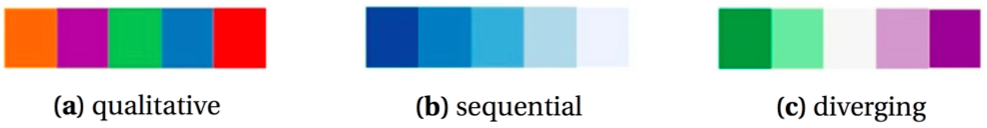

# Elements of data visualization {#sec:elements}

>
>   
> 
>*"Excellence in statistical graphics consists of complex ideas communicated with clarity, precision and efficiency."*
> 
> *Edward Tufte*
> 
> 

This chapter aims to lay out the context and basics of data visualization, and thereby establish the background knowledge to contextualize and further investigate specific display strategies. First, a brief overview of some general notions in data visualization is given to familiarize with the context, along with guidelines for successful implementation. Then, an overview of the multiple visualization tools is provided, aiming to support ES analysts to choose the most adapted software or library for each application.

## Notions and techniques in data visualization 

###Information visualization and graphical integrity {#sec:graphintegrity}
Information visualization, or visual communication, consists in transforming complex and abstract data into an accessible and concrete form, that a human brain can perceive with as little as possible cognitive effort. It consists simply in encoding data into visual objects, such as lines or points [@tufte]. The goal of a visualization is to effectively convey information [@Kelleher].

In order to achieve this aim honestly, *graphical integrity* considerations must be kept in mind throughout the process of building visualizations. It has been shown that graphs can clearly be misleading because of design choices [@Allen1]. Graphical integrity consists in accurate representations of data, avoiding distortions or misleading designs. To this end, data must be shown in its context, well-known units and clear labeling should be used to avoid ambiguity and true proportions must be kept in representing numbers [@tufte]. 

Graphical integrity considerations in the context of ES are especially relevant concerning uncertainty representation, scenarios displays and scales. Hiding some uncertainties, or some scenarios considered during the analysis, may be considered dishonest [@McMahon2016], however analyst may decide to show a subset only in order to focus on the core message but showing the relevant context is necessary to a global understanding. Graphical integrity considerations also needs to be taken into account in the choice of the scale: it is important to normalize[^262back] it, and use the same scale on comparable figures, to avoid biasing comparisons.

[^262back]: Normalizing a scale to a common one for reference in comparison, or apply a more sophisticated transformation to the data, relevant to the specific case (e.g. divide by population).

###Vocabulary and grammar of graphics
Graphs, charts, diagrams and plots, despite ambiguous nuances, are all defined as representations of data, these words will be used synonymously in this work. A graph consists in at least one dataset translated into a set of mappings (i.e. visual encodings), forming layers that are statistically transformed according to the scale, the coordinate system and the facet specification[^601back]. Refer to @wickham08 and @wilkinson for additional details about the *grammar of graphics*. 

[^601back]: The faceting specification is relative to the coordinate system, it *“describes which variables should be used to split up the data, and how they should be arranged”* [@wickham08].		

Spatial data , presents its own visualization and handling challenges, it is therefore typically handled with specific tools, so called geographical information systems (GIS) which link geographic (e.g. maps) and descriptive information. Data is organized in different layers, associated based on their geography. Spatial data can be stored in two types: raster, which is a gridded collection of pixels referenced with coordinates, and vector, which corresponds to a set of points, lines, and polygons. Different projections and coordinate systems are of great importance when dealing with spatial data: the round shape of the earth is different from the flat projections of the maps and this means that distortion cannot be avoided. These projections conserve either the shape, or the area for example but cannot conserve all measures [@LectureGIS]. For further information regarding GIS, we point out to the myriad of work in this vast field, among others, the book written by @de2007geospatial. 

###Modes of visualization
Visualization can be delivered in different forms. There are three main groupings of visual information delivery modes:

* **Static presentations** are required for printed format and often essential. In the context of inter-organizational projects, there is almost always a need to summarize results in static reports. 
* **Dynamic user-interactive visualizations** give the greatest flexibility to the user who is given options to test and visualize results while having some control on the display. In many cases, user interactivity enhances the user's implication and satisfaction [@Teo2003281]. Dynamic displays offers many options to tailored and multi-dimensional visualizations. Section \ref{sec:interactivefeatures} will detail some of the main features of interest.
* **Dynamic storytelling** is part way between the two previous visualization modes: it is a dynamic animation, but not fully interactive. The viewer is guided through the visualization, either by a presenter, or step-by-step through the storyline, (s)he therefore has less flexibility to "play around" with the variables, but it can result in easier delivery of key messages.  Especially useful during presentations, but also on webpages, the dynamic storytelling allows the flexibility and multi-dimensional displays options of dynamic visualizations, while keeping control on the selected options, i.e. walking the user through the visualization to lead to the envisioned goal. 

###Distortion techniques {#sec:disto}
When displaying large datasets, combining information on different scales can become very tricky. As noted earlier (\ref{sec:graphintegrity}), graphical integrity requires to present the context of the dataset. However, when attempting to show local variations, displaying two scales at once is a notable challenge. Some distortion techniques have been developed in order to view precisely local details in their global context. They allows a greater space to the display of a focused zone, while still embedding its surrounding context. Generally, linear or hyperbolic geometry supports the smooth connection of the focus area and the background, that have different scales [@Leung]. Distortion techniques include: 

-  **bifocal display** (or lens) corresponds simply to a linear transformation (in one or two directions) (@bifocal, @Leung).
-  **polyfocal lens** is similar to bifocal lens, but using a more complex hyperbolic (or polynomial) transformation function [@Leung].
-  **fisheye view**, originally called *Focus + Context* technique (@Lamping and @Furnas_fisheye) uses a continuous magnification function (that also transforms the boundaries). Tough this term has been used with different definitions, it is broadly used and very intuitive.
- there are other less common options among which can be mentioned the **perspective wall** [@Mackinlay], that simulates the perspective effect or the **hyperbolic tree** that extends the fisheye view using hyperbolic plane mapped onto a circular display region [@Lamping]. 

###Interaction techniques {#sec:interactivefeatures}
A few interactive features of interest include [@wilhelm1995software]:

-	**Scaling**, which is simply the ability to zoom in and out, is powerful in the sense that it allows the user to both a global view of the whole dataset and a view of precise details on smaller variations, therefore removing the need for a distorted view. Some scaling options also combine distortion techniques (see section \ref{sec:disto}) to both zoom in and keep the background context in the surroundings.
-	**Identification** (also called *pointing*) allows access to detailed information of a subset of the graph by clicking on it.
-	**Generalized selection** visually highlights or extracts in some way every linked graphical element that is associated with the user’s selection for an overview of subsets. The association rules are defined according to the case.
-	**Brushing** consists in selecting a subset of data, that is then highlighted. Also, brushing can be used to remove unwanted data, when a specific threshold defines a subset of interest [@Kollat_Video]. Brushing can be done with a slider, or with direct selection on the plot [@xmdvtool].
-      In a context where the displays consists in several views (different plots), **linking** adds value to brushing: it is the dynamic update of the other graphs displayed, to undergo the corresponding «brushed» selection [@Buja].

##Graphical best practices and guidelines {#sec:colors}
What makes a good visualization? Keeping in mind the goal which is to effectively convey information, i.e. to gain insight on the data, an efficient visualization reduces the cognitive effort of understanding the graph, in order to bring the observer's attention to the actual facts. Some may seem trivial, nevertheless the guidelines summarized in the following paragraphs are essential to achieving the intended purpose. As described by an expert in data visualization, Tufte (1983) in his classic text (p.13), graphical displays should: 

> * “show the data,
> * induce the viewer to think about the substance rather than about methodology, graphic design, the technology of graphic production,...
> * avoid distorting what the data has to say,
> * present many numbers in a small space,
>  * make large data sets coherent,
>  * encourage the eye to compare different pieces of data,
>  * reveal the data at several levels of detail, from a broad overview to the fine structure,
> *  serve a reasonably clear purpose: description, exploration, tabulation or decoration,
>  * be closely integrated with the statistical and verbal descriptions of a dataset". 

In the context of maps, @Buckley2012 states five major maps design principles, namely legibility, visual contrast (for which the choice of an appropriate color scheme is essential), figure-ground organization, hierarchical organization, and balance (see her work for further details and guidance specific to maps).

Best practices seem to be summarized by three main points. An efficient display should be self-explanatory, tailored to the audience, and most importantly convey the key message. Moreover a good visualization is highly dependent on the task and the type of display and other design choices are very specific to the dataset considered.

### Legibility and intuitiveness
Simplicity is key to an effective display. [@tufte] advocates to minimize the design complexity, to maximize the time spent on reasoning on the actual content. Redundancy introduces needless complication and should be avoided. For example, the data ink ratio (i.e. the ratio of ink used to display data over the total ink of the figure) should be minimized as far as possible. Additionally, @Kelleher argues to maintain axis ranges across subplots for easier comparison, connect sequential data (but, for example in time series plots, disconnect specifically the area of missing data) and express density of overlapping points (e.g. with color gradient in scatterplots). Appropriate encoding of objects and attributes lead to intuitive plots, as detailed by @cleveland1984graphical.

### Scale and ratios 
The success of a visualization is contingent upon the careful selection of appropriate scales and aspect ratios. There is always trade-offs between showing the zero, or zooming on variations. Dynamic features and distortion techniques allow to overcome some of this difficult choices, but are not always possible. Making the right choice between displaying patterns or details is crucial [@kosslyn1992minding]. Meaningful axis ranges, data transformations (e.g. log scale) and aggregation level (e.g. temporal aggregation by averaging over a larger time step for long time-series) are essential too [@Kelleher].

###Legend
For the graph to be self-explanatory, a clear labeling must be included. If opting for a legend, it should be ordered by some properties of data, never alphabetically according to @tufte because a space to express something about the data would be wasted. Creating logical groups assists the understanding. For color codes, it is advised to display adjacent to each other in the legend the colors that are adjacent in the corresponding map [@Desi5656].

###Color scheme 
The color scheme is an another important choice to be made when displaying data[@Kelleher]. Sequential color scheme ought to be chosen when the underlying data shows ranked differences; diverging scheme when dealing with negative and positive differences around a mean or a neutral value; and a categorical scheme for discrete values (see figure \ref{fig:colorschemes} and recommendations of [the tilemill project](https://tilemill-project.github.io/tilemill/docs/guides/tips-for-color/). Moreover, many sources suggests to use only a few colors (about 6), while choosing them distinct, and striving for color harmony. Other considerations to bear in mind: cultural conventions and intuitive tints facilitate fast perception, colorblind and printing safe schemes are prudent. Also, the color scale should be normalized[^232back], considering which datapoints should appear in different categories. Websites like [Colorbrewer](http://colorbrewer2.org/), [Colrdl](http://colrd.com/palette/) or [Adobe Kuler](https://color.adobe.com) provide good color palettes, based on color theory.

[^232back]: Normalizing a colorscale consists in adjusting the scale to a reference one for comparison or to a more sophisticated one depending on the context. 

{#fig:colorschemes width=80%}

###Interactivity
The success of an interactive display results from the appropriate interface complexity for a certain user motivation [@Roth]. In the field of interactive maps, [@Roth] examines when cartographic interaction positively supports work. Interactivity is not always beneficial to the graphs, but relevant for users who wish to customize the communicated information to their particular interests, also relevant to overcome some display problematics. Interactivity also helps enhance the user's involvement with the map, by offering a sense of control over the experience.

## Overview of visualization tools

To put the above principles into practice, various tools are available to create data visualizations. A few important things to consider when choosing an appropriate tool are the features supported (user interactivity, spatial data, 3D, web), and also the price, speed, scalability, robustness, customizability and user adoption. Then, it is often a trade-off between customizability and ease of use. Such software is usually easier to utilize, and the resulting visualizations are often more aesthetic, but if the user is willing to code, custom scripts offer the most flexibility in design, and various charting libraries allow to tailor the figure to specific needs. This section does not pretend to be exhaustive but attempts to give an overview of the available data visualization tools, based on a review conducted in late 2016. Emphasis will be given on spatial data as it constitutes an essential part of natural capital information.

{#fig:boooo width=90%}

### Data analysis and visualization software
There is a myriad of data visualization software available, usually combining some analytics features. Some of the main ones are **Tableau**, **Spotfire**, **Qlickview** and **MS BI Stack**. Dynamic visualization has historically been supported by software like **Xmdv Tool** and **OpenDX** (both open source) and is recently proposed by many new software, as visual data analytics is becoming very trendy.

In terms of maps, some software support spatial data (namely Tableau, Spotfire and OpenDX). Moreover, GIS software are designed to build maps from any data and to perform spatial data analysis; **ArcGIS** and **QGIS** are the most common. The former integrates in its desktop version several applications, namely ArcMap to build maps, ArcCatalog for data management, ArcToolbox for geoprocessing, and also ArcScene, ArcGlobe, and ArcGIS Pro. QGIS (formerly Quantum GIS) is the corresponding open-source software. According to synthesis of users' forums, it seems that ArcGIS seems to have more functionalities, especially when dealing with rasters and better support tools, and QGIS a steeper learning curve. However, they are really comparable. To combine spatial data and dynamic displays, some software such as **InstantAtlas** provide interactive mapping services. [More details and examples of geovisualization tools are presented by](http://geoawesomeness.com/top-19-online-geovisualization-tools-apis-libraries-beautiful-maps/) @Buczkowski and include Carto, the Mapzen API, Maps4news, as well as Tableau, mentioned above. 

### Charting libraries
Charts and maps can also be generated through scripting, allowing greater flexibility. Sorted by programming languages, some of the main plotting and mapping libraries are listed below. On the spatial data side, @python_libs advocates for these over GIS software for exploratory data analysis. 

####Javascript
Javascript is, without a doubt, the go-to language for *fancy* - and definitely for interactive - data visualization, considering the multiple charting libraries written in this language. The one that stands out is **D3.js** (or just D3 for Data-Driven Documents). Formerly *Protovis*, it produces dynamic, interactive and very customizable web visualizations. In the same vein, *Processing, Anychart, FusionCharts, Dygraphs, Highchart, Zingchart, Three (3D)* can be cited among others. Several tools build upon D3, the library **Dc.js** adds crossfiltering functionalities, such as brushing and linking,  *Raw* provides a user interface to build D3 typical examples without having to code [@raw_raw]. Also **Plotly** API libraries that build on D3.js not only for javascript but also with versions for Python, Matlab and R.

**Leaflet** is probably the most adopted mapping library for spatial data. **Mapbox** supports similar functionalities with the *Mapbox GL library*. Other mapping libraries include *ModestMap* (from the makers of Mapbox) and *Highmaps*.

####R
R plotting packages **ggplot** and **ggplot2** are very efficient for static visualizations. The map package built on top of the latter, **ggmap** combines spatial information from GoogleMaps, OpenStreetMap with the grammar of graphics of ggplot2 [@ggmap]. The interactive version of ggplot2 would be **ggvis**, however its dynamic  functionalities are quite limited. A powerful package for interactive (web) visualizations is **Shiny**, it can be combined to *Leaflet* for spatial data. R spatial packages include **sp**, **raster**, **maptools** and **rasterVis** [^6782back]. Also, as mentioned above, Plotly has an R version too, converting ggplot2 charts to interactive ones. Another way to connect to the multiple javascript charting libraries is to use the package rCharts.

The OpenMORDM visualization toolkit [@Hadka2015] is a dynamic visualization platform built from R Shiny. It allows to explore, gain insight on the data, and make static plots, with a focus on deep uncertainty and robustness visualizations.

####Python
**Matplotlib** is the main Python graphing library. It contains a toolkit for plotting 2D data on maps: **basemap**[^6789back].  Also, **geopandas** extends the data analysis library Pandas to spatial data, using also Fiona for file access, Shapely and Descartes for geometric operations, PySal for spatial analysis, and of course Matplotlib for plotting [@python_libs]. Interactive plots are based on **Bokeh** which imitates D3, or, as mentioned previously, Plotly. 

[^6789back]: Useful links to make maps using Python (with matplotlib and basemap):  [a well written blogpost](http://sensitivecities.com/so-youd-like-to-make-a-map-using-python-EN.html#.WCJPDvkrJhE), [another one](http://www.datadependence.com/2016/06/creating-map-visualisations-in-python/), and [basemap examples](http://matplotlib.org/basemap/users/examples.html).
 
[^6782back]: Useful links about analysis of spatial data in R: \
- [overview of analysis of spatial data](https://cran.r-project.org/web/views/Spatial.html) \
- [Illustration of the ggmap package](https://journal.r-project.org/archive/2013-1/kahle-wickham.pdf) \
- [Introduction to the raster package](https://cran.r-project.org/web/packages/raster/vignettes/Raster.pdf) \
- [Introduction to RasterVis, which builds on raster package](https://oscarperpinan.github.io/rastervis/)

